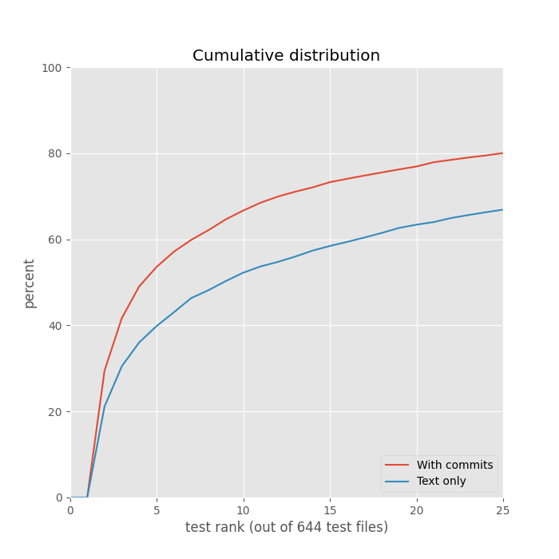

# Histograms

Note validation data leaks into training data when using commits.

# Files using commits

## [`fastnode-go/navigation/recommend/recommend.go`](https://github.com/khulnasoft-lab/fastnode/blob/master/fastnode-go/navigation/recommend/recommend.go)

Coverage: 1.250059

Retrieved:

|Test rank|Total rank|Coverage|Test|Weighted Hits|
|-|-|-|-|-|
|0|0|1.000000|[`fastnode-go/navigation/recommend/recommend_test.go`](https://github.com/khulnasoft-lab/fastnode/blob/master/fastnode-go/navigation/recommend/recommend_test.go)|0.05263157894736842|
|1|2|0.250000|[`fastnode-go/navigation/recommend/load_test.go`](https://github.com/khulnasoft-lab/fastnode/blob/master/fastnode-go/navigation/recommend/load_test.go)|0.05263157894736842|
|2|15|0.000031|[`fastnode-go/client/internal/fastnodelocal/internal/navigation/manager_test.go`](https://github.com/khulnasoft-lab/fastnode/blob/master/fastnode-go/client/internal/fastnodelocal/internal/navigation/manager_test.go)|0.05263157894736842|
|3|16|0.000015|[`fastnode-go/navigation/offline/validation/validation_test.go`](https://github.com/khulnasoft-lab/fastnode/blob/master/fastnode-go/navigation/offline/validation/validation_test.go)|0.05263157894736842|
|4|17|0.000008|[`fastnode-go/navigation/codebase/codebase_test.go`](https://github.com/khulnasoft-lab/fastnode/blob/master/fastnode-go/navigation/codebase/codebase_test.go)|0.05263157894736842|
|5|18|0.000004|[`fastnode-go/navigation/recommend/vectorizer_test.go`](https://github.com/khulnasoft-lab/fastnode/blob/master/fastnode-go/navigation/recommend/vectorizer_test.go)|0.05263157894736842|
|6|19|0.000002|[`fastnode-go/navigation/recommend/graph_test.go`](https://github.com/khulnasoft-lab/fastnode/blob/master/fastnode-go/navigation/recommend/graph_test.go)|0.05263157894736842|
|7|24|0.000000|[`fastnode-go/navigation/codebase/project_test.go`](https://github.com/khulnasoft-lab/fastnode/blob/master/fastnode-go/navigation/codebase/project_test.go)|0.05263157894736842|
|8|27|0.000000|[`fastnode-go/navigation/git/git_test.go`](https://github.com/khulnasoft-lab/fastnode/blob/master/fastnode-go/navigation/git/git_test.go)|0|
|9|29|0.000000|[`fastnode-go/navigation/metrics/metrics_test.go`](https://github.com/khulnasoft-lab/fastnode/blob/master/fastnode-go/navigation/metrics/metrics_test.go)|0|
|10|32|0.000000|[`fastnode-go/navigation/ignore/ignore_test.go`](https://github.com/khulnasoft-lab/fastnode/blob/master/fastnode-go/navigation/ignore/ignore_test.go)|0|
|11|42|0.000000|[`fastnode-go/navigation/localpath/localpath_test.go`](https://github.com/khulnasoft-lab/fastnode/blob/master/fastnode-go/navigation/localpath/localpath_test.go)|0|
|12|48|0.000000|[`fastnode-go/navigation/recommend/files_test.go`](https://github.com/khulnasoft-lab/fastnode/blob/master/fastnode-go/navigation/recommend/files_test.go)|0.05263157894736842|
|13|51|0.000000|[`fastnode-go/navigation/offline/validation/load_test.go`](https://github.com/khulnasoft-lab/fastnode/blob/master/fastnode-go/navigation/offline/validation/load_test.go)|0.05263157894736842|
|14|59|0.000000|[`fastnode-golib/lexicalv0/tfserving/cmds/test_client/main.go`](https://github.com/khulnasoft-lab/fastnode/blob/master/fastnode-golib/lexicalv0/tfserving/cmds/test_client/main.go)|0|
|15|64|0.000000|[`fastnode-go/client/internal/settings/compat_manager_test.go`](https://github.com/khulnasoft-lab/fastnode/blob/master/fastnode-go/client/internal/settings/compat_manager_test.go)|0|
|16|112|0.000000|[`fastnode-golib/lexicalv0/text/split_test.go`](https://github.com/khulnasoft-lab/fastnode/blob/master/fastnode-golib/lexicalv0/text/split_test.go)|0|
|17|129|0.000000|[`fastnode-go/client/internal/clientapp/test/license_test.go`](https://github.com/khulnasoft-lab/fastnode/blob/master/fastnode-go/client/internal/clientapp/test/license_test.go)|0|
|18|131|0.000000|[`fastnode-go/client/internal/fastnodelocal/internal/indexing/manager_test.go`](https://github.com/khulnasoft-lab/fastnode/blob/master/fastnode-go/client/internal/fastnodelocal/internal/indexing/manager_test.go)|0|
|19|134|0.000000|[`fastnode-go/clientlogs/server_test.go`](https://github.com/khulnasoft-lab/fastnode/blob/master/fastnode-go/clientlogs/server_test.go)|0|
|20|136|0.000000|[`fastnode-go/client/internal/fastnodelocal/internal/filesystem/manager_test.go`](https://github.com/khulnasoft-lab/fastnode/blob/master/fastnode-go/client/internal/fastnodelocal/internal/filesystem/manager_test.go)|0|
|21|175|0.000000|[`fastnode-go/navigation/git/storage_test.go`](https://github.com/khulnasoft-lab/fastnode/blob/master/fastnode-go/navigation/git/storage_test.go)|0|
|22|186|0.000000|[`fastnode-go/lang/python/pythoncomplete/recalltest/recallcomputer.go`](https://github.com/khulnasoft-lab/fastnode/blob/master/fastnode-go/lang/python/pythoncomplete/recalltest/recallcomputer.go)|0|
|23|192|0.000000|[`fastnode-go/community/account/manager_test.go`](https://github.com/khulnasoft-lab/fastnode/blob/master/fastnode-go/community/account/manager_test.go)|0|
|24|200|0.000000|[`local-pipelines/mixing/data/normalize/analyze_test.go`](https://github.com/khulnasoft-lab/fastnode/blob/master/local-pipelines/mixing/data/normalize/analyze_test.go)|0|

## [`fastnode-go/client/internal/fastnodelocal/internal/navigation/manager.go`](https://github.com/khulnasoft-lab/fastnode/blob/master/fastnode-go/client/internal/fastnodelocal/internal/navigation/manager.go)

Coverage: 1.132828

Retrieved:

|Test rank|Total rank|Coverage|Test|Weighted Hits|
|-|-|-|-|-|
|0|0|1.000000|[`fastnode-go/client/internal/fastnodelocal/internal/navigation/manager_test.go`](https://github.com/khulnasoft-lab/fastnode/blob/master/fastnode-go/client/internal/fastnodelocal/internal/navigation/manager_test.go)|15.134642160957952|
|1|3|0.125000|[`fastnode-go/navigation/codebase/codebase_test.go`](https://github.com/khulnasoft-lab/fastnode/blob/master/fastnode-go/navigation/codebase/codebase_test.go)|3.3065998329156225|
|2|7|0.007812|[`fastnode-go/navigation/codebase/project_test.go`](https://github.com/khulnasoft-lab/fastnode/blob/master/fastnode-go/navigation/codebase/project_test.go)|1.556599832915622|
|3|16|0.000015|[`fastnode-go/navigation/recommend/recommend_test.go`](https://github.com/khulnasoft-lab/fastnode/blob/master/fastnode-go/navigation/recommend/recommend_test.go)|0.05263157894736842|
|4|23|0.000000|[`fastnode-go/client/internal/status/manager_test.go`](https://github.com/khulnasoft-lab/fastnode/blob/master/fastnode-go/client/internal/status/manager_test.go)|0.18518518518518517|
|5|25|0.000000|[`fastnode-go/client/internal/settings/compat_manager_test.go`](https://github.com/khulnasoft-lab/fastnode/blob/master/fastnode-go/client/internal/settings/compat_manager_test.go)|0.35185185185185186|
|6|53|0.000000|[`fastnode-go/client/internal/ws/manager_test.go`](https://github.com/khulnasoft-lab/fastnode/blob/master/fastnode-go/client/internal/ws/manager_test.go)|0.1111111111111111|
|7|59|0.000000|[`fastnode-go/client/internal/metrics/livemetrics/manager_test.go`](https://github.com/khulnasoft-lab/fastnode/blob/master/fastnode-go/client/internal/metrics/livemetrics/manager_test.go)|0.018518518518518517|
|8|75|0.000000|[`fastnode-go/navigation/git/git_test.go`](https://github.com/khulnasoft-lab/fastnode/blob/master/fastnode-go/navigation/git/git_test.go)|0.08333333333333333|
|9|76|0.000000|[`fastnode-golib/wstest/helpers.go`](https://github.com/khulnasoft-lab/fastnode/blob/master/fastnode-golib/wstest/helpers.go)|0.1111111111111111|
|10|78|0.000000|[`fastnode-go/client/internal/autocorrect/manager_test.go`](https://github.com/khulnasoft-lab/fastnode/blob/master/fastnode-go/client/internal/autocorrect/manager_test.go)|0|
|11|84|0.000000|[`fastnode-go/client/internal/clientapp/test/mainloop_test.go`](https://github.com/khulnasoft-lab/fastnode/blob/master/fastnode-go/client/internal/clientapp/test/mainloop_test.go)|0|
|12|91|0.000000|[`fastnode-go/navigation/recommend/load_test.go`](https://github.com/khulnasoft-lab/fastnode/blob/master/fastnode-go/navigation/recommend/load_test.go)|0.05263157894736842|
|13|97|0.000000|[`fastnode-go/client/internal/desktoplogin/manager_test.go`](https://github.com/khulnasoft-lab/fastnode/blob/master/fastnode-go/client/internal/desktoplogin/manager_test.go)|0|
|14|100|0.000000|[`fastnode-go/client/internal/fastnodelocal/test/indexing_test.go`](https://github.com/khulnasoft-lab/fastnode/blob/master/fastnode-go/client/internal/fastnodelocal/test/indexing_test.go)|0|
|15|101|0.000000|[`fastnode-go/clientlogs/server_test.go`](https://github.com/khulnasoft-lab/fastnode/blob/master/fastnode-go/clientlogs/server_test.go)|0|
|16|103|0.000000|[`fastnode-go/client/internal/fastnodelocal/test/autosearch.go`](https://github.com/khulnasoft-lab/fastnode/blob/master/fastnode-go/client/internal/fastnodelocal/test/autosearch.go)|0|
|17|112|0.000000|[`fastnode-go/navigation/offline/validation/validation_test.go`](https://github.com/khulnasoft-lab/fastnode/blob/master/fastnode-go/navigation/offline/validation/validation_test.go)|0.05263157894736842|
|18|117|0.000000|[`fastnode-go/client/internal/fastnodelocal/event_processor_test.go`](https://github.com/khulnasoft-lab/fastnode/blob/master/fastnode-go/client/internal/fastnodelocal/event_processor_test.go)|0|
|19|121|0.000000|[`fastnode-go/client/internal/clientapp/test_setup.go`](https://github.com/khulnasoft-lab/fastnode/blob/master/fastnode-go/client/internal/clientapp/test_setup.go)|0|
|20|123|0.000000|[`fastnode-go/client/internal/settings/manager_test.go`](https://github.com/khulnasoft-lab/fastnode/blob/master/fastnode-go/client/internal/settings/manager_test.go)|0|
|21|138|0.000000|[`fastnode-go/client/internal/autosearch/test/manager_test.go`](https://github.com/khulnasoft-lab/fastnode/blob/master/fastnode-go/client/internal/autosearch/test/manager_test.go)|0|
|22|140|0.000000|[`fastnode-go/client/internal/conversion/cohort/manager_test.go`](https://github.com/khulnasoft-lab/fastnode/blob/master/fastnode-go/client/internal/conversion/cohort/manager_test.go)|0|
|23|149|0.000000|[`fastnode-go/client/internal/fastnodelocal/permissions/handlers_test.go`](https://github.com/khulnasoft-lab/fastnode/blob/master/fastnode-go/client/internal/fastnodelocal/permissions/handlers_test.go)|0|
|24|152|0.000000|[`fastnode-go/client/internal/fastnodelocal/test/editorapi_buffer_test.go`](https://github.com/khulnasoft-lab/fastnode/blob/master/fastnode-go/client/internal/fastnodelocal/test/editorapi_buffer_test.go)|0|

Relevant but not retrieved:

|Test|Weighted Hits|
|-|-|
|fastnode-go/navigation/offline/validation/load_test.go|0.05263157894736842|
|fastnode-go/navigation/recommend/files_test.go|0.05263157894736842|
|fastnode-go/navigation/recommend/graph_test.go|0.05263157894736842|
|fastnode-go/navigation/recommend/vectorizer_test.go|0.05263157894736842|
|fastnode-go/client/internal/plugins_new/internal/vscode/vscode_darwin_test.go|0.14285714285714285|
|fastnode-go/client/internal/plugins_new/internal/vscode/vscode_linux_test.go|0.14285714285714285|
|fastnode-go/client/internal/plugins_new/internal/vscode/vscode_windows_test.go|0.14285714285714285|
|fastnode-go/navigation/ignore/ignore_test.go|0.25|
|fastnode-go/navigation/ignore/munge_test.go|0.25|
|fastnode-go/client/internal/conversion/cohort/autostart-trial_test.go|0.018518518518518517|
|fastnode-go/client/internal/conversion/cohort/cta_test.go|0.018518518518518517|
|fastnode-go/client/internal/conversion/cohort/quiet-autostart_test.go|0.018518518518518517|
|fastnode-go/client/internal/conversion/cohort/usage-paywall_test.go|0.018518518518518517|
|fastnode-go/client/internal/fastnodelocal/internal/signatures/manager_test.go|0.018518518518518517|
|fastnode-go/client/internal/metrics/proselected_test.go|0.018518518518518517|
|fastnode-go/client/internal/notifications/manager_test.go|0.018518518518518517|
|local-pipelines/lexical/train/cmds/utils/datasets_test.go|0.018518518518518517|
|fastnode-go/navigation/git/cache_test.go|0.08333333333333333|
|fastnode-go/navigation/git/storage_test.go|0.08333333333333333|

## [`fastnode-go/lang/language.go`](https://github.com/khulnasoft-lab/fastnode/blob/master/fastnode-go/lang/language.go)

Coverage: 1.195325

Retrieved:

|Test rank|Total rank|Coverage|Test|Weighted Hits|
|-|-|-|-|-|
|0|0|1.000000|[`fastnode-go/lang/language_test.go`](https://github.com/khulnasoft-lab/fastnode/blob/master/fastnode-go/lang/language_test.go)|1.0|
|1|3|0.125000|[`local-pipelines/lexical/train/cmds/utils/datasets_test.go`](https://github.com/khulnasoft-lab/fastnode/blob/master/local-pipelines/lexical/train/cmds/utils/datasets_test.go)|0.8333333333333333|
|2|4|0.062500|[`fastnode-golib/lexicalv0/langgroup_test.go`](https://github.com/khulnasoft-lab/fastnode/blob/master/fastnode-golib/lexicalv0/langgroup_test.go)|0|
|3|7|0.007812|[`fastnode-go/client/internal/fastnodelocal/permissions/support_status_test.go`](https://github.com/khulnasoft-lab/fastnode/blob/master/fastnode-go/client/internal/fastnodelocal/permissions/support_status_test.go)|1.0|
|4|17|0.000008|[`fastnode-go/client/internal/metrics/livemetrics/languagemetrics_test.go`](https://github.com/khulnasoft-lab/fastnode/blob/master/fastnode-go/client/internal/metrics/livemetrics/languagemetrics_test.go)|0|
|5|18|0.000004|[`fastnode-go/lang/lexical/lexicalcomplete/corpustest/shared_test.go`](https://github.com/khulnasoft-lab/fastnode/blob/master/fastnode-go/lang/lexical/lexicalcomplete/corpustest/shared_test.go)|0|
|6|20|0.000001|[`fastnode-golib/lexicalv0/encoder_test.go`](https://github.com/khulnasoft-lab/fastnode/blob/master/fastnode-golib/lexicalv0/encoder_test.go)|0.5|
|7|35|0.000000|[`fastnode-go/navigation/localpath/localpath_test.go`](https://github.com/khulnasoft-lab/fastnode/blob/master/fastnode-go/navigation/localpath/localpath_test.go)|0|
|8|45|0.000000|[`fastnode-go/client/internal/clientapp/lang_test.go`](https://github.com/khulnasoft-lab/fastnode/blob/master/fastnode-go/client/internal/clientapp/lang_test.go)|0|
|9|57|0.000000|[`fastnode-golib/lexicalv0/context_test.go`](https://github.com/khulnasoft-lab/fastnode/blob/master/fastnode-golib/lexicalv0/context_test.go)|0|
|10|58|0.000000|[`fastnode-golib/lexicalv0/inspect/inspect_test.go`](https://github.com/khulnasoft-lab/fastnode/blob/master/fastnode-golib/lexicalv0/inspect/inspect_test.go)|0|
|11|63|0.000000|[`fastnode-golib/lexicalv0/text/split_test.go`](https://github.com/khulnasoft-lab/fastnode/blob/master/fastnode-golib/lexicalv0/text/split_test.go)|0.29166666666666663|
|12|67|0.000000|[`fastnode-go/client/internal/fastnodelocal/internal/navigation/manager_test.go`](https://github.com/khulnasoft-lab/fastnode/blob/master/fastnode-go/client/internal/fastnodelocal/internal/navigation/manager_test.go)|0|
|13|76|0.000000|[`fastnode-golib/lexicalv0/text/lexer_test.go`](https://github.com/khulnasoft-lab/fastnode/blob/master/fastnode-golib/lexicalv0/text/lexer_test.go)|0.125|
|14|78|0.000000|[`fastnode-go/client/internal/plugins_new/internal/vscode/vscode_darwin_test.go`](https://github.com/khulnasoft-lab/fastnode/blob/master/fastnode-go/client/internal/plugins_new/internal/vscode/vscode_darwin_test.go)|0|
|15|80|0.000000|[`fastnode-golib/lexicalv0/tfserving/cmds/test_client/main.go`](https://github.com/khulnasoft-lab/fastnode/blob/master/fastnode-golib/lexicalv0/tfserving/cmds/test_client/main.go)|0|
|16|86|0.000000|[`fastnode-go/client/internal/plugins_new/internal/vscode/vscode_linux_test.go`](https://github.com/khulnasoft-lab/fastnode/blob/master/fastnode-go/client/internal/plugins_new/internal/vscode/vscode_linux_test.go)|0|
|18|90|0.000000|[`fastnode-go/navigation/offline/validation/load_test.go`](https://github.com/khulnasoft-lab/fastnode/blob/master/fastnode-go/navigation/offline/validation/load_test.go)|0|
|19|95|0.000000|[`fastnode-golib/lexicalv0/javascript/render_test.go`](https://github.com/khulnasoft-lab/fastnode/blob/master/fastnode-golib/lexicalv0/javascript/render_test.go)|0|
|20|96|0.000000|[`fastnode-go/client/internal/fastnodelocal/permissions/handlers_test.go`](https://github.com/khulnasoft-lab/fastnode/blob/master/fastnode-go/client/internal/fastnodelocal/permissions/handlers_test.go)|0|
|21|97|0.000000|[`fastnode-go/lang/lexical/lexicalcomplete/lexicalproviders/textjavascript_test.go`](https://github.com/khulnasoft-lab/fastnode/blob/master/fastnode-go/lang/lexical/lexicalcomplete/lexicalproviders/textjavascript_test.go)|0|
|22|114|0.000000|[`fastnode-go/client/internal/plugins_new/internal/vscode/vscode_windows_test.go`](https://github.com/khulnasoft-lab/fastnode/blob/master/fastnode-go/client/internal/plugins_new/internal/vscode/vscode_windows_test.go)|0|
|23|120|0.000000|[`fastnode-go/curation/titleparser/utility_test.go`](https://github.com/khulnasoft-lab/fastnode/blob/master/fastnode-go/curation/titleparser/utility_test.go)|0|
|24|131|0.000000|[`fastnode-go/lang/detect_test.go`](https://github.com/khulnasoft-lab/fastnode/blob/master/fastnode-go/lang/detect_test.go)|0|

Relevant but not retrieved:

|Test|Weighted Hits|
|-|-|
|fastnode-golib/lexicalv0/text/render_test.go|0.125|

## [`fastnode-go/client/internal/fastnodelocal/internal/completions/lexical.go`](https://github.com/khulnasoft-lab/fastnode/blob/master/fastnode-go/client/internal/fastnodelocal/internal/completions/lexical.go)

Coverage: 0.000368

Retrieved:

|Test rank|Total rank|Coverage|Test|Weighted Hits|
|-|-|-|-|-|
|0|12|0.000244|[`fastnode-go/lang/lexical/lexicalcomplete/corpustest/shared_test.go`](https://github.com/khulnasoft-lab/fastnode/blob/master/fastnode-go/lang/lexical/lexicalcomplete/corpustest/shared_test.go)|0|
|1|13|0.000122|[`fastnode-go/lang/python/pythoncomplete/api/mixing_test.go`](https://github.com/khulnasoft-lab/fastnode/blob/master/fastnode-go/lang/python/pythoncomplete/api/mixing_test.go)|0|
|2|19|0.000002|[`fastnode-golib/complete/data/api_test.go`](https://github.com/khulnasoft-lab/fastnode/blob/master/fastnode-golib/complete/data/api_test.go)|0|
|3|29|0.000000|[`fastnode-go/lang/python/pythoncomplete/corpustest/shared_test.go`](https://github.com/khulnasoft-lab/fastnode/blob/master/fastnode-go/lang/python/pythoncomplete/corpustest/shared_test.go)|0|
|4|34|0.000000|[`fastnode-go/client/internal/settings/compat_manager_test.go`](https://github.com/khulnasoft-lab/fastnode/blob/master/fastnode-go/client/internal/settings/compat_manager_test.go)|0.11851851851851852|
|5|40|0.000000|[`fastnode-go/client/internal/metrics/completions/metric_test.go`](https://github.com/khulnasoft-lab/fastnode/blob/master/fastnode-go/client/internal/metrics/completions/metric_test.go)|0|
|6|41|0.000000|[`fastnode-go/lang/python/pythoncomplete/pythonproviders/call_test.go`](https://github.com/khulnasoft-lab/fastnode/blob/master/fastnode-go/lang/python/pythoncomplete/pythonproviders/call_test.go)|0|
|7|42|0.000000|[`fastnode-go/lang/lexical/lexicalcomplete/lexicalproviders/providers_test.go`](https://github.com/khulnasoft-lab/fastnode/blob/master/fastnode-go/lang/lexical/lexicalcomplete/lexicalproviders/providers_test.go)|0|
|8|48|0.000000|[`fastnode-go/client/internal/fastnodelocal/internal/navigation/manager_test.go`](https://github.com/khulnasoft-lab/fastnode/blob/master/fastnode-go/client/internal/fastnodelocal/internal/navigation/manager_test.go)|0.018518518518518517|
|9|49|0.000000|[`fastnode-go/client/internal/fastnodelocal/event_processor_test.go`](https://github.com/khulnasoft-lab/fastnode/blob/master/fastnode-go/client/internal/fastnodelocal/event_processor_test.go)|0.14285714285714285|
|10|51|0.000000|[`fastnode-go/lang/python/pythoncomplete/pythonproviders/providers_test.go`](https://github.com/khulnasoft-lab/fastnode/blob/master/fastnode-go/lang/python/pythoncomplete/pythonproviders/providers_test.go)|0|
|11|53|0.000000|[`fastnode-go/client/internal/metrics/livemetrics_test/metrics_test.go`](https://github.com/khulnasoft-lab/fastnode/blob/master/fastnode-go/client/internal/metrics/livemetrics_test/metrics_test.go)|0.14285714285714285|
|12|55|0.000000|[`fastnode-golib/lexicalv0/cmds/test_ast_based_render/main.go`](https://github.com/khulnasoft-lab/fastnode/blob/master/fastnode-golib/lexicalv0/cmds/test_ast_based_render/main.go)|0|
|13|64|0.000000|[`fastnode-golib/lexicalv0/tfserving/cmds/test_client/main.go`](https://github.com/khulnasoft-lab/fastnode/blob/master/fastnode-golib/lexicalv0/tfserving/cmds/test_client/main.go)|0|
|14|66|0.000000|[`fastnode-go/lang/python/pythoncomplete/driver/mixing_test.go`](https://github.com/khulnasoft-lab/fastnode/blob/master/fastnode-go/lang/python/pythoncomplete/driver/mixing_test.go)|0|
|15|68|0.000000|[`fastnode-go/navigation/offline/validation/load_test.go`](https://github.com/khulnasoft-lab/fastnode/blob/master/fastnode-go/navigation/offline/validation/load_test.go)|0|
|16|77|0.000000|[`fastnode-go/clientlogs/server_test.go`](https://github.com/khulnasoft-lab/fastnode/blob/master/fastnode-go/clientlogs/server_test.go)|0|
|17|79|0.000000|[`fastnode-go/client/internal/notifications/manager_test.go`](https://github.com/khulnasoft-lab/fastnode/blob/master/fastnode-go/client/internal/notifications/manager_test.go)|0.018518518518518517|
|18|83|0.000000|[`fastnode-go/client/platform/platform_test.go`](https://github.com/khulnasoft-lab/fastnode/blob/master/fastnode-go/client/platform/platform_test.go)|0|
|19|84|0.000000|[`fastnode-go/lang/python/pythoncomplete/recalltest/recallcomputer.go`](https://github.com/khulnasoft-lab/fastnode/blob/master/fastnode-go/lang/python/pythoncomplete/recalltest/recallcomputer.go)|0|
|20|87|0.000000|[`fastnode-go/client/internal/metrics/livemetrics/manager_test.go`](https://github.com/khulnasoft-lab/fastnode/blob/master/fastnode-go/client/internal/metrics/livemetrics/manager_test.go)|0.018518518518518517|
|21|93|0.000000|[`fastnode-go/lang/lexical/lexicalcomplete/lexicalproviders/textpython_test.go`](https://github.com/khulnasoft-lab/fastnode/blob/master/fastnode-go/lang/lexical/lexicalcomplete/lexicalproviders/textpython_test.go)|0|
|22|96|0.000000|[`fastnode-go/lang/lexical/lexicalcomplete/lexicalproviders/textgolang_test.go`](https://github.com/khulnasoft-lab/fastnode/blob/master/fastnode-go/lang/lexical/lexicalcomplete/lexicalproviders/textgolang_test.go)|0|
|23|98|0.000000|[`fastnode-golib/lexicalv0/cmds/test_inference_latency/main.go`](https://github.com/khulnasoft-lab/fastnode/blob/master/fastnode-golib/lexicalv0/cmds/test_inference_latency/main.go)|0|
|24|102|0.000000|[`fastnode-go/client/internal/fastnodelocal/test/editorapi_buffer_test.go`](https://github.com/khulnasoft-lab/fastnode/blob/master/fastnode-go/client/internal/fastnodelocal/test/editorapi_buffer_test.go)|0.14285714285714285|

Relevant but not retrieved:

|Test|Weighted Hits|
|-|-|
|fastnode-go/client/internal/conversion/cohort/autostart-trial_test.go|0.018518518518518517|
|fastnode-go/client/internal/conversion/cohort/cta_test.go|0.018518518518518517|
|fastnode-go/client/internal/conversion/cohort/quiet-autostart_test.go|0.018518518518518517|
|fastnode-go/client/internal/conversion/cohort/usage-paywall_test.go|0.018518518518518517|
|fastnode-go/client/internal/fastnodelocal/internal/signatures/manager_test.go|0.018518518518518517|
|fastnode-go/client/internal/metrics/proselected_test.go|0.018518518518518517|
|fastnode-go/client/internal/status/manager_test.go|0.018518518518518517|
|local-pipelines/lexical/train/cmds/utils/datasets_test.go|0.018518518518518517|

## [`fastnode-go/lang/lexical/lexicalcomplete/lexicalproviders/Data_inputs.go`](https://github.com/khulnasoft-lab/fastnode/blob/master/fastnode-go/lang/lexical/lexicalcomplete/lexicalproviders/Data_inputs.go)

Coverage: 0.265632

Retrieved:

|Test rank|Total rank|Coverage|Test|Weighted Hits|
|-|-|-|-|-|
|0|2|0.250000|[`fastnode-golib/lexicalv0/context_test.go`](https://github.com/khulnasoft-lab/fastnode/blob/master/fastnode-golib/lexicalv0/context_test.go)|1.342156862745098|
|1|6|0.015625|[`fastnode-go/lang/lexical/lexicalcomplete/lexicalproviders/providers_test.go`](https://github.com/khulnasoft-lab/fastnode/blob/master/fastnode-go/lang/lexical/lexicalcomplete/lexicalproviders/providers_test.go)|1.2509803921568627|
|2|18|0.000004|[`fastnode-golib/lexicalv0/langgroup_test.go`](https://github.com/khulnasoft-lab/fastnode/blob/master/fastnode-golib/lexicalv0/langgroup_test.go)|0|
|3|19|0.000002|[`fastnode-golib/lexicalv0/cmds/test_ast_based_render/main.go`](https://github.com/khulnasoft-lab/fastnode/blob/master/fastnode-golib/lexicalv0/cmds/test_ast_based_render/main.go)|0.1801470588235294|
|4|20|0.000001|[`local-pipelines/lexical/train/cmds/utils/datasets_test.go`](https://github.com/khulnasoft-lab/fastnode/blob/master/local-pipelines/lexical/train/cmds/utils/datasets_test.go)|0|
|5|24|0.000000|[`fastnode-go/lang/lexical/lexicalcomplete/lexicalproviders/textgolang_test.go`](https://github.com/khulnasoft-lab/fastnode/blob/master/fastnode-go/lang/lexical/lexicalcomplete/lexicalproviders/textgolang_test.go)|0.8333333333333333|
|6|25|0.000000|[`fastnode-golib/lexicalv0/cmds/test_search_latency/main.go`](https://github.com/khulnasoft-lab/fastnode/blob/master/fastnode-golib/lexicalv0/cmds/test_search_latency/main.go)|0.24136321195144722|
|7|29|0.000000|[`fastnode-go/lang/lexical/lexicalcomplete/corpustest/shared_test.go`](https://github.com/khulnasoft-lab/fastnode/blob/master/fastnode-go/lang/lexical/lexicalcomplete/corpustest/shared_test.go)|0.6333333333333333|
|8|30|0.000000|[`fastnode-go/client/internal/fastnodelocal/permissions/support_status_test.go`](https://github.com/khulnasoft-lab/fastnode/blob/master/fastnode-go/client/internal/fastnodelocal/permissions/support_status_test.go)|0|
|9|31|0.000000|[`fastnode-go/lang/lexical/lexicalcomplete/lexicalproviders/textjavascript_test.go`](https://github.com/khulnasoft-lab/fastnode/blob/master/fastnode-go/lang/lexical/lexicalcomplete/lexicalproviders/textjavascript_test.go)|0.3333333333333333|
|10|36|0.000000|[`fastnode-go/client/internal/clientapp/lang_test.go`](https://github.com/khulnasoft-lab/fastnode/blob/master/fastnode-go/client/internal/clientapp/lang_test.go)|0|
|11|37|0.000000|[`fastnode-golib/lexicalv0/cmds/test_inference_latency/main.go`](https://github.com/khulnasoft-lab/fastnode/blob/master/fastnode-golib/lexicalv0/cmds/test_inference_latency/main.go)|0.13025210084033612|
|12|38|0.000000|[`fastnode-golib/lexicalv0/encoder_test.go`](https://github.com/khulnasoft-lab/fastnode/blob/master/fastnode-golib/lexicalv0/encoder_test.go)|0.33723262032085566|
|13|43|0.000000|[`fastnode-golib/lexicalv0/tfserving/cmds/test_client/main.go`](https://github.com/khulnasoft-lab/fastnode/blob/master/fastnode-golib/lexicalv0/tfserving/cmds/test_client/main.go)|0.058823529411764705|
|14|44|0.000000|[`fastnode-go/lang/lexical/lexicalcomplete/lexicalproviders/textc_test.go`](https://github.com/khulnasoft-lab/fastnode/blob/master/fastnode-go/lang/lexical/lexicalcomplete/lexicalproviders/textc_test.go)|0.43333333333333335|
|15|45|0.000000|[`fastnode-golib/lexicalv0/predict/context_test.go`](https://github.com/khulnasoft-lab/fastnode/blob/master/fastnode-golib/lexicalv0/predict/context_test.go)|0|
|16|54|0.000000|[`fastnode-go/lang/python/pythoncomplete/pythonproviders/call_test.go`](https://github.com/khulnasoft-lab/fastnode/blob/master/fastnode-go/lang/python/pythoncomplete/pythonproviders/call_test.go)|0|
|17|56|0.000000|[`fastnode-go/lang/python/pythoncomplete/api/mixing_test.go`](https://github.com/khulnasoft-lab/fastnode/blob/master/fastnode-go/lang/python/pythoncomplete/api/mixing_test.go)|0|
|18|61|0.000000|[`fastnode-go/lang/python/pythoncomplete/pythonproviders/providers_test.go`](https://github.com/khulnasoft-lab/fastnode/blob/master/fastnode-go/lang/python/pythoncomplete/pythonproviders/providers_test.go)|0|
|19|71|0.000000|[`fastnode-go/lang/lexical/lexicalcomplete/lexicalproviders/curated_context_test.go`](https://github.com/khulnasoft-lab/fastnode/blob/master/fastnode-go/lang/lexical/lexicalcomplete/lexicalproviders/curated_context_test.go)|0.058823529411764705|
|20|72|0.000000|[`fastnode-go/lang/lexical/lexicalcomplete/lexicalproviders/textpython_test.go`](https://github.com/khulnasoft-lab/fastnode/blob/master/fastnode-go/lang/lexical/lexicalcomplete/lexicalproviders/textpython_test.go)|0|
|21|73|0.000000|[`fastnode-golib/lexicalv0/text/lexer_test.go`](https://github.com/khulnasoft-lab/fastnode/blob/master/fastnode-golib/lexicalv0/text/lexer_test.go)|0.7588235294117647|
|22|77|0.000000|[`fastnode-go/lang/lexical/lexicalcomplete/api/events_test.go`](https://github.com/khulnasoft-lab/fastnode/blob/master/fastnode-go/lang/lexical/lexicalcomplete/api/events_test.go)|0|
|23|82|0.000000|[`fastnode-go/lang/python/pythoncomplete/performancetest/testenv.go`](https://github.com/khulnasoft-lab/fastnode/blob/master/fastnode-go/lang/python/pythoncomplete/performancetest/testenv.go)|0|
|24|90|0.000000|[`fastnode-golib/lexicalv0/cmds/test_prettify_golang/main.go`](https://github.com/khulnasoft-lab/fastnode/blob/master/fastnode-golib/lexicalv0/cmds/test_prettify_golang/main.go)|0|

Relevant but not retrieved:

|Test|Weighted Hits|
|-|-|
|fastnode-golib/lexicalv0/javascript/javascript_test.go|0.24632352941176472|
|fastnode-golib/lexicalv0/javascript/treesitter_test.go|0.24632352941176472|
|fastnode-golib/lexicalv0/text/split_test.go|0.24632352941176472|
|fastnode-golib/lexicalv0/inspect/inspect_test.go|0.09090909090909091|
|fastnode-go/client/internal/metrics/completions/metric_test.go|0.058823529411764705|
|fastnode-go/lang/lexical/lexicalcomplete/lexicalproviders/agnostic_test.go|0.058823529411764705|
|fastnode-golib/lexicalv0/javascript/render_test.go|0.058823529411764705|
|fastnode-golib/lexicalv0/cmds/compare_text_model/normalize_test.go|0.058823529411764705|
|fastnode-go/client/internal/status/manager_test.go|0.058823529411764705|
|fastnode-go/lang/lexical/lexicalcomplete/corpustest/corpus/text/autoCloseParen.go|0.5333333333333333|
|fastnode-go/lang/lexical/lexicalcomplete/corpustest/corpus/text/noNonMatchedCloseParen.go|0.5333333333333333|
|fastnode-go/lang/lexical/lexicalcomplete/corpustest/corpus/text/dedupeCall.go|0.2|
|fastnode-go/lang/lexical/lexicalcomplete/corpustest/corpus/text/identifierMiddleOfLine.go|0.2|
|fastnode-golib/lexicalv0/text/render_test.go|0.2|
|fastnode-golib/lexicalv0/css/lexer_test.go|0.1213235294117647|
|fastnode-golib/lexicalv0/html/lexer_test.go|0.1213235294117647|
|fastnode-golib/lexicalv0/python/lexer_test.go|0.1213235294117647|
|fastnode-golib/lexicalv0/vue/lexer_test.go|0.1213235294117647|
|fastnode-go/lang/lexical/lexicalcomplete/corpustest/corpus/text/basic1.js|0.1|
|fastnode-go/lang/lexical/lexicalcomplete/lexicalproviders/texthtml_test.go|0.1|
|fastnode-go/lang/lexical/lexicalcomplete/lexicalproviders/textjava_test.go|0.1|
|fastnode-golib/lexicalv0/predict/partialrun_test.go|0.1|

## [`fastnode-go/lang/python/pythoncomplete/driver/mixing.go`](https://github.com/khulnasoft-lab/fastnode/blob/master/fastnode-go/lang/python/pythoncomplete/driver/mixing.go)

Coverage: 0.002443

Retrieved:

|Test rank|Total rank|Coverage|Test|Weighted Hits|
|-|-|-|-|-|
|0|9|0.001953|[`fastnode-go/lang/python/pythoncomplete/corpustest/shared_test.go`](https://github.com/khulnasoft-lab/fastnode/blob/master/fastnode-go/lang/python/pythoncomplete/corpustest/shared_test.go)|0.4793939393939394|
|1|11|0.000488|[`fastnode-go/lang/python/pythoncomplete/driver/mixing_test.go`](https://github.com/khulnasoft-lab/fastnode/blob/master/fastnode-go/lang/python/pythoncomplete/driver/mixing_test.go)|0.022727272727272728|
|2|19|0.000002|[`fastnode-golib/complete/corpustests/testcase.go`](https://github.com/khulnasoft-lab/fastnode/blob/master/fastnode-golib/complete/corpustests/testcase.go)|0.6|
|3|23|0.000000|[`fastnode-go/lang/python/pythoncomplete/api/mixing_test.go`](https://github.com/khulnasoft-lab/fastnode/blob/master/fastnode-go/lang/python/pythoncomplete/api/mixing_test.go)|0.14606060606060606|
|4|26|0.000000|[`fastnode-go/navigation/offline/validation/load_test.go`](https://github.com/khulnasoft-lab/fastnode/blob/master/fastnode-go/navigation/offline/validation/load_test.go)|0|
|5|27|0.000000|[`fastnode-go/lang/python/pythoncomplete/pythonproviders/call_test.go`](https://github.com/khulnasoft-lab/fastnode/blob/master/fastnode-go/lang/python/pythoncomplete/pythonproviders/call_test.go)|0.022727272727272728|
|6|28|0.000000|[`fastnode-go/lang/python/pythoncomplete/pythonproviders/lexical_test.go`](https://github.com/khulnasoft-lab/fastnode/blob/master/fastnode-go/lang/python/pythoncomplete/pythonproviders/lexical_test.go)|0.022727272727272728|
|7|41|0.000000|[`fastnode-go/lang/python/pythoncomplete/recalltest/recallcomputer.go`](https://github.com/khulnasoft-lab/fastnode/blob/master/fastnode-go/lang/python/pythoncomplete/recalltest/recallcomputer.go)|0.12333333333333332|
|8|43|0.000000|[`fastnode-go/lang/python/pythoncomplete/pythonproviders/providers_test.go`](https://github.com/khulnasoft-lab/fastnode/blob/master/fastnode-go/lang/python/pythoncomplete/pythonproviders/providers_test.go)|0.022727272727272728|
|9|44|0.000000|[`fastnode-go/lang/python/pythoncomplete/performancetest/testenv.go`](https://github.com/khulnasoft-lab/fastnode/blob/master/fastnode-go/lang/python/pythoncomplete/performancetest/testenv.go)|0.14606060606060606|
|10|54|0.000000|[`fastnode-go/lang/python/pythoncomplete/pythonproviders/empty_calls_test.go`](https://github.com/khulnasoft-lab/fastnode/blob/master/fastnode-go/lang/python/pythoncomplete/pythonproviders/empty_calls_test.go)|0.022727272727272728|
|11|55|0.000000|[`fastnode-go/lang/lexical/lexicalcomplete/lexicalproviders/providers_test.go`](https://github.com/khulnasoft-lab/fastnode/blob/master/fastnode-go/lang/lexical/lexicalcomplete/lexicalproviders/providers_test.go)|0|
|12|59|0.000000|[`fastnode-go/lang/python/pythoncomplete/corpustest/corpus/lexical.py`](https://github.com/khulnasoft-lab/fastnode/blob/master/fastnode-go/lang/python/pythoncomplete/corpustest/corpus/lexical.py)|0.8333333333333333|
|13|60|0.000000|[`fastnode-golib/complete/data/completion_test.go`](https://github.com/khulnasoft-lab/fastnode/blob/master/fastnode-golib/complete/data/completion_test.go)|0|
|14|71|0.000000|[`fastnode-go/lang/python/pythoncomplete/pythonproviders/attributes_test.go`](https://github.com/khulnasoft-lab/fastnode/blob/master/fastnode-go/lang/python/pythoncomplete/pythonproviders/attributes_test.go)|0.022727272727272728|
|15|83|0.000000|[`fastnode-go/client/internal/metrics/completions/metric_test.go`](https://github.com/khulnasoft-lab/fastnode/blob/master/fastnode-go/client/internal/metrics/completions/metric_test.go)|0|
|16|86|0.000000|[`fastnode-go/client/internal/settings/compat_manager_test.go`](https://github.com/khulnasoft-lab/fastnode/blob/master/fastnode-go/client/internal/settings/compat_manager_test.go)|0.2|
|17|87|0.000000|[`fastnode-golib/complete/data/api_test.go`](https://github.com/khulnasoft-lab/fastnode/blob/master/fastnode-golib/complete/data/api_test.go)|0|
|18|90|0.000000|[`fastnode-go/lang/python/pythoncomplete/pythonproviders/ggnn_provider_test.go`](https://github.com/khulnasoft-lab/fastnode/blob/master/fastnode-go/lang/python/pythoncomplete/pythonproviders/ggnn_provider_test.go)|0.022727272727272728|
|19|91|0.000000|[`fastnode-go/lang/lexical/lexicalcomplete/lexicalproviders/textpython_test.go`](https://github.com/khulnasoft-lab/fastnode/blob/master/fastnode-go/lang/lexical/lexicalcomplete/lexicalproviders/textpython_test.go)|0|
|20|93|0.000000|[`fastnode-golib/lexicalv0/cmds/test_ast_based_render/main.go`](https://github.com/khulnasoft-lab/fastnode/blob/master/fastnode-golib/lexicalv0/cmds/test_ast_based_render/main.go)|0.04|
|21|99|0.000000|[`fastnode-go/lang/lexical/lexicalcomplete/corpustest/shared_test.go`](https://github.com/khulnasoft-lab/fastnode/blob/master/fastnode-go/lang/lexical/lexicalcomplete/corpustest/shared_test.go)|0.12333333333333332|
|22|100|0.000000|[`fastnode-go/lang/lexical/lexicalcomplete/lexicalproviders/textjavascript_test.go`](https://github.com/khulnasoft-lab/fastnode/blob/master/fastnode-go/lang/lexical/lexicalcomplete/lexicalproviders/textjavascript_test.go)|0|
|23|101|0.000000|[`fastnode-go/lang/python/pythoncomplete/pythonproviders/names_test.go`](https://github.com/khulnasoft-lab/fastnode/blob/master/fastnode-go/lang/python/pythoncomplete/pythonproviders/names_test.go)|0.022727272727272728|
|24|102|0.000000|[`fastnode-go/lang/lexical/lexicalcomplete/lexicalproviders/textgolang_test.go`](https://github.com/khulnasoft-lab/fastnode/blob/master/fastnode-go/lang/lexical/lexicalcomplete/lexicalproviders/textgolang_test.go)|0|

Relevant but not retrieved:

|Test|Weighted Hits|
|-|-|
|fastnode-go/lang/python/pythoncomplete/corpustest/corpus/arg_placeholder_with_call_model.py|0.5|
|fastnode-go/lang/python/pythoncomplete/corpustest/corpus/call_with_call_model.py|0.5|
|fastnode-go/lang/python/pythoncomplete/corpustest/corpus/ggnn_subtoken.py|0.5|
|fastnode-go/lang/python/pythoncomplete/offline/cmds/recalltest/main.go|0.12333333333333332|
|fastnode-go/lang/python/pythoncomplete/corpustest/corpus/attr.py|0.1|
|fastnode-go/lang/python/pythoncomplete/performancetest/performance_test.go|0.022727272727272728|
|fastnode-go/lang/python/pythoncomplete/pythonproviders/call_patterns_test.go|0.022727272727272728|
|fastnode-go/lang/python/pythoncomplete/pythonproviders/dict_test.go|0.022727272727272728|
|fastnode-go/lang/python/pythoncomplete/pythonproviders/imports_test.go|0.022727272727272728|
|fastnode-go/lang/python/pythoncomplete/pythonproviders/keywords_test.go|0.022727272727272728|
|fastnode-go/lang/python/pythoncomplete/pythonproviders/kwargs_test.go|0.022727272727272728|

## [`fastnode-go/lang/python/pythondocs/index.go`](https://github.com/khulnasoft-lab/fastnode/blob/master/fastnode-go/lang/python/pythondocs/index.go)

Coverage: 1.015656

Retrieved:

|Test rank|Total rank|Coverage|Test|Weighted Hits|
|-|-|-|-|-|
|0|0|1.000000|[`fastnode-golib/tfidf/termcounter_test.go`](https://github.com/khulnasoft-lab/fastnode/blob/master/fastnode-golib/tfidf/termcounter_test.go)|0|
|1|6|0.015625|[`fastnode-golib/text/tokenizer_test.go`](https://github.com/khulnasoft-lab/fastnode/blob/master/fastnode-golib/text/tokenizer_test.go)|0|
|2|15|0.000031|[`fastnode-golib/tfidf/scorer_test.go`](https://github.com/khulnasoft-lab/fastnode/blob/master/fastnode-golib/tfidf/scorer_test.go)|0|
|3|39|0.000000|[`fastnode-go/lang/python/pythondocs/response_test.go`](https://github.com/khulnasoft-lab/fastnode/blob/master/fastnode-go/lang/python/pythondocs/response_test.go)|0|
|4|52|0.000000|[`fastnode-go/client/internal/fastnodelocal/internal/navigation/manager_test.go`](https://github.com/khulnasoft-lab/fastnode/blob/master/fastnode-go/client/internal/fastnodelocal/internal/navigation/manager_test.go)|0|
|5|60|0.000000|[`fastnode-go/lang/python/pythongraph/traindata/stringops_test.go`](https://github.com/khulnasoft-lab/fastnode/blob/master/fastnode-go/lang/python/pythongraph/traindata/stringops_test.go)|0|
|6|64|0.000000|[`fastnode-go/lang/python/pythonranker/featurers_test.go`](https://github.com/khulnasoft-lab/fastnode/blob/master/fastnode-go/lang/python/pythonranker/featurers_test.go)|0|
|7|87|0.000000|[`fastnode-go/lang/python/pythondocs/testutils_test.go`](https://github.com/khulnasoft-lab/fastnode/blob/master/fastnode-go/lang/python/pythondocs/testutils_test.go)|0|
|8|89|0.000000|[`fastnode-go/navigation/codebase/codebase_test.go`](https://github.com/khulnasoft-lab/fastnode/blob/master/fastnode-go/navigation/codebase/codebase_test.go)|0|
|9|96|0.000000|[`fastnode-go/lang/python/pythoncode/stats_test.go`](https://github.com/khulnasoft-lab/fastnode/blob/master/fastnode-go/lang/python/pythoncode/stats_test.go)|0|
|10|108|0.000000|[`fastnode-go/lang/python/pythoncomplete/driver/mixing_test.go`](https://github.com/khulnasoft-lab/fastnode/blob/master/fastnode-go/lang/python/pythoncomplete/driver/mixing_test.go)|0|
|11|122|0.000000|[`fastnode-go/lang/python/pythoncomplete/offline/cmds/performancetest/histogram.go`](https://github.com/khulnasoft-lab/fastnode/blob/master/fastnode-go/lang/python/pythoncomplete/offline/cmds/performancetest/histogram.go)|0|
|12|128|0.000000|[`fastnode-go/client/internal/fastnodelocal/event_processor_test.go`](https://github.com/khulnasoft-lab/fastnode/blob/master/fastnode-go/client/internal/fastnodelocal/event_processor_test.go)|0|
|13|129|0.000000|[`fastnode-go/lang/lexical/lexicalcomplete/corpustest/shared_test.go`](https://github.com/khulnasoft-lab/fastnode/blob/master/fastnode-go/lang/lexical/lexicalcomplete/corpustest/shared_test.go)|0|
|14|147|0.000000|[`fastnode-go/lang/python/pythonindex/client_test.go`](https://github.com/khulnasoft-lab/fastnode/blob/master/fastnode-go/lang/python/pythonindex/client_test.go)|0|
|15|152|0.000000|[`fastnode-go/lang/python/pythoncomplete/corpustest/completions_slow_test.go`](https://github.com/khulnasoft-lab/fastnode/blob/master/fastnode-go/lang/python/pythoncomplete/corpustest/completions_slow_test.go)|0|
|16|157|0.000000|[`fastnode-go/lang/python/testcorpus/testcorpus.go`](https://github.com/khulnasoft-lab/fastnode/blob/master/fastnode-go/lang/python/testcorpus/testcorpus.go)|0|
|17|161|0.000000|[`fastnode-go/lang/lexical/lexicalcomplete/corpustest/completions_test.go`](https://github.com/khulnasoft-lab/fastnode/blob/master/fastnode-go/lang/lexical/lexicalcomplete/corpustest/completions_test.go)|0|
|18|171|0.000000|[`fastnode-golib/pipeline/engine_test.go`](https://github.com/khulnasoft-lab/fastnode/blob/master/fastnode-golib/pipeline/engine_test.go)|0|
|19|173|0.000000|[`fastnode-golib/lexicalv0/cmds/test_inference_latency/main.go`](https://github.com/khulnasoft-lab/fastnode/blob/master/fastnode-golib/lexicalv0/cmds/test_inference_latency/main.go)|0|
|20|175|0.000000|[`fastnode-golib/lexicalv0/tfserving/cmds/test_client/main.go`](https://github.com/khulnasoft-lab/fastnode/blob/master/fastnode-golib/lexicalv0/tfserving/cmds/test_client/main.go)|0|
|21|181|0.000000|[`fastnode-go/lang/python/pythoncomplete/corpustest/shared_test.go`](https://github.com/khulnasoft-lab/fastnode/blob/master/fastnode-go/lang/python/pythoncomplete/corpustest/shared_test.go)|0|
|22|186|0.000000|[`fastnode-golib/lexicalv0/javascript/treesitter_test.go`](https://github.com/khulnasoft-lab/fastnode/blob/master/fastnode-golib/lexicalv0/javascript/treesitter_test.go)|0|
|23|190|0.000000|[`fastnode-go/clientlogs/server_test.go`](https://github.com/khulnasoft-lab/fastnode/blob/master/fastnode-go/clientlogs/server_test.go)|0|
|24|192|0.000000|[`fastnode-golib/complete/corpustests/testcase.go`](https://github.com/khulnasoft-lab/fastnode/blob/master/fastnode-golib/complete/corpustests/testcase.go)|0|

# Files using text only

## [`fastnode-go/navigation/recommend/recommend.go`](https://github.com/khulnasoft-lab/fastnode/blob/master/fastnode-go/navigation/recommend/recommend.go)

Coverage: 1.250149

Retrieved:

|Test rank|Total rank|Coverage|Test|Weighted Hits|
|-|-|-|-|-|
|0|0|1.000000|[`fastnode-go/navigation/recommend/recommend_test.go`](https://github.com/khulnasoft-lab/fastnode/blob/master/fastnode-go/navigation/recommend/recommend_test.go)|0.05263157894736842|
|1|2|0.250000|[`fastnode-go/navigation/recommend/load_test.go`](https://github.com/khulnasoft-lab/fastnode/blob/master/fastnode-go/navigation/recommend/load_test.go)|0.05263157894736842|
|2|13|0.000122|[`fastnode-go/navigation/offline/validation/validation_test.go`](https://github.com/khulnasoft-lab/fastnode/blob/master/fastnode-go/navigation/offline/validation/validation_test.go)|0.05263157894736842|
|3|16|0.000015|[`fastnode-go/navigation/recommend/vectorizer_test.go`](https://github.com/khulnasoft-lab/fastnode/blob/master/fastnode-go/navigation/recommend/vectorizer_test.go)|0.05263157894736842|
|4|17|0.000008|[`fastnode-go/navigation/codebase/codebase_test.go`](https://github.com/khulnasoft-lab/fastnode/blob/master/fastnode-go/navigation/codebase/codebase_test.go)|0.05263157894736842|
|5|18|0.000004|[`fastnode-go/navigation/recommend/graph_test.go`](https://github.com/khulnasoft-lab/fastnode/blob/master/fastnode-go/navigation/recommend/graph_test.go)|0.05263157894736842|
|6|21|0.000000|[`fastnode-go/client/internal/fastnodelocal/internal/navigation/manager_test.go`](https://github.com/khulnasoft-lab/fastnode/blob/master/fastnode-go/client/internal/fastnodelocal/internal/navigation/manager_test.go)|0.05263157894736842|
|7|24|0.000000|[`fastnode-go/navigation/git/git_test.go`](https://github.com/khulnasoft-lab/fastnode/blob/master/fastnode-go/navigation/git/git_test.go)|0|
|8|26|0.000000|[`fastnode-go/navigation/codebase/project_test.go`](https://github.com/khulnasoft-lab/fastnode/blob/master/fastnode-go/navigation/codebase/project_test.go)|0.05263157894736842|
|9|27|0.000000|[`fastnode-go/navigation/metrics/metrics_test.go`](https://github.com/khulnasoft-lab/fastnode/blob/master/fastnode-go/navigation/metrics/metrics_test.go)|0|
|10|29|0.000000|[`fastnode-go/navigation/ignore/ignore_test.go`](https://github.com/khulnasoft-lab/fastnode/blob/master/fastnode-go/navigation/ignore/ignore_test.go)|0|
|11|32|0.000000|[`fastnode-go/navigation/localpath/localpath_test.go`](https://github.com/khulnasoft-lab/fastnode/blob/master/fastnode-go/navigation/localpath/localpath_test.go)|0|
|12|50|0.000000|[`fastnode-go/navigation/recommend/files_test.go`](https://github.com/khulnasoft-lab/fastnode/blob/master/fastnode-go/navigation/recommend/files_test.go)|0.05263157894736842|
|13|54|0.000000|[`fastnode-go/navigation/offline/validation/load_test.go`](https://github.com/khulnasoft-lab/fastnode/blob/master/fastnode-go/navigation/offline/validation/load_test.go)|0.05263157894736842|
|14|83|0.000000|[`fastnode-go/client/internal/fastnodelocal/internal/indexing/manager_test.go`](https://github.com/khulnasoft-lab/fastnode/blob/master/fastnode-go/client/internal/fastnodelocal/internal/indexing/manager_test.go)|0|
|15|84|0.000000|[`fastnode-go/client/internal/fastnodelocal/internal/filesystem/manager_test.go`](https://github.com/khulnasoft-lab/fastnode/blob/master/fastnode-go/client/internal/fastnodelocal/internal/filesystem/manager_test.go)|0|
|16|122|0.000000|[`fastnode-go/navigation/git/storage_test.go`](https://github.com/khulnasoft-lab/fastnode/blob/master/fastnode-go/navigation/git/storage_test.go)|0|
|17|132|0.000000|[`local-pipelines/mixing/data/normalize/analyze_test.go`](https://github.com/khulnasoft-lab/fastnode/blob/master/local-pipelines/mixing/data/normalize/analyze_test.go)|0|
|18|144|0.000000|[`fastnode-go/client/internal/fastnodelocal/test/remotecontrol.go`](https://github.com/khulnasoft-lab/fastnode/blob/master/fastnode-go/client/internal/fastnodelocal/test/remotecontrol.go)|0|
|19|161|0.000000|[`fastnode-golib/lexicalv0/text/split_test.go`](https://github.com/khulnasoft-lab/fastnode/blob/master/fastnode-golib/lexicalv0/text/split_test.go)|0|
|20|169|0.000000|[`fastnode-go/lang/python/pythoncomplete/recalltest/recallcomputer.go`](https://github.com/khulnasoft-lab/fastnode/blob/master/fastnode-go/lang/python/pythoncomplete/recalltest/recallcomputer.go)|0|
|21|173|0.000000|[`fastnode-go/client/internal/localpath/localpath_unixlike_test.go`](https://github.com/khulnasoft-lab/fastnode/blob/master/fastnode-go/client/internal/localpath/localpath_unixlike_test.go)|0|
|22|193|0.000000|[`fastnode-go/localfiles/file_test.go`](https://github.com/khulnasoft-lab/fastnode/blob/master/fastnode-go/localfiles/file_test.go)|0|
|23|210|0.000000|[`fastnode-go/lang/python/pythonbatch/selectfiles_test.go`](https://github.com/khulnasoft-lab/fastnode/blob/master/fastnode-go/lang/python/pythonbatch/selectfiles_test.go)|0|
|24|211|0.000000|[`fastnode-go/hmacutil/hmac_test.go`](https://github.com/khulnasoft-lab/fastnode/blob/master/fastnode-go/hmacutil/hmac_test.go)|0|

## [`fastnode-go/client/internal/fastnodelocal/internal/navigation/manager.go`](https://github.com/khulnasoft-lab/fastnode/blob/master/fastnode-go/client/internal/fastnodelocal/internal/navigation/manager.go)

Coverage: 1.257816

Retrieved:

|Test rank|Total rank|Coverage|Test|Weighted Hits|
|-|-|-|-|-|
|0|0|1.000000|[`fastnode-go/client/internal/fastnodelocal/internal/navigation/manager_test.go`](https://github.com/khulnasoft-lab/fastnode/blob/master/fastnode-go/client/internal/fastnodelocal/internal/navigation/manager_test.go)|15.134642160957952|
|1|2|0.250000|[`fastnode-go/navigation/codebase/codebase_test.go`](https://github.com/khulnasoft-lab/fastnode/blob/master/fastnode-go/navigation/codebase/codebase_test.go)|3.3065998329156225|
|2|7|0.007812|[`fastnode-go/navigation/recommend/recommend_test.go`](https://github.com/khulnasoft-lab/fastnode/blob/master/fastnode-go/navigation/recommend/recommend_test.go)|0.05263157894736842|
|3|18|0.000004|[`fastnode-go/navigation/codebase/project_test.go`](https://github.com/khulnasoft-lab/fastnode/blob/master/fastnode-go/navigation/codebase/project_test.go)|1.556599832915622|
|4|28|0.000000|[`fastnode-go/client/internal/status/manager_test.go`](https://github.com/khulnasoft-lab/fastnode/blob/master/fastnode-go/client/internal/status/manager_test.go)|0.18518518518518517|
|5|52|0.000000|[`fastnode-go/client/internal/metrics/livemetrics/manager_test.go`](https://github.com/khulnasoft-lab/fastnode/blob/master/fastnode-go/client/internal/metrics/livemetrics/manager_test.go)|0.018518518518518517|
|6|61|0.000000|[`fastnode-go/client/internal/ws/manager_test.go`](https://github.com/khulnasoft-lab/fastnode/blob/master/fastnode-go/client/internal/ws/manager_test.go)|0.1111111111111111|
|7|62|0.000000|[`fastnode-go/client/internal/autocorrect/manager_test.go`](https://github.com/khulnasoft-lab/fastnode/blob/master/fastnode-go/client/internal/autocorrect/manager_test.go)|0|
|8|71|0.000000|[`fastnode-go/client/internal/clientapp/test/mainloop_test.go`](https://github.com/khulnasoft-lab/fastnode/blob/master/fastnode-go/client/internal/clientapp/test/mainloop_test.go)|0|
|9|74|0.000000|[`fastnode-go/navigation/git/git_test.go`](https://github.com/khulnasoft-lab/fastnode/blob/master/fastnode-go/navigation/git/git_test.go)|0.08333333333333333|
|10|84|0.000000|[`fastnode-go/client/internal/desktoplogin/manager_test.go`](https://github.com/khulnasoft-lab/fastnode/blob/master/fastnode-go/client/internal/desktoplogin/manager_test.go)|0|
|11|85|0.000000|[`fastnode-go/client/internal/fastnodelocal/test/indexing_test.go`](https://github.com/khulnasoft-lab/fastnode/blob/master/fastnode-go/client/internal/fastnodelocal/test/indexing_test.go)|0|
|12|87|0.000000|[`fastnode-go/client/internal/fastnodelocal/test/autosearch.go`](https://github.com/khulnasoft-lab/fastnode/blob/master/fastnode-go/client/internal/fastnodelocal/test/autosearch.go)|0|
|13|88|0.000000|[`fastnode-go/client/internal/settings/compat_manager_test.go`](https://github.com/khulnasoft-lab/fastnode/blob/master/fastnode-go/client/internal/settings/compat_manager_test.go)|0.35185185185185186|
|14|89|0.000000|[`fastnode-golib/wstest/helpers.go`](https://github.com/khulnasoft-lab/fastnode/blob/master/fastnode-golib/wstest/helpers.go)|0.1111111111111111|
|15|92|0.000000|[`fastnode-go/navigation/recommend/load_test.go`](https://github.com/khulnasoft-lab/fastnode/blob/master/fastnode-go/navigation/recommend/load_test.go)|0.05263157894736842|
|16|97|0.000000|[`fastnode-go/client/internal/fastnodelocal/event_processor_test.go`](https://github.com/khulnasoft-lab/fastnode/blob/master/fastnode-go/client/internal/fastnodelocal/event_processor_test.go)|0|
|17|104|0.000000|[`fastnode-go/client/internal/clientapp/test_setup.go`](https://github.com/khulnasoft-lab/fastnode/blob/master/fastnode-go/client/internal/clientapp/test_setup.go)|0|
|18|111|0.000000|[`fastnode-go/client/internal/settings/manager_test.go`](https://github.com/khulnasoft-lab/fastnode/blob/master/fastnode-go/client/internal/settings/manager_test.go)|0|
|19|116|0.000000|[`fastnode-go/client/internal/autosearch/test/manager_test.go`](https://github.com/khulnasoft-lab/fastnode/blob/master/fastnode-go/client/internal/autosearch/test/manager_test.go)|0|
|20|118|0.000000|[`fastnode-go/navigation/offline/validation/validation_test.go`](https://github.com/khulnasoft-lab/fastnode/blob/master/fastnode-go/navigation/offline/validation/validation_test.go)|0.05263157894736842|
|21|125|0.000000|[`fastnode-go/clientlogs/server_test.go`](https://github.com/khulnasoft-lab/fastnode/blob/master/fastnode-go/clientlogs/server_test.go)|0|
|22|126|0.000000|[`fastnode-go/client/internal/fastnodelocal/permissions/handlers_test.go`](https://github.com/khulnasoft-lab/fastnode/blob/master/fastnode-go/client/internal/fastnodelocal/permissions/handlers_test.go)|0|
|23|131|0.000000|[`fastnode-go/client/internal/clientapp/test/panic_component.go`](https://github.com/khulnasoft-lab/fastnode/blob/master/fastnode-go/client/internal/clientapp/test/panic_component.go)|0|
|24|134|0.000000|[`fastnode-go/client/internal/auth/proxy_test.go`](https://github.com/khulnasoft-lab/fastnode/blob/master/fastnode-go/client/internal/auth/proxy_test.go)|0|

Relevant but not retrieved:

|Test|Weighted Hits|
|-|-|
|fastnode-go/navigation/offline/validation/load_test.go|0.05263157894736842|
|fastnode-go/navigation/recommend/files_test.go|0.05263157894736842|
|fastnode-go/navigation/recommend/graph_test.go|0.05263157894736842|
|fastnode-go/navigation/recommend/vectorizer_test.go|0.05263157894736842|
|fastnode-go/client/internal/plugins_new/internal/vscode/vscode_darwin_test.go|0.14285714285714285|
|fastnode-go/client/internal/plugins_new/internal/vscode/vscode_linux_test.go|0.14285714285714285|
|fastnode-go/client/internal/plugins_new/internal/vscode/vscode_windows_test.go|0.14285714285714285|
|fastnode-go/navigation/ignore/ignore_test.go|0.25|
|fastnode-go/navigation/ignore/munge_test.go|0.25|
|fastnode-go/client/internal/conversion/cohort/autostart-trial_test.go|0.018518518518518517|
|fastnode-go/client/internal/conversion/cohort/cta_test.go|0.018518518518518517|
|fastnode-go/client/internal/conversion/cohort/quiet-autostart_test.go|0.018518518518518517|
|fastnode-go/client/internal/conversion/cohort/usage-paywall_test.go|0.018518518518518517|
|fastnode-go/client/internal/fastnodelocal/internal/signatures/manager_test.go|0.018518518518518517|
|fastnode-go/client/internal/metrics/proselected_test.go|0.018518518518518517|
|fastnode-go/client/internal/notifications/manager_test.go|0.018518518518518517|
|local-pipelines/lexical/train/cmds/utils/datasets_test.go|0.018518518518518517|
|fastnode-go/navigation/git/cache_test.go|0.08333333333333333|
|fastnode-go/navigation/git/storage_test.go|0.08333333333333333|

## [`fastnode-go/lang/language.go`](https://github.com/khulnasoft-lab/fastnode/blob/master/fastnode-go/lang/language.go)

Coverage: 1.503540

Retrieved:

|Test rank|Total rank|Coverage|Test|Weighted Hits|
|-|-|-|-|-|
|0|0|1.000000|[`fastnode-go/lang/language_test.go`](https://github.com/khulnasoft-lab/fastnode/blob/master/fastnode-go/lang/language_test.go)|1.0|
|1|1|0.500000|[`fastnode-golib/lexicalv0/langgroup_test.go`](https://github.com/khulnasoft-lab/fastnode/blob/master/fastnode-golib/lexicalv0/langgroup_test.go)|0|
|2|9|0.001953|[`fastnode-go/client/internal/metrics/livemetrics/languagemetrics_test.go`](https://github.com/khulnasoft-lab/fastnode/blob/master/fastnode-go/client/internal/metrics/livemetrics/languagemetrics_test.go)|0|
|3|10|0.000977|[`local-pipelines/lexical/train/cmds/utils/datasets_test.go`](https://github.com/khulnasoft-lab/fastnode/blob/master/local-pipelines/lexical/train/cmds/utils/datasets_test.go)|0.8333333333333333|
|4|11|0.000488|[`fastnode-go/client/internal/fastnodelocal/permissions/support_status_test.go`](https://github.com/khulnasoft-lab/fastnode/blob/master/fastnode-go/client/internal/fastnodelocal/permissions/support_status_test.go)|1.0|
|5|13|0.000122|[`fastnode-go/lang/lexical/lexicalcomplete/corpustest/shared_test.go`](https://github.com/khulnasoft-lab/fastnode/blob/master/fastnode-go/lang/lexical/lexicalcomplete/corpustest/shared_test.go)|0|
|6|27|0.000000|[`fastnode-go/navigation/localpath/localpath_test.go`](https://github.com/khulnasoft-lab/fastnode/blob/master/fastnode-go/navigation/localpath/localpath_test.go)|0|
|7|35|0.000000|[`fastnode-go/client/internal/clientapp/lang_test.go`](https://github.com/khulnasoft-lab/fastnode/blob/master/fastnode-go/client/internal/clientapp/lang_test.go)|0|
|8|49|0.000000|[`fastnode-golib/lexicalv0/inspect/inspect_test.go`](https://github.com/khulnasoft-lab/fastnode/blob/master/fastnode-golib/lexicalv0/inspect/inspect_test.go)|0|
|9|52|0.000000|[`fastnode-golib/lexicalv0/context_test.go`](https://github.com/khulnasoft-lab/fastnode/blob/master/fastnode-golib/lexicalv0/context_test.go)|0|
|10|61|0.000000|[`fastnode-go/client/internal/plugins_new/internal/vscode/vscode_darwin_test.go`](https://github.com/khulnasoft-lab/fastnode/blob/master/fastnode-go/client/internal/plugins_new/internal/vscode/vscode_darwin_test.go)|0|
|12|65|0.000000|[`fastnode-go/navigation/offline/validation/load_test.go`](https://github.com/khulnasoft-lab/fastnode/blob/master/fastnode-go/navigation/offline/validation/load_test.go)|0|
|13|70|0.000000|[`fastnode-go/client/internal/plugins_new/internal/vscode/vscode_linux_test.go`](https://github.com/khulnasoft-lab/fastnode/blob/master/fastnode-go/client/internal/plugins_new/internal/vscode/vscode_linux_test.go)|0|
|14|74|0.000000|[`fastnode-go/client/internal/fastnodelocal/permissions/handlers_test.go`](https://github.com/khulnasoft-lab/fastnode/blob/master/fastnode-go/client/internal/fastnodelocal/permissions/handlers_test.go)|0|
|15|89|0.000000|[`fastnode-go/lang/lexical/lexicalcomplete/lexicalproviders/textjavascript_test.go`](https://github.com/khulnasoft-lab/fastnode/blob/master/fastnode-go/lang/lexical/lexicalcomplete/lexicalproviders/textjavascript_test.go)|0|
|16|96|0.000000|[`fastnode-golib/lexicalv0/javascript/render_test.go`](https://github.com/khulnasoft-lab/fastnode/blob/master/fastnode-golib/lexicalv0/javascript/render_test.go)|0|
|17|104|0.000000|[`fastnode-go/curation/titleparser/utility_test.go`](https://github.com/khulnasoft-lab/fastnode/blob/master/fastnode-go/curation/titleparser/utility_test.go)|0|
|18|105|0.000000|[`fastnode-go/client/internal/plugins_new/internal/vscode/vscode_windows_test.go`](https://github.com/khulnasoft-lab/fastnode/blob/master/fastnode-go/client/internal/plugins_new/internal/vscode/vscode_windows_test.go)|0|
|19|112|0.000000|[`fastnode-go/lang/detect_test.go`](https://github.com/khulnasoft-lab/fastnode/blob/master/fastnode-go/lang/detect_test.go)|0|
|20|131|0.000000|[`fastnode-go/localfiles/server_test.go`](https://github.com/khulnasoft-lab/fastnode/blob/master/fastnode-go/localfiles/server_test.go)|0|
|21|140|0.000000|[`fastnode-golib/lexicalv0/tfserving/cmds/test_client/main.go`](https://github.com/khulnasoft-lab/fastnode/blob/master/fastnode-golib/lexicalv0/tfserving/cmds/test_client/main.go)|0|
|22|147|0.000000|[`fastnode-golib/lexicalv0/words/count_test.go`](https://github.com/khulnasoft-lab/fastnode/blob/master/fastnode-golib/lexicalv0/words/count_test.go)|0|
|23|176|0.000000|[`fastnode-golib/lexicalv0/cmds/test_ast_based_render/main.go`](https://github.com/khulnasoft-lab/fastnode/blob/master/fastnode-golib/lexicalv0/cmds/test_ast_based_render/main.go)|0|
|24|181|0.000000|[`fastnode-golib/lexicalv0/javascript/javascript_test.go`](https://github.com/khulnasoft-lab/fastnode/blob/master/fastnode-golib/lexicalv0/javascript/javascript_test.go)|0|

Relevant but not retrieved:

|Test|Weighted Hits|
|-|-|
|fastnode-golib/lexicalv0/encoder_test.go|0.5|
|fastnode-golib/lexicalv0/text/split_test.go|0.29166666666666663|
|fastnode-golib/lexicalv0/text/lexer_test.go|0.125|
|fastnode-golib/lexicalv0/text/render_test.go|0.125|

## [`fastnode-go/client/internal/fastnodelocal/internal/completions/lexical.go`](https://github.com/khulnasoft-lab/fastnode/blob/master/fastnode-go/client/internal/fastnodelocal/internal/completions/lexical.go)

Coverage: 0.003052

Retrieved:

|Test rank|Total rank|Coverage|Test|Weighted Hits|
|-|-|-|-|-|
|0|9|0.001953|[`fastnode-go/lang/lexical/lexicalcomplete/corpustest/shared_test.go`](https://github.com/khulnasoft-lab/fastnode/blob/master/fastnode-go/lang/lexical/lexicalcomplete/corpustest/shared_test.go)|0|
|1|10|0.000977|[`fastnode-go/lang/python/pythoncomplete/api/mixing_test.go`](https://github.com/khulnasoft-lab/fastnode/blob/master/fastnode-go/lang/python/pythoncomplete/api/mixing_test.go)|0|
|2|13|0.000122|[`fastnode-golib/complete/data/api_test.go`](https://github.com/khulnasoft-lab/fastnode/blob/master/fastnode-golib/complete/data/api_test.go)|0|
|3|21|0.000000|[`fastnode-go/lang/python/pythoncomplete/corpustest/shared_test.go`](https://github.com/khulnasoft-lab/fastnode/blob/master/fastnode-go/lang/python/pythoncomplete/corpustest/shared_test.go)|0|
|4|25|0.000000|[`fastnode-go/lang/python/pythoncomplete/pythonproviders/call_test.go`](https://github.com/khulnasoft-lab/fastnode/blob/master/fastnode-go/lang/python/pythoncomplete/pythonproviders/call_test.go)|0|
|5|26|0.000000|[`fastnode-go/client/internal/metrics/completions/metric_test.go`](https://github.com/khulnasoft-lab/fastnode/blob/master/fastnode-go/client/internal/metrics/completions/metric_test.go)|0|
|6|29|0.000000|[`fastnode-go/lang/python/pythoncomplete/pythonproviders/providers_test.go`](https://github.com/khulnasoft-lab/fastnode/blob/master/fastnode-go/lang/python/pythoncomplete/pythonproviders/providers_test.go)|0|
|7|33|0.000000|[`fastnode-go/lang/lexical/lexicalcomplete/lexicalproviders/providers_test.go`](https://github.com/khulnasoft-lab/fastnode/blob/master/fastnode-go/lang/lexical/lexicalcomplete/lexicalproviders/providers_test.go)|0|
|8|34|0.000000|[`fastnode-golib/lexicalv0/cmds/test_ast_based_render/main.go`](https://github.com/khulnasoft-lab/fastnode/blob/master/fastnode-golib/lexicalv0/cmds/test_ast_based_render/main.go)|0|
|9|39|0.000000|[`fastnode-go/navigation/offline/validation/load_test.go`](https://github.com/khulnasoft-lab/fastnode/blob/master/fastnode-go/navigation/offline/validation/load_test.go)|0|
|10|42|0.000000|[`fastnode-go/lang/python/pythoncomplete/driver/mixing_test.go`](https://github.com/khulnasoft-lab/fastnode/blob/master/fastnode-go/lang/python/pythoncomplete/driver/mixing_test.go)|0|
|11|56|0.000000|[`fastnode-go/client/platform/platform_test.go`](https://github.com/khulnasoft-lab/fastnode/blob/master/fastnode-go/client/platform/platform_test.go)|0|
|12|65|0.000000|[`fastnode-go/lang/python/pythoncomplete/recalltest/recallcomputer.go`](https://github.com/khulnasoft-lab/fastnode/blob/master/fastnode-go/lang/python/pythoncomplete/recalltest/recallcomputer.go)|0|
|13|67|0.000000|[`fastnode-go/lang/lexical/lexicalcomplete/lexicalproviders/textpython_test.go`](https://github.com/khulnasoft-lab/fastnode/blob/master/fastnode-go/lang/lexical/lexicalcomplete/lexicalproviders/textpython_test.go)|0|
|14|71|0.000000|[`fastnode-go/client/internal/notifications/manager_test.go`](https://github.com/khulnasoft-lab/fastnode/blob/master/fastnode-go/client/internal/notifications/manager_test.go)|0.018518518518518517|
|15|74|0.000000|[`fastnode-go/userids/userids_test.go`](https://github.com/khulnasoft-lab/fastnode/blob/master/fastnode-go/userids/userids_test.go)|0|
|16|81|0.000000|[`fastnode-go/lang/python/testcorpus/testcorpus.go`](https://github.com/khulnasoft-lab/fastnode/blob/master/fastnode-go/lang/python/testcorpus/testcorpus.go)|0|
|17|83|0.000000|[`fastnode-go/lang/lexical/lexicalcomplete/lexicalproviders/texthtml_test.go`](https://github.com/khulnasoft-lab/fastnode/blob/master/fastnode-go/lang/lexical/lexicalcomplete/lexicalproviders/texthtml_test.go)|0|
|18|86|0.000000|[`fastnode-go/client/internal/fastnodelocal/internal/indexing/manager_test.go`](https://github.com/khulnasoft-lab/fastnode/blob/master/fastnode-go/client/internal/fastnodelocal/internal/indexing/manager_test.go)|0|
|19|87|0.000000|[`fastnode-go/lang/lexical/lexicalcomplete/lexicalproviders/textgolang_test.go`](https://github.com/khulnasoft-lab/fastnode/blob/master/fastnode-go/lang/lexical/lexicalcomplete/lexicalproviders/textgolang_test.go)|0|
|20|90|0.000000|[`fastnode-go/client/internal/metrics/livemetrics/manager_test.go`](https://github.com/khulnasoft-lab/fastnode/blob/master/fastnode-go/client/internal/metrics/livemetrics/manager_test.go)|0.018518518518518517|
|21|92|0.000000|[`fastnode-go/lang/lexical/lexicalcomplete/lexicalproviders/textjavascript_test.go`](https://github.com/khulnasoft-lab/fastnode/blob/master/fastnode-go/lang/lexical/lexicalcomplete/lexicalproviders/textjavascript_test.go)|0|
|22|93|0.000000|[`fastnode-golib/complete/data/completion_test.go`](https://github.com/khulnasoft-lab/fastnode/blob/master/fastnode-golib/complete/data/completion_test.go)|0|
|23|99|0.000000|[`fastnode-go/lang/lexical/lexicalcomplete/lexicalproviders/textvue_test.go`](https://github.com/khulnasoft-lab/fastnode/blob/master/fastnode-go/lang/lexical/lexicalcomplete/lexicalproviders/textvue_test.go)|0|
|24|101|0.000000|[`fastnode-golib/lexicalv0/text/comment_test.go`](https://github.com/khulnasoft-lab/fastnode/blob/master/fastnode-golib/lexicalv0/text/comment_test.go)|0|

Relevant but not retrieved:

|Test|Weighted Hits|
|-|-|
|fastnode-go/client/internal/settings/compat_manager_test.go|0.11851851851851852|
|fastnode-go/client/internal/fastnodelocal/test/editorapi_buffer_test.go|0.14285714285714285|
|fastnode-go/client/internal/metrics/livemetrics_test/metrics_test.go|0.14285714285714285|
|fastnode-go/client/internal/fastnodelocal/event_processor_test.go|0.14285714285714285|
|fastnode-go/client/internal/conversion/cohort/autostart-trial_test.go|0.018518518518518517|
|fastnode-go/client/internal/conversion/cohort/cta_test.go|0.018518518518518517|
|fastnode-go/client/internal/conversion/cohort/quiet-autostart_test.go|0.018518518518518517|
|fastnode-go/client/internal/conversion/cohort/usage-paywall_test.go|0.018518518518518517|
|fastnode-go/client/internal/fastnodelocal/internal/navigation/manager_test.go|0.018518518518518517|
|fastnode-go/client/internal/fastnodelocal/internal/signatures/manager_test.go|0.018518518518518517|
|fastnode-go/client/internal/metrics/proselected_test.go|0.018518518518518517|
|fastnode-go/client/internal/status/manager_test.go|0.018518518518518517|
|local-pipelines/lexical/train/cmds/utils/datasets_test.go|0.018518518518518517|

## [`fastnode-go/lang/lexical/lexicalcomplete/lexicalproviders/Data_inputs.go`](https://github.com/khulnasoft-lab/fastnode/blob/master/fastnode-go/lang/lexical/lexicalcomplete/lexicalproviders/Data_inputs.go)

Coverage: 0.537295

Retrieved:

|Test rank|Total rank|Coverage|Test|Weighted Hits|
|-|-|-|-|-|
|0|1|0.500000|[`fastnode-golib/lexicalv0/context_test.go`](https://github.com/khulnasoft-lab/fastnode/blob/master/fastnode-golib/lexicalv0/context_test.go)|1.342156862745098|
|1|5|0.031250|[`fastnode-go/lang/lexical/lexicalcomplete/lexicalproviders/providers_test.go`](https://github.com/khulnasoft-lab/fastnode/blob/master/fastnode-go/lang/lexical/lexicalcomplete/lexicalproviders/providers_test.go)|1.2509803921568627|
|2|8|0.003906|[`fastnode-golib/lexicalv0/langgroup_test.go`](https://github.com/khulnasoft-lab/fastnode/blob/master/fastnode-golib/lexicalv0/langgroup_test.go)|0|
|3|9|0.001953|[`local-pipelines/lexical/train/cmds/utils/datasets_test.go`](https://github.com/khulnasoft-lab/fastnode/blob/master/local-pipelines/lexical/train/cmds/utils/datasets_test.go)|0|
|4|13|0.000122|[`fastnode-golib/lexicalv0/cmds/test_ast_based_render/main.go`](https://github.com/khulnasoft-lab/fastnode/blob/master/fastnode-golib/lexicalv0/cmds/test_ast_based_render/main.go)|0.1801470588235294|
|5|14|0.000061|[`fastnode-go/client/internal/fastnodelocal/permissions/support_status_test.go`](https://github.com/khulnasoft-lab/fastnode/blob/master/fastnode-go/client/internal/fastnodelocal/permissions/support_status_test.go)|0|
|6|19|0.000002|[`fastnode-go/client/internal/clientapp/lang_test.go`](https://github.com/khulnasoft-lab/fastnode/blob/master/fastnode-go/client/internal/clientapp/lang_test.go)|0|
|7|23|0.000000|[`fastnode-golib/lexicalv0/predict/context_test.go`](https://github.com/khulnasoft-lab/fastnode/blob/master/fastnode-golib/lexicalv0/predict/context_test.go)|0|
|8|24|0.000000|[`fastnode-go/lang/python/pythoncomplete/pythonproviders/call_test.go`](https://github.com/khulnasoft-lab/fastnode/blob/master/fastnode-go/lang/python/pythoncomplete/pythonproviders/call_test.go)|0|
|9|27|0.000000|[`fastnode-go/lang/python/pythoncomplete/api/mixing_test.go`](https://github.com/khulnasoft-lab/fastnode/blob/master/fastnode-go/lang/python/pythoncomplete/api/mixing_test.go)|0|
|10|29|0.000000|[`fastnode-go/lang/python/pythoncomplete/pythonproviders/providers_test.go`](https://github.com/khulnasoft-lab/fastnode/blob/master/fastnode-go/lang/python/pythoncomplete/pythonproviders/providers_test.go)|0|
|11|32|0.000000|[`fastnode-golib/lexicalv0/cmds/test_search_latency/main.go`](https://github.com/khulnasoft-lab/fastnode/blob/master/fastnode-golib/lexicalv0/cmds/test_search_latency/main.go)|0.24136321195144722|
|12|42|0.000000|[`fastnode-go/lang/lexical/lexicalcomplete/lexicalproviders/textjavascript_test.go`](https://github.com/khulnasoft-lab/fastnode/blob/master/fastnode-go/lang/lexical/lexicalcomplete/lexicalproviders/textjavascript_test.go)|0.3333333333333333|
|13|44|0.000000|[`fastnode-golib/lexicalv0/cmds/test_inference_latency/main.go`](https://github.com/khulnasoft-lab/fastnode/blob/master/fastnode-golib/lexicalv0/cmds/test_inference_latency/main.go)|0.13025210084033612|
|14|47|0.000000|[`fastnode-golib/lexicalv0/tfserving/cmds/test_client/main.go`](https://github.com/khulnasoft-lab/fastnode/blob/master/fastnode-golib/lexicalv0/tfserving/cmds/test_client/main.go)|0.058823529411764705|
|15|53|0.000000|[`fastnode-go/lang/lexical/lexicalcomplete/lexicalproviders/textgolang_test.go`](https://github.com/khulnasoft-lab/fastnode/blob/master/fastnode-go/lang/lexical/lexicalcomplete/lexicalproviders/textgolang_test.go)|0.8333333333333333|
|16|55|0.000000|[`fastnode-go/lang/lexical/lexicalcomplete/lexicalproviders/textpython_test.go`](https://github.com/khulnasoft-lab/fastnode/blob/master/fastnode-go/lang/lexical/lexicalcomplete/lexicalproviders/textpython_test.go)|0|
|17|56|0.000000|[`fastnode-go/lang/lexical/lexicalcomplete/corpustest/shared_test.go`](https://github.com/khulnasoft-lab/fastnode/blob/master/fastnode-go/lang/lexical/lexicalcomplete/corpustest/shared_test.go)|0.6333333333333333|
|18|57|0.000000|[`fastnode-go/lang/lexical/lexicalcomplete/api/events_test.go`](https://github.com/khulnasoft-lab/fastnode/blob/master/fastnode-go/lang/lexical/lexicalcomplete/api/events_test.go)|0|
|19|62|0.000000|[`fastnode-go/lang/lexical/lexicalcomplete/lexicalproviders/curated_context_test.go`](https://github.com/khulnasoft-lab/fastnode/blob/master/fastnode-go/lang/lexical/lexicalcomplete/lexicalproviders/curated_context_test.go)|0.058823529411764705|
|20|64|0.000000|[`fastnode-go/lang/python/pythoncomplete/performancetest/testenv.go`](https://github.com/khulnasoft-lab/fastnode/blob/master/fastnode-go/lang/python/pythoncomplete/performancetest/testenv.go)|0|
|21|68|0.000000|[`fastnode-golib/lexicalv0/encoder_test.go`](https://github.com/khulnasoft-lab/fastnode/blob/master/fastnode-golib/lexicalv0/encoder_test.go)|0.33723262032085566|
|22|71|0.000000|[`fastnode-golib/lexicalv0/cmds/test_prettify_golang/main.go`](https://github.com/khulnasoft-lab/fastnode/blob/master/fastnode-golib/lexicalv0/cmds/test_prettify_golang/main.go)|0|
|23|72|0.000000|[`fastnode-go/lang/lexical/lexicalcomplete/lexicalproviders/utils_test.go`](https://github.com/khulnasoft-lab/fastnode/blob/master/fastnode-go/lang/lexical/lexicalcomplete/lexicalproviders/utils_test.go)|0|
|24|81|0.000000|[`fastnode-go/lang/python/pythoncomplete/corpustest/shared_test.go`](https://github.com/khulnasoft-lab/fastnode/blob/master/fastnode-go/lang/python/pythoncomplete/corpustest/shared_test.go)|0|

Relevant but not retrieved:

|Test|Weighted Hits|
|-|-|
|fastnode-golib/lexicalv0/javascript/javascript_test.go|0.24632352941176472|
|fastnode-golib/lexicalv0/javascript/treesitter_test.go|0.24632352941176472|
|fastnode-golib/lexicalv0/text/split_test.go|0.24632352941176472|
|fastnode-golib/lexicalv0/inspect/inspect_test.go|0.09090909090909091|
|fastnode-go/client/internal/metrics/completions/metric_test.go|0.058823529411764705|
|fastnode-go/lang/lexical/lexicalcomplete/lexicalproviders/agnostic_test.go|0.058823529411764705|
|fastnode-golib/lexicalv0/javascript/render_test.go|0.058823529411764705|
|fastnode-golib/lexicalv0/text/lexer_test.go|0.7588235294117647|
|fastnode-golib/lexicalv0/cmds/compare_text_model/normalize_test.go|0.058823529411764705|
|fastnode-go/client/internal/status/manager_test.go|0.058823529411764705|
|fastnode-go/lang/lexical/lexicalcomplete/corpustest/corpus/text/autoCloseParen.go|0.5333333333333333|
|fastnode-go/lang/lexical/lexicalcomplete/corpustest/corpus/text/noNonMatchedCloseParen.go|0.5333333333333333|
|fastnode-go/lang/lexical/lexicalcomplete/corpustest/corpus/text/dedupeCall.go|0.2|
|fastnode-go/lang/lexical/lexicalcomplete/corpustest/corpus/text/identifierMiddleOfLine.go|0.2|
|fastnode-golib/lexicalv0/text/render_test.go|0.2|
|fastnode-golib/lexicalv0/css/lexer_test.go|0.1213235294117647|
|fastnode-golib/lexicalv0/html/lexer_test.go|0.1213235294117647|
|fastnode-golib/lexicalv0/python/lexer_test.go|0.1213235294117647|
|fastnode-golib/lexicalv0/vue/lexer_test.go|0.1213235294117647|
|fastnode-go/lang/lexical/lexicalcomplete/corpustest/corpus/text/basic1.js|0.1|
|fastnode-go/lang/lexical/lexicalcomplete/lexicalproviders/textc_test.go|0.43333333333333335|
|fastnode-go/lang/lexical/lexicalcomplete/lexicalproviders/texthtml_test.go|0.1|
|fastnode-go/lang/lexical/lexicalcomplete/lexicalproviders/textjava_test.go|0.1|
|fastnode-golib/lexicalv0/predict/partialrun_test.go|0.1|

## [`fastnode-go/lang/python/pythoncomplete/driver/mixing.go`](https://github.com/khulnasoft-lab/fastnode/blob/master/fastnode-go/lang/python/pythoncomplete/driver/mixing.go)

Coverage: 0.015658

Retrieved:

|Test rank|Total rank|Coverage|Test|Weighted Hits|
|-|-|-|-|-|
|0|6|0.015625|[`fastnode-go/lang/python/pythoncomplete/driver/mixing_test.go`](https://github.com/khulnasoft-lab/fastnode/blob/master/fastnode-go/lang/python/pythoncomplete/driver/mixing_test.go)|0.022727272727272728|
|1|15|0.000031|[`fastnode-go/lang/python/pythoncomplete/corpustest/shared_test.go`](https://github.com/khulnasoft-lab/fastnode/blob/master/fastnode-go/lang/python/pythoncomplete/corpustest/shared_test.go)|0.4793939393939394|
|2|19|0.000002|[`fastnode-go/navigation/offline/validation/load_test.go`](https://github.com/khulnasoft-lab/fastnode/blob/master/fastnode-go/navigation/offline/validation/load_test.go)|0|
|3|22|0.000000|[`fastnode-go/lang/python/pythoncomplete/pythonproviders/call_test.go`](https://github.com/khulnasoft-lab/fastnode/blob/master/fastnode-go/lang/python/pythoncomplete/pythonproviders/call_test.go)|0.022727272727272728|
|4|23|0.000000|[`fastnode-go/lang/python/pythoncomplete/pythonproviders/lexical_test.go`](https://github.com/khulnasoft-lab/fastnode/blob/master/fastnode-go/lang/python/pythoncomplete/pythonproviders/lexical_test.go)|0.022727272727272728|
|5|24|0.000000|[`fastnode-go/lang/python/pythoncomplete/api/mixing_test.go`](https://github.com/khulnasoft-lab/fastnode/blob/master/fastnode-go/lang/python/pythoncomplete/api/mixing_test.go)|0.14606060606060606|
|6|30|0.000000|[`fastnode-golib/complete/corpustests/testcase.go`](https://github.com/khulnasoft-lab/fastnode/blob/master/fastnode-golib/complete/corpustests/testcase.go)|0.6|
|7|32|0.000000|[`fastnode-go/lang/python/pythoncomplete/pythonproviders/providers_test.go`](https://github.com/khulnasoft-lab/fastnode/blob/master/fastnode-go/lang/python/pythoncomplete/pythonproviders/providers_test.go)|0.022727272727272728|
|8|44|0.000000|[`fastnode-go/lang/python/pythoncomplete/recalltest/recallcomputer.go`](https://github.com/khulnasoft-lab/fastnode/blob/master/fastnode-go/lang/python/pythoncomplete/recalltest/recallcomputer.go)|0.12333333333333332|
|9|45|0.000000|[`fastnode-golib/complete/data/completion_test.go`](https://github.com/khulnasoft-lab/fastnode/blob/master/fastnode-golib/complete/data/completion_test.go)|0|
|10|46|0.000000|[`fastnode-go/lang/python/pythoncomplete/pythonproviders/empty_calls_test.go`](https://github.com/khulnasoft-lab/fastnode/blob/master/fastnode-go/lang/python/pythoncomplete/pythonproviders/empty_calls_test.go)|0.022727272727272728|
|11|50|0.000000|[`fastnode-go/lang/lexical/lexicalcomplete/lexicalproviders/providers_test.go`](https://github.com/khulnasoft-lab/fastnode/blob/master/fastnode-go/lang/lexical/lexicalcomplete/lexicalproviders/providers_test.go)|0|
|12|53|0.000000|[`fastnode-go/lang/python/pythoncomplete/performancetest/testenv.go`](https://github.com/khulnasoft-lab/fastnode/blob/master/fastnode-go/lang/python/pythoncomplete/performancetest/testenv.go)|0.14606060606060606|
|13|63|0.000000|[`fastnode-go/lang/python/pythoncomplete/pythonproviders/attributes_test.go`](https://github.com/khulnasoft-lab/fastnode/blob/master/fastnode-go/lang/python/pythoncomplete/pythonproviders/attributes_test.go)|0.022727272727272728|
|14|69|0.000000|[`fastnode-go/client/internal/metrics/completions/metric_test.go`](https://github.com/khulnasoft-lab/fastnode/blob/master/fastnode-go/client/internal/metrics/completions/metric_test.go)|0|
|15|72|0.000000|[`fastnode-golib/complete/data/api_test.go`](https://github.com/khulnasoft-lab/fastnode/blob/master/fastnode-golib/complete/data/api_test.go)|0|
|16|75|0.000000|[`fastnode-go/lang/lexical/lexicalcomplete/lexicalproviders/textpython_test.go`](https://github.com/khulnasoft-lab/fastnode/blob/master/fastnode-go/lang/lexical/lexicalcomplete/lexicalproviders/textpython_test.go)|0|
|17|80|0.000000|[`fastnode-go/lang/python/pythoncomplete/pythonproviders/ggnn_provider_test.go`](https://github.com/khulnasoft-lab/fastnode/blob/master/fastnode-go/lang/python/pythoncomplete/pythonproviders/ggnn_provider_test.go)|0.022727272727272728|
|18|84|0.000000|[`fastnode-golib/lexicalv0/cmds/test_ast_based_render/main.go`](https://github.com/khulnasoft-lab/fastnode/blob/master/fastnode-golib/lexicalv0/cmds/test_ast_based_render/main.go)|0.04|
|19|86|0.000000|[`fastnode-go/lang/lexical/lexicalcomplete/lexicalproviders/textjavascript_test.go`](https://github.com/khulnasoft-lab/fastnode/blob/master/fastnode-go/lang/lexical/lexicalcomplete/lexicalproviders/textjavascript_test.go)|0|
|20|89|0.000000|[`fastnode-go/lang/python/pythoncomplete/pythonproviders/names_test.go`](https://github.com/khulnasoft-lab/fastnode/blob/master/fastnode-go/lang/python/pythoncomplete/pythonproviders/names_test.go)|0.022727272727272728|
|21|90|0.000000|[`fastnode-go/lang/lexical/lexicalcomplete/lexicalproviders/textgolang_test.go`](https://github.com/khulnasoft-lab/fastnode/blob/master/fastnode-go/lang/lexical/lexicalcomplete/lexicalproviders/textgolang_test.go)|0|
|22|97|0.000000|[`fastnode-go/lang/python/pythoncomplete/pythonproviders/imports_test.go`](https://github.com/khulnasoft-lab/fastnode/blob/master/fastnode-go/lang/python/pythoncomplete/pythonproviders/imports_test.go)|0.022727272727272728|
|23|99|0.000000|[`fastnode-go/lang/lexical/lexicalcomplete/lexicalproviders/textvue_test.go`](https://github.com/khulnasoft-lab/fastnode/blob/master/fastnode-go/lang/lexical/lexicalcomplete/lexicalproviders/textvue_test.go)|0|
|24|108|0.000000|[`fastnode-go/lang/lexical/lexicalcomplete/corpustest/shared_test.go`](https://github.com/khulnasoft-lab/fastnode/blob/master/fastnode-go/lang/lexical/lexicalcomplete/corpustest/shared_test.go)|0.12333333333333332|

Relevant but not retrieved:

|Test|Weighted Hits|
|-|-|
|fastnode-go/lang/python/pythoncomplete/corpustest/corpus/lexical.py|0.8333333333333333|
|fastnode-go/lang/python/pythoncomplete/corpustest/corpus/arg_placeholder_with_call_model.py|0.5|
|fastnode-go/lang/python/pythoncomplete/corpustest/corpus/call_with_call_model.py|0.5|
|fastnode-go/lang/python/pythoncomplete/corpustest/corpus/ggnn_subtoken.py|0.5|
|fastnode-go/lang/python/pythoncomplete/offline/cmds/recalltest/main.go|0.12333333333333332|
|fastnode-go/lang/python/pythoncomplete/corpustest/corpus/attr.py|0.1|
|fastnode-go/client/internal/settings/compat_manager_test.go|0.2|
|fastnode-go/lang/python/pythoncomplete/performancetest/performance_test.go|0.022727272727272728|
|fastnode-go/lang/python/pythoncomplete/pythonproviders/call_patterns_test.go|0.022727272727272728|
|fastnode-go/lang/python/pythoncomplete/pythonproviders/dict_test.go|0.022727272727272728|
|fastnode-go/lang/python/pythoncomplete/pythonproviders/keywords_test.go|0.022727272727272728|
|fastnode-go/lang/python/pythoncomplete/pythonproviders/kwargs_test.go|0.022727272727272728|

## [`fastnode-go/lang/python/pythondocs/index.go`](https://github.com/khulnasoft-lab/fastnode/blob/master/fastnode-go/lang/python/pythondocs/index.go)

Coverage: 1.015686

Retrieved:

|Test rank|Total rank|Coverage|Test|Weighted Hits|
|-|-|-|-|-|
|0|0|1.000000|[`fastnode-golib/tfidf/termcounter_test.go`](https://github.com/khulnasoft-lab/fastnode/blob/master/fastnode-golib/tfidf/termcounter_test.go)|0|
|1|6|0.015625|[`fastnode-golib/text/tokenizer_test.go`](https://github.com/khulnasoft-lab/fastnode/blob/master/fastnode-golib/text/tokenizer_test.go)|0|
|2|14|0.000061|[`fastnode-golib/tfidf/scorer_test.go`](https://github.com/khulnasoft-lab/fastnode/blob/master/fastnode-golib/tfidf/scorer_test.go)|0|
|3|33|0.000000|[`fastnode-go/lang/python/pythondocs/response_test.go`](https://github.com/khulnasoft-lab/fastnode/blob/master/fastnode-go/lang/python/pythondocs/response_test.go)|0|
|4|48|0.000000|[`fastnode-go/lang/python/pythongraph/traindata/stringops_test.go`](https://github.com/khulnasoft-lab/fastnode/blob/master/fastnode-go/lang/python/pythongraph/traindata/stringops_test.go)|0|
|5|52|0.000000|[`fastnode-go/lang/python/pythonranker/featurers_test.go`](https://github.com/khulnasoft-lab/fastnode/blob/master/fastnode-go/lang/python/pythonranker/featurers_test.go)|0|
|6|67|0.000000|[`fastnode-go/lang/python/pythondocs/testutils_test.go`](https://github.com/khulnasoft-lab/fastnode/blob/master/fastnode-go/lang/python/pythondocs/testutils_test.go)|0|
|7|73|0.000000|[`fastnode-go/lang/python/pythoncode/stats_test.go`](https://github.com/khulnasoft-lab/fastnode/blob/master/fastnode-go/lang/python/pythoncode/stats_test.go)|0|
|8|90|0.000000|[`fastnode-go/lang/python/pythoncomplete/offline/cmds/performancetest/histogram.go`](https://github.com/khulnasoft-lab/fastnode/blob/master/fastnode-go/lang/python/pythoncomplete/offline/cmds/performancetest/histogram.go)|0|
|9|95|0.000000|[`fastnode-go/lang/python/pythoncomplete/driver/mixing_test.go`](https://github.com/khulnasoft-lab/fastnode/blob/master/fastnode-go/lang/python/pythoncomplete/driver/mixing_test.go)|0|
|10|112|0.000000|[`fastnode-go/lang/python/pythonindex/client_test.go`](https://github.com/khulnasoft-lab/fastnode/blob/master/fastnode-go/lang/python/pythonindex/client_test.go)|0|
|11|116|0.000000|[`fastnode-go/lang/python/pythoncomplete/corpustest/completions_slow_test.go`](https://github.com/khulnasoft-lab/fastnode/blob/master/fastnode-go/lang/python/pythoncomplete/corpustest/completions_slow_test.go)|0|
|12|118|0.000000|[`fastnode-go/client/internal/fastnodelocal/event_processor_test.go`](https://github.com/khulnasoft-lab/fastnode/blob/master/fastnode-go/client/internal/fastnodelocal/event_processor_test.go)|0|
|13|121|0.000000|[`fastnode-go/lang/python/testcorpus/testcorpus.go`](https://github.com/khulnasoft-lab/fastnode/blob/master/fastnode-go/lang/python/testcorpus/testcorpus.go)|0|
|14|125|0.000000|[`fastnode-go/lang/lexical/lexicalcomplete/corpustest/completions_test.go`](https://github.com/khulnasoft-lab/fastnode/blob/master/fastnode-go/lang/lexical/lexicalcomplete/corpustest/completions_test.go)|0|
|15|134|0.000000|[`fastnode-golib/pipeline/engine_test.go`](https://github.com/khulnasoft-lab/fastnode/blob/master/fastnode-golib/pipeline/engine_test.go)|0|
|16|149|0.000000|[`fastnode-go/lang/lexical/lexicalcomplete/corpustest/shared_test.go`](https://github.com/khulnasoft-lab/fastnode/blob/master/fastnode-go/lang/lexical/lexicalcomplete/corpustest/shared_test.go)|0|
|17|153|0.000000|[`fastnode-go/lang/python/pythoncomplete/corpustest/completions_test.go`](https://github.com/khulnasoft-lab/fastnode/blob/master/fastnode-go/lang/python/pythoncomplete/corpustest/completions_test.go)|0|
|18|159|0.000000|[`fastnode-golib/lexicalv0/javascript/treesitter_test.go`](https://github.com/khulnasoft-lab/fastnode/blob/master/fastnode-golib/lexicalv0/javascript/treesitter_test.go)|0|
|19|187|0.000000|[`fastnode-go/lang/python/pythoncomplete/corpustest/shared_test.go`](https://github.com/khulnasoft-lab/fastnode/blob/master/fastnode-go/lang/python/pythoncomplete/corpustest/shared_test.go)|0|
|20|188|0.000000|[`fastnode-go/client/internal/autosearch/test/manager_test.go`](https://github.com/khulnasoft-lab/fastnode/blob/master/fastnode-go/client/internal/autosearch/test/manager_test.go)|0|
|21|215|0.000000|[`fastnode-golib/complete/corpustests/testcase.go`](https://github.com/khulnasoft-lab/fastnode/blob/master/fastnode-golib/complete/corpustests/testcase.go)|0|
|22|216|0.000000|[`fastnode-go/client/internal/fastnodelocal/file_processor_test.go`](https://github.com/khulnasoft-lab/fastnode/blob/master/fastnode-go/client/internal/fastnodelocal/file_processor_test.go)|0|
|23|217|0.000000|[`fastnode-go/navigation/codebase/codebase_test.go`](https://github.com/khulnasoft-lab/fastnode/blob/master/fastnode-go/navigation/codebase/codebase_test.go)|0|
|24|231|0.000000|[`fastnode-go/lang/python/pythonkeyword/cmds/model-test/examples.go`](https://github.com/khulnasoft-lab/fastnode/blob/master/fastnode-go/lang/python/pythonkeyword/cmds/model-test/examples.go)|0|

# Directories

|Directory|Coverage|Number of files|
|-|-|-|
|[`services`](https://github.com/khulnasoft-lab/fastnode/blob/master/services)|0.781799|2|
|[`lambda-functions`](https://github.com/khulnasoft-lab/fastnode/blob/master/lambda-functions)|0.535367|14|
|[`fastnode-go`](https://github.com/khulnasoft-lab/fastnode/blob/master/fastnode-go)|0.252564|1397|
|[`fastnode-golib`](https://github.com/khulnasoft-lab/fastnode/blob/master/fastnode-golib)|0.247924|329|
|[`fastnode-python`](https://github.com/khulnasoft-lab/fastnode/blob/master/fastnode-python)|0.148939|197|
|[`linux`](https://github.com/khulnasoft-lab/fastnode/blob/master/linux)|0.124030|22|
|[`fastnode-server`](https://github.com/khulnasoft-lab/fastnode/blob/master/fastnode-server)|0.091084|19|
|[`windows`](https://github.com/khulnasoft-lab/fastnode/blob/master/windows)|0.090834|57|
|[`fastnode-answers`](https://github.com/khulnasoft-lab/fastnode/blob/master/fastnode-answers)|0.087773|71|
|[`devops`](https://github.com/khulnasoft-lab/fastnode/blob/master/devops)|0.086393|11|
|[`sidebar`](https://github.com/khulnasoft-lab/fastnode/blob/master/sidebar)|0.075525|176|
|[`fastnode-exp`](https://github.com/khulnasoft-lab/fastnode/blob/master/fastnode-exp)|0.075480|77|
|[`local-pipelines`](https://github.com/khulnasoft-lab/fastnode/blob/master/local-pipelines)|0.050823|157|
|[`emr-pipelines`](https://github.com/khulnasoft-lab/fastnode/blob/master/emr-pipelines)|0.045220|47|
|[`web`](https://github.com/khulnasoft-lab/fastnode/blob/master/web)|0.026438|196|
|[`docker-images`](https://github.com/khulnasoft-lab/fastnode/blob/master/docker-images)|0.022084|7|
|[`osx`](https://github.com/khulnasoft-lab/fastnode/blob/master/osx)|0.017735|18|
|[`airflow`](https://github.com/khulnasoft-lab/fastnode/blob/master/airflow)|0.012854|25|

|Directory|Coverage|Number of files|
|-|-|-|
|[`fastnode-go/client/internal/mockserver`](https://github.com/khulnasoft-lab/fastnode/blob/master/fastnode-go/client/internal/mockserver)|1.023488|6|
|[`fastnode-go/client/internal/conversion`](https://github.com/khulnasoft-lab/fastnode/blob/master/fastnode-go/client/internal/conversion)|0.817623|8|
|[`fastnode-go/client/internal/status`](https://github.com/khulnasoft-lab/fastnode/blob/master/fastnode-go/client/internal/status)|0.816956|2|
|[`fastnode-go/client/internal/metrics`](https://github.com/khulnasoft-lab/fastnode/blob/master/fastnode-go/client/internal/metrics)|0.669142|19|
|[`fastnode-go/client/internal/settings`](https://github.com/khulnasoft-lab/fastnode/blob/master/fastnode-go/client/internal/settings)|0.639194|4|
|[`fastnode-go/client/internal/clienttelemetry`](https://github.com/khulnasoft-lab/fastnode/blob/master/fastnode-go/client/internal/clienttelemetry)|0.523483|3|
|[`fastnode-go/client/internal/proxy`](https://github.com/khulnasoft-lab/fastnode/blob/master/fastnode-go/client/internal/proxy)|0.507822|2|
|[`fastnode-go/client/internal/notifications`](https://github.com/khulnasoft-lab/fastnode/blob/master/fastnode-go/client/internal/notifications)|0.464869|3|
|[`fastnode-go/client/internal/fastnodelocal`](https://github.com/khulnasoft-lab/fastnode/blob/master/fastnode-go/client/internal/fastnodelocal)|0.457537|39|
|[`fastnode-go/client/internal/localpath`](https://github.com/khulnasoft-lab/fastnode/blob/master/fastnode-go/client/internal/localpath)|0.407123|3|
|[`fastnode-go/client/internal/plugins_new`](https://github.com/khulnasoft-lab/fastnode/blob/master/fastnode-go/client/internal/plugins_new)|0.380803|87|
|[`fastnode-go/client/internal/plugins`](https://github.com/khulnasoft-lab/fastnode/blob/master/fastnode-go/client/internal/plugins)|0.321167|2|
|[`fastnode-go/client/internal/statusicon`](https://github.com/khulnasoft-lab/fastnode/blob/master/fastnode-go/client/internal/statusicon)|0.304695|5|
|[`fastnode-go/client/internal/systeminfo`](https://github.com/khulnasoft-lab/fastnode/blob/master/fastnode-go/client/internal/systeminfo)|0.285159|2|
|[`fastnode-go/client/internal/client`](https://github.com/khulnasoft-lab/fastnode/blob/master/fastnode-go/client/internal/client)|0.272959|5|
|[`fastnode-go/client/internal/performance`](https://github.com/khulnasoft-lab/fastnode/blob/master/fastnode-go/client/internal/performance)|0.265837|11|
|[`fastnode-go/client/internal/watch`](https://github.com/khulnasoft-lab/fastnode/blob/master/fastnode-go/client/internal/watch)|0.260149|4|
|[`fastnode-go/client/internal/autocorrect`](https://github.com/khulnasoft-lab/fastnode/blob/master/fastnode-go/client/internal/autocorrect)|0.250080|2|
|[`fastnode-go/client/internal/auth`](https://github.com/khulnasoft-lab/fastnode/blob/master/fastnode-go/client/internal/auth)|0.219902|11|
|[`fastnode-go/client/internal/desktoplogin`](https://github.com/khulnasoft-lab/fastnode/blob/master/fastnode-go/client/internal/desktoplogin)|0.082050|2|
|[`fastnode-go/client/internal/windowsui`](https://github.com/khulnasoft-lab/fastnode/blob/master/fastnode-go/client/internal/windowsui)|0.044427|2|
|[`fastnode-go/client/internal/clientapp`](https://github.com/khulnasoft-lab/fastnode/blob/master/fastnode-go/client/internal/clientapp)|0.040624|4|
|[`fastnode-go/client/internal/reg`](https://github.com/khulnasoft-lab/fastnode/blob/master/fastnode-go/client/internal/reg)|0.007813|2|
|[`fastnode-go/client/internal/health`](https://github.com/khulnasoft-lab/fastnode/blob/master/fastnode-go/client/internal/health)|0.005412|3|
|[`fastnode-go/client/internal/updates`](https://github.com/khulnasoft-lab/fastnode/blob/master/fastnode-go/client/internal/updates)|0.000554|8|

|Directory|Coverage|Number of files|
|-|-|-|
|[`fastnode-go/clientlogs`](https://github.com/khulnasoft-lab/fastnode/blob/master/fastnode-go/clientlogs)|1.265778|2|
|[`fastnode-go/clustering`](https://github.com/khulnasoft-lab/fastnode/blob/master/fastnode-go/clustering)|0.854350|3|
|[`fastnode-go/conversion`](https://github.com/khulnasoft-lab/fastnode/blob/master/fastnode-go/conversion)|0.836716|3|
|[`fastnode-go/navigation`](https://github.com/khulnasoft-lab/fastnode/blob/master/fastnode-go/navigation)|0.781080|27|
|[`fastnode-go/annotate`](https://github.com/khulnasoft-lab/fastnode/blob/master/fastnode-go/annotate)|0.729371|8|
|[`fastnode-go/typeinduction`](https://github.com/khulnasoft-lab/fastnode/blob/master/fastnode-go/typeinduction)|0.638137|5|
|[`fastnode-go/health`](https://github.com/khulnasoft-lab/fastnode/blob/master/fastnode-go/health)|0.628915|4|
|[`fastnode-go/sandbox`](https://github.com/khulnasoft-lab/fastnode/blob/master/fastnode-go/sandbox)|0.585508|12|
|[`fastnode-go/release`](https://github.com/khulnasoft-lab/fastnode/blob/master/fastnode-go/release)|0.519596|4|
|[`fastnode-go/localfiles`](https://github.com/khulnasoft-lab/fastnode/blob/master/fastnode-go/localfiles)|0.515437|11|
|[`fastnode-go/event`](https://github.com/khulnasoft-lab/fastnode/blob/master/fastnode-go/event)|0.449251|9|
|[`fastnode-go/client`](https://github.com/khulnasoft-lab/fastnode/blob/master/fastnode-go/client)|0.383216|328|
|[`fastnode-go/diff`](https://github.com/khulnasoft-lab/fastnode/blob/master/fastnode-go/diff)|0.376355|4|
|[`fastnode-go/websandbox`](https://github.com/khulnasoft-lab/fastnode/blob/master/fastnode-go/websandbox)|0.347843|4|
|[`fastnode-go/ranking`](https://github.com/khulnasoft-lab/fastnode/blob/master/fastnode-go/ranking)|0.278722|9|
|[`fastnode-go/community`](https://github.com/khulnasoft-lab/fastnode/blob/master/fastnode-go/community)|0.255068|33|
|[`fastnode-go/curation`](https://github.com/khulnasoft-lab/fastnode/blob/master/fastnode-go/curation)|0.225194|59|
|[`fastnode-go/lang`](https://github.com/khulnasoft-lab/fastnode/blob/master/fastnode-go/lang)|0.210340|592|
|[`fastnode-go/web`](https://github.com/khulnasoft-lab/fastnode/blob/master/fastnode-go/web)|0.149340|8|
|[`fastnode-go/autocorrect`](https://github.com/khulnasoft-lab/fastnode/blob/master/fastnode-go/autocorrect)|0.125293|5|
|[`fastnode-go/localcode`](https://github.com/khulnasoft-lab/fastnode/blob/master/fastnode-go/localcode)|0.096659|19|
|[`fastnode-go/response`](https://github.com/khulnasoft-lab/fastnode/blob/master/fastnode-go/response)|0.070230|11|
|[`fastnode-go/cmds`](https://github.com/khulnasoft-lab/fastnode/blob/master/fastnode-go/cmds)|0.068191|92|
|[`fastnode-go/summarize`](https://github.com/khulnasoft-lab/fastnode/blob/master/fastnode-go/summarize)|0.038951|13|
|[`fastnode-go/dynamicanalysis`](https://github.com/khulnasoft-lab/fastnode/blob/master/fastnode-go/dynamicanalysis)|0.031875|17|
|[`fastnode-go/stackoverflow`](https://github.com/khulnasoft-lab/fastnode/blob/master/fastnode-go/stackoverflow)|0.028911|35|
|[`fastnode-go/lsp`](https://github.com/khulnasoft-lab/fastnode/blob/master/fastnode-go/lsp)|0.027691|24|
|[`fastnode-go/knowledge`](https://github.com/khulnasoft-lab/fastnode/blob/master/fastnode-go/knowledge)|0.025372|12|
|[`fastnode-go/core`](https://github.com/khulnasoft-lab/fastnode/blob/master/fastnode-go/core)|0.021851|2|
|[`fastnode-go/codewrap`](https://github.com/khulnasoft-lab/fastnode/blob/master/fastnode-go/codewrap)|0.021760|4|
|[`fastnode-go/segment-analysis`](https://github.com/khulnasoft-lab/fastnode/blob/master/fastnode-go/segment-analysis)|0.021467|17|
|[`fastnode-go/github`](https://github.com/khulnasoft-lab/fastnode/blob/master/fastnode-go/github)|0.014393|9|
|[`fastnode-go/traindata`](https://github.com/khulnasoft-lab/fastnode/blob/master/fastnode-go/traindata)|0.002604|3|
|[`fastnode-go/deployments`](https://github.com/khulnasoft-lab/fastnode/blob/master/fastnode-go/deployments)|0.000000|3|

|Directory|Coverage|Number of files|
|-|-|-|
|[`fastnode-go/lang/python/pythonenv`](https://github.com/khulnasoft-lab/fastnode/blob/master/fastnode-go/lang/python/pythonenv)|1.132167|3|
|[`fastnode-go/lang/python/pythonkeyword`](https://github.com/khulnasoft-lab/fastnode/blob/master/fastnode-go/lang/python/pythonkeyword)|0.696110|5|
|[`fastnode-go/lang/python/pythonstatic`](https://github.com/khulnasoft-lab/fastnode/blob/master/fastnode-go/lang/python/pythonstatic)|0.507481|16|
|[`fastnode-go/lang/python/pythonimports`](https://github.com/khulnasoft-lab/fastnode/blob/master/fastnode-go/lang/python/pythonimports)|0.506326|14|
|[`fastnode-go/lang/python/pythonscanner`](https://github.com/khulnasoft-lab/fastnode/blob/master/fastnode-go/lang/python/pythonscanner)|0.456195|8|
|[`fastnode-go/lang/python/pythonmetrics`](https://github.com/khulnasoft-lab/fastnode/blob/master/fastnode-go/lang/python/pythonmetrics)|0.335950|3|
|[`fastnode-go/lang/python/pythonlocal`](https://github.com/khulnasoft-lab/fastnode/blob/master/fastnode-go/lang/python/pythonlocal)|0.332326|5|
|[`fastnode-go/lang/python/pythonparser`](https://github.com/khulnasoft-lab/fastnode/blob/master/fastnode-go/lang/python/pythonparser)|0.331911|35|
|[`fastnode-go/lang/python/pythondocs`](https://github.com/khulnasoft-lab/fastnode/blob/master/fastnode-go/lang/python/pythondocs)|0.312556|24|
|[`fastnode-go/lang/python/pythonbatch`](https://github.com/khulnasoft-lab/fastnode/blob/master/fastnode-go/lang/python/pythonbatch)|0.310246|12|
|[`fastnode-go/lang/python/pythonast`](https://github.com/khulnasoft-lab/fastnode/blob/master/fastnode-go/lang/python/pythonast)|0.291074|10|
|[`fastnode-go/lang/python/pythonindex`](https://github.com/khulnasoft-lab/fastnode/blob/master/fastnode-go/lang/python/pythonindex)|0.280725|12|
|[`fastnode-go/lang/python/seo`](https://github.com/khulnasoft-lab/fastnode/blob/master/fastnode-go/lang/python/seo)|0.254202|5|
|[`fastnode-go/lang/python/pythonranker`](https://github.com/khulnasoft-lab/fastnode/blob/master/fastnode-go/lang/python/pythonranker)|0.249681|18|
|[`fastnode-go/lang/python/pythonresource`](https://github.com/khulnasoft-lab/fastnode/blob/master/fastnode-go/lang/python/pythonresource)|0.202096|69|
|[`fastnode-go/lang/python/pythonskeletons`](https://github.com/khulnasoft-lab/fastnode/blob/master/fastnode-go/lang/python/pythonskeletons)|0.193285|8|
|[`fastnode-go/lang/python/pythonexpr`](https://github.com/khulnasoft-lab/fastnode/blob/master/fastnode-go/lang/python/pythonexpr)|0.171165|11|
|[`fastnode-go/lang/python/pythoncode`](https://github.com/khulnasoft-lab/fastnode/blob/master/fastnode-go/lang/python/pythoncode)|0.154524|13|
|[`fastnode-go/lang/python/pythoncomplete`](https://github.com/khulnasoft-lab/fastnode/blob/master/fastnode-go/lang/python/pythoncomplete)|0.131646|49|
|[`fastnode-go/lang/python/cmds`](https://github.com/khulnasoft-lab/fastnode/blob/master/fastnode-go/lang/python/cmds)|0.123228|31|
|[`fastnode-go/lang/python/pythonautocorrect`](https://github.com/khulnasoft-lab/fastnode/blob/master/fastnode-go/lang/python/pythonautocorrect)|0.119537|12|
|[`fastnode-go/lang/python/pythongraph`](https://github.com/khulnasoft-lab/fastnode/blob/master/fastnode-go/lang/python/pythongraph)|0.102443|57|
|[`fastnode-go/lang/python/pythonpipeline`](https://github.com/khulnasoft-lab/fastnode/blob/master/fastnode-go/lang/python/pythonpipeline)|0.101975|6|
|[`fastnode-go/lang/python/pythonanalyzer`](https://github.com/khulnasoft-lab/fastnode/blob/master/fastnode-go/lang/python/pythonanalyzer)|0.098969|2|
|[`fastnode-go/lang/python/pythontype`](https://github.com/khulnasoft-lab/fastnode/blob/master/fastnode-go/lang/python/pythontype)|0.068941|33|
|[`fastnode-go/lang/python/pythoncuration`](https://github.com/khulnasoft-lab/fastnode/blob/master/fastnode-go/lang/python/pythoncuration)|0.062157|9|
|[`fastnode-go/lang/python/pythontracking`](https://github.com/khulnasoft-lab/fastnode/blob/master/fastnode-go/lang/python/pythontracking)|0.014985|19|
|[`fastnode-go/lang/python/pythonmodels`](https://github.com/khulnasoft-lab/fastnode/blob/master/fastnode-go/lang/python/pythonmodels)|0.000601|14|

|Directory|Coverage|Number of files|
|-|-|-|
|[`fastnode-golib/conversion`](https://github.com/khulnasoft-lab/fastnode/blob/master/fastnode-golib/conversion)|0.891991|2|
|[`fastnode-golib/rollbar`](https://github.com/khulnasoft-lab/fastnode/blob/master/fastnode-golib/rollbar)|0.875567|2|
|[`fastnode-golib/decisiontree`](https://github.com/khulnasoft-lab/fastnode/blob/master/fastnode-golib/decisiontree)|0.774430|2|
|[`fastnode-golib/languagemodel`](https://github.com/khulnasoft-lab/fastnode/blob/master/fastnode-golib/languagemodel)|0.718792|3|
|[`fastnode-golib/tfidf`](https://github.com/khulnasoft-lab/fastnode/blob/master/fastnode-golib/tfidf)|0.625992|3|
|[`fastnode-golib/telemetry`](https://github.com/khulnasoft-lab/fastnode/blob/master/fastnode-golib/telemetry)|0.625203|6|
|[`fastnode-golib/text`](https://github.com/khulnasoft-lab/fastnode/blob/master/fastnode-golib/text)|0.552075|5|
|[`fastnode-golib/stringindex`](https://github.com/khulnasoft-lab/fastnode/blob/master/fastnode-golib/stringindex)|0.511810|2|
|[`fastnode-golib/linenumber`](https://github.com/khulnasoft-lab/fastnode/blob/master/fastnode-golib/linenumber)|0.511787|2|
|[`fastnode-golib/errors`](https://github.com/khulnasoft-lab/fastnode/blob/master/fastnode-golib/errors)|0.500496|2|
|[`fastnode-golib/licensing`](https://github.com/khulnasoft-lab/fastnode/blob/master/fastnode-golib/licensing)|0.475320|9|
|[`fastnode-golib/awsutil`](https://github.com/khulnasoft-lab/fastnode/blob/master/fastnode-golib/awsutil)|0.433799|6|
|[`fastnode-golib/email`](https://github.com/khulnasoft-lab/fastnode/blob/master/fastnode-golib/email)|0.354269|3|
|[`fastnode-golib/fastnodectx`](https://github.com/khulnasoft-lab/fastnode/blob/master/fastnode-golib/fastnodectx)|0.339569|5|
|[`fastnode-golib/lexicalv0`](https://github.com/khulnasoft-lab/fastnode/blob/master/fastnode-golib/lexicalv0)|0.301726|102|
|[`fastnode-golib/diskmap`](https://github.com/khulnasoft-lab/fastnode/blob/master/fastnode-golib/diskmap)|0.258724|7|
|[`fastnode-golib/fileutil`](https://github.com/khulnasoft-lab/fastnode/blob/master/fastnode-golib/fileutil)|0.258128|6|
|[`fastnode-golib/tensorflow`](https://github.com/khulnasoft-lab/fastnode/blob/master/fastnode-golib/tensorflow)|0.183737|7|
|[`fastnode-golib/status`](https://github.com/khulnasoft-lab/fastnode/blob/master/fastnode-golib/status)|0.170201|7|
|[`fastnode-golib/complete`](https://github.com/khulnasoft-lab/fastnode/blob/master/fastnode-golib/complete)|0.143588|8|
|[`fastnode-golib/zseek`](https://github.com/khulnasoft-lab/fastnode/blob/master/fastnode-golib/zseek)|0.125153|2|
|[`fastnode-golib/readdirchanges`](https://github.com/khulnasoft-lab/fastnode/blob/master/fastnode-golib/readdirchanges)|0.071810|2|
|[`fastnode-golib/envutil`](https://github.com/khulnasoft-lab/fastnode/blob/master/fastnode-golib/envutil)|0.053140|3|
|[`fastnode-golib/throttle`](https://github.com/khulnasoft-lab/fastnode/blob/master/fastnode-golib/throttle)|0.035156|3|
|[`fastnode-golib/pipeline`](https://github.com/khulnasoft-lab/fastnode/blob/master/fastnode-golib/pipeline)|0.018319|48|
|[`fastnode-golib/segment`](https://github.com/khulnasoft-lab/fastnode/blob/master/fastnode-golib/segment)|0.015656|4|
|[`fastnode-golib/serialization`](https://github.com/khulnasoft-lab/fastnode/blob/master/fastnode-golib/serialization)|0.009802|2|
|[`fastnode-golib/scalinggroups`](https://github.com/khulnasoft-lab/fastnode/blob/master/fastnode-golib/scalinggroups)|0.007820|2|
|[`fastnode-golib/diskmapindex`](https://github.com/khulnasoft-lab/fastnode/blob/master/fastnode-golib/diskmapindex)|0.005457|4|
|[`fastnode-golib/azureutil`](https://github.com/khulnasoft-lab/fastnode/blob/master/fastnode-golib/azureutil)|0.001100|2|
|[`fastnode-golib/macaddr`](https://github.com/khulnasoft-lab/fastnode/blob/master/fastnode-golib/macaddr)|0.000344|3|
|[`fastnode-golib/exec`](https://github.com/khulnasoft-lab/fastnode/blob/master/fastnode-golib/exec)|0.000245|3|
|[`fastnode-golib/mixpanel`](https://github.com/khulnasoft-lab/fastnode/blob/master/fastnode-golib/mixpanel)|0.000245|4|
|[`fastnode-golib/stripe`](https://github.com/khulnasoft-lab/fastnode/blob/master/fastnode-golib/stripe)|0.000143|4|
|[`fastnode-golib/octobat`](https://github.com/khulnasoft-lab/fastnode/blob/master/fastnode-golib/octobat)|0.000131|2|
|[`fastnode-golib/bufutil`](https://github.com/khulnasoft-lab/fastnode/blob/master/fastnode-golib/bufutil)|0.000122|2|
|[`fastnode-golib/contextutil`](https://github.com/khulnasoft-lab/fastnode/blob/master/fastnode-golib/contextutil)|0.000092|3|
|[`fastnode-golib/codesearch`](https://github.com/khulnasoft-lab/fastnode/blob/master/fastnode-golib/codesearch)|0.000047|2|
|[`fastnode-golib/githubcorpus`](https://github.com/khulnasoft-lab/fastnode/blob/master/fastnode-golib/githubcorpus)|0.000040|9|
|[`fastnode-golib/fastnodelog`](https://github.com/khulnasoft-lab/fastnode/blob/master/fastnode-golib/fastnodelog)|0.000000|2|
|[`fastnode-golib/systray`](https://github.com/khulnasoft-lab/fastnode/blob/master/fastnode-golib/systray)|0.000000|5|

|Directory|Coverage|Number of files|
|-|-|-|
|[`fastnode-golib/lexicalv0/benchmark`](https://github.com/khulnasoft-lab/fastnode/blob/master/fastnode-golib/lexicalv0/benchmark)|0.669481|3|
|[`fastnode-golib/lexicalv0/text`](https://github.com/khulnasoft-lab/fastnode/blob/master/fastnode-golib/lexicalv0/text)|0.634089|7|
|[`fastnode-golib/lexicalv0/render`](https://github.com/khulnasoft-lab/fastnode/blob/master/fastnode-golib/lexicalv0/render)|0.607932|3|
|[`fastnode-golib/lexicalv0/css`](https://github.com/khulnasoft-lab/fastnode/blob/master/fastnode-golib/lexicalv0/css)|0.516393|2|
|[`fastnode-golib/lexicalv0/tfserving`](https://github.com/khulnasoft-lab/fastnode/blob/master/fastnode-golib/lexicalv0/tfserving)|0.456750|6|
|[`fastnode-golib/lexicalv0/bpe`](https://github.com/khulnasoft-lab/fastnode/blob/master/fastnode-golib/lexicalv0/bpe)|0.397972|4|
|[`fastnode-golib/lexicalv0/vue`](https://github.com/khulnasoft-lab/fastnode/blob/master/fastnode-golib/lexicalv0/vue)|0.377475|2|
|[`fastnode-golib/lexicalv0/javascript`](https://github.com/khulnasoft-lab/fastnode/blob/master/fastnode-golib/lexicalv0/javascript)|0.286045|5|
|[`fastnode-golib/lexicalv0/words`](https://github.com/khulnasoft-lab/fastnode/blob/master/fastnode-golib/lexicalv0/words)|0.281619|3|
|[`fastnode-golib/lexicalv0/html`](https://github.com/khulnasoft-lab/fastnode/blob/master/fastnode-golib/lexicalv0/html)|0.267169|2|
|[`fastnode-golib/lexicalv0/predict`](https://github.com/khulnasoft-lab/fastnode/blob/master/fastnode-golib/lexicalv0/predict)|0.262945|20|
|[`fastnode-golib/lexicalv0/inspect`](https://github.com/khulnasoft-lab/fastnode/blob/master/fastnode-golib/lexicalv0/inspect)|0.181743|5|
|[`fastnode-golib/lexicalv0/cmds`](https://github.com/khulnasoft-lab/fastnode/blob/master/fastnode-golib/lexicalv0/cmds)|0.140885|8|
|[`fastnode-golib/lexicalv0/golang`](https://github.com/khulnasoft-lab/fastnode/blob/master/fastnode-golib/lexicalv0/golang)|0.114404|5|
|[`fastnode-golib/lexicalv0/githubdata`](https://github.com/khulnasoft-lab/fastnode/blob/master/fastnode-golib/lexicalv0/githubdata)|0.106771|3|
|[`fastnode-golib/lexicalv0/python`](https://github.com/khulnasoft-lab/fastnode/blob/master/fastnode-golib/lexicalv0/python)|0.070711|5|
|[`fastnode-golib/lexicalv0/localtraining`](https://github.com/khulnasoft-lab/fastnode/blob/master/fastnode-golib/lexicalv0/localtraining)|0.028572|5|
|[`fastnode-golib/lexicalv0/lexer`](https://github.com/khulnasoft-lab/fastnode/blob/master/fastnode-golib/lexicalv0/lexer)|0.019713|4|
|[`fastnode-golib/lexicalv0/performance`](https://github.com/khulnasoft-lab/fastnode/blob/master/fastnode-golib/lexicalv0/performance)|0.000733|4|

|Directory|Coverage|Number of files|
|-|-|-|
|[`fastnode-python/metrics`](https://github.com/khulnasoft-lab/fastnode/blob/master/fastnode-python/metrics)|0.696610|4|
|[`fastnode-python/analysis`](https://github.com/khulnasoft-lab/fastnode/blob/master/fastnode-python/analysis)|0.341362|6|
|[`fastnode-python/fastnode_emr`](https://github.com/khulnasoft-lab/fastnode/blob/master/fastnode-python/fastnode_emr)|0.291666|8|
|[`fastnode-python/fastnode_pkgexploration`](https://github.com/khulnasoft-lab/fastnode/blob/master/fastnode-python/fastnode_pkgexploration)|0.269131|24|
|[`fastnode-python/fastnode_common`](https://github.com/khulnasoft-lab/fastnode/blob/master/fastnode-python/fastnode_common)|0.147060|61|
|[`fastnode-python/fastnode_ml`](https://github.com/khulnasoft-lab/fastnode/blob/master/fastnode-python/fastnode_ml)|0.076224|87|
|[`fastnode-python/slackbuildbot`](https://github.com/khulnasoft-lab/fastnode/blob/master/fastnode-python/slackbuildbot)|0.023247|4|
|[`fastnode-python/instrumental`](https://github.com/khulnasoft-lab/fastnode/blob/master/fastnode-python/instrumental)|0.008318|2|