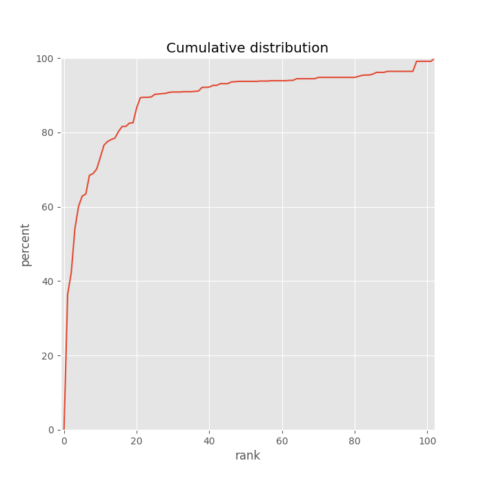

# Histogram:

- Number of quip documents: 37
- Number of issues: 103
- Normalized area under CDF: 0.889

|Ranking|Weighted Frequency|Percent|Cumulative|
|-|-|-|-|
|1|13.47|36|36|
|2|2.2|6|42|
|3|4.37|12|54|
|4|2.2|6|60|
|5|1.03|3|63|
|6|0.2|1|63|
|7|1.87|5|68|
|8|0.17|0|69|
|9|0.47|1|70|
|10|1.17|3|73|
|11|1.2|3|77|
|12|0.37|1|78|
|13|0.2|1|78|
|14|0.13|0|78|
|15|0.67|2|80|
|16|0.5|1|82|
|17|0|0|82|
|18|0.33|1|82|
|19|0.03|0|83|
|20|1.5|4|87|
|21|1.0|3|89|
|22|0.03|0|89|
|23|0|0|89|
|24|0.03|0|90|
|25|0.27|1|90|
|26|0.03|0|90|
|27|0.03|0|90|
|28|0.03|0|90|
|29|0.1|0|91|
|30|0.03|0|91|
|31|0|0|91|
|32|0|0|91|
|33|0.03|0|91|
|34|0|0|91|
|35|0|0|91|
|36|0.03|0|91|
|37|0.03|0|91|
|38|0.37|1|92|
|39|0|0|92|
|40|0.03|0|92|
|41|0.17|0|93|
|42|0|0|93|
|43|0.17|0|93|
|44|0|0|93|
|45|0|0|93|
|46|0.17|0|94|
|47|0.03|0|94|
|48|0.03|0|94|
|49|0|0|94|
|50|0|0|94|
|51|0|0|94|
|52|0|0|94|
|53|0|0|94|
|54|0.03|0|94|
|55|0|0|94|
|56|0|0|94|
|57|0.03|0|94|
|58|0|0|94|
|59|0|0|94|
|60|0|0|94|
|61|0|0|94|
|62|0.03|0|94|
|63|0|0|94|
|64|0.17|0|94|
|65|0|0|94|
|66|0|0|94|
|67|0|0|94|
|68|0|0|94|
|69|0|0|94|
|70|0.13|0|95|
|71|0|0|95|
|72|0|0|95|
|73|0|0|95|
|74|0|0|95|
|75|0|0|95|
|76|0|0|95|
|77|0|0|95|
|78|0|0|95|
|79|0|0|95|
|80|0|0|95|
|81|0.1|0|95|
|82|0.1|0|95|
|83|0.03|0|95|
|84|0|0|95|
|85|0.1|0|96|
|86|0.17|0|96|
|87|0|0|96|
|88|0|0|96|
|89|0.1|0|96|
|90|0|0|96|
|91|0|0|96|
|92|0|0|96|
|93|0|0|96|
|94|0|0|96|
|95|0|0|96|
|96|0|0|96|
|97|1.0|3|99|
|98|0|0|99|
|99|0|0|99|
|100|0|0|99|
|101|0|0|99|
|102|0.33|1|100|
|Unranked|0|0|100|

# Examples:

## [Product Spec: Editor Plugins](https://fastnode.quip.com/inEeARJyKheB)

### Top 10 retrieved:
|Rank|Document|Relevant|
|-|-|-|
|1|[JLab: prevent Fastnode completions from being filtered out on new tokens](https://github.com/khulnasoft-lab/fastnode/issues/11136)|Yes|
|2|[\[Beta\] Previously unsupported editor onboarding flow](https://github.com/khulnasoft-lab/fastnode/issues/10519)||
|3|[Python lexical completions for open ( \[ {](https://github.com/khulnasoft-lab/fastnode/issues/10896)||
|4|[Implement Char trigger suppression](https://github.com/khulnasoft-lab/fastnode/issues/10948)||
|5|[Implement char trigger suppression](https://github.com/khulnasoft-lab/fastnode/issues/10825)||
|6|[JLab: Remove space from triggering Fastnode completions](https://github.com/khulnasoft-lab/fastnode/issues/11504)||
|7|[Lexical: don't retrigger completions on empty placeholder](https://github.com/khulnasoft-lab/fastnode/issues/10626)|Yes|
|8|[Update khulnasoft-lab/plugins](https://github.com/khulnasoft-lab/fastnode/issues/10658)||
|9|[JLab: Fastnode not recognized until typing if opened after JLab](https://github.com/khulnasoft-lab/fastnode/issues/11289)||
|10|[Enable Fastnode Pro for all Fastnode Server Users](https://github.com/khulnasoft-lab/fastnode/issues/11677)||

### Relevant but not in top 10 retrieved:
|Rank|Document|Relevant|
|-|-|-|
|12|[JLab: Add docs panel toggle in command palette (3 days)](https://github.com/khulnasoft-lab/fastnode/issues/11179)|Yes|
|25|[Fastnode commands in Command Palette](https://github.com/khulnasoft-lab/fastnode/issues/11170)|Yes|
|43|[Document the encoded char trigger behavior](https://github.com/khulnasoft-lab/fastnode/issues/10670)|Yes|
|46|[Notification when plugin installed without Fastnode engine (1 day)](https://github.com/khulnasoft-lab/fastnode/issues/11172)|Yes|

## [ML Daily Logs (Q4 2020)](https://fastnode.quip.com/kwRYA5aHqcRT)

### Top 10 retrieved:
|Rank|Document|Relevant|
|-|-|-|
|1|[Python lexical completions for open ( \[ {](https://github.com/khulnasoft-lab/fastnode/issues/10896)||
|2|[Track shown completions with 2+ identifiers](https://github.com/khulnasoft-lab/fastnode/issues/10485)||
|3|[Implement Char trigger suppression](https://github.com/khulnasoft-lab/fastnode/issues/10948)||
|4|[Predictive nav: should we return results from the existing index after an ignore file is changed or wait for reindexing to complete?](https://github.com/khulnasoft-lab/fastnode/issues/12045)||
|5|[Fastnode crashes on M1 hardware](https://github.com/khulnasoft-lab/fastnode/issues/12126)||
|6|[JLab: Additional character inserted, hard to repro](https://github.com/khulnasoft-lab/fastnode/issues/11482)||
|7|[Dedupe empty parens](https://github.com/khulnasoft-lab/fastnode/issues/10908)||
|8|[Fastnode Pro: license distribution & validation](https://github.com/khulnasoft-lab/fastnode/issues/10582)||
|9|[Implement char trigger suppression](https://github.com/khulnasoft-lab/fastnode/issues/10825)||
|10|[Enable Fastnode Pro for all Fastnode Server Users](https://github.com/khulnasoft-lab/fastnode/issues/11677)||

### Relevant but not in top 10 retrieved:
|Rank|Document|Relevant|
|-|-|-|
|97|[Deduping similar completions](https://github.com/khulnasoft-lab/fastnode/issues/10368)|Yes|

## [Spec: Email Required Test](https://fastnode.quip.com/6OrhA51l7f1a)

### Top 10 retrieved:
|Rank|Document|Relevant|
|-|-|-|
|1|[Emailed required during onboarding test](https://github.com/khulnasoft-lab/fastnode/issues/12143)|Yes|
|2|[Choose Cloud v Local Engine during Copilot Onboarding – v2 (redesign)](https://github.com/khulnasoft-lab/fastnode/issues/11821)||
|3|[\[Beta\] Previously unsupported editor onboarding flow](https://github.com/khulnasoft-lab/fastnode/issues/10519)||
|4|[update onboarding file behavior](https://github.com/khulnasoft-lab/fastnode/issues/10456)||
|5|[Fastnode Pro onboarding screen](https://github.com/khulnasoft-lab/fastnode/issues/12343)||
|6|[Remove score and % from completion hint](https://github.com/khulnasoft-lab/fastnode/issues/10470)||
|7|[Lexical: Multiline completions ](https://github.com/khulnasoft-lab/fastnode/issues/10617)||
|8|[Python lexical completions for open ( \[ {](https://github.com/khulnasoft-lab/fastnode/issues/10896)||
|9|[Predictive nav: should we return results from the existing index after an ignore file is changed or wait for reindexing to complete?](https://github.com/khulnasoft-lab/fastnode/issues/12045)||
|10|[\[WIP\] Investigate experience for low-powered machines](https://github.com/khulnasoft-lab/fastnode/issues/10481)||

### Relevant but not in top 10 retrieved:
|Rank|Document|Relevant|
|-|-|-|

## [Spec: Editor Plugin Install Flow](https://fastnode.quip.com/VGaAAdpgwvnc)

### Top 10 retrieved:
|Rank|Document|Relevant|
|-|-|-|
|1|[Add Fastnode installer notification to Intellij Plugin](https://github.com/khulnasoft-lab/fastnode/issues/12072)||
|2|[Fastnode status in lower right](https://github.com/khulnasoft-lab/fastnode/issues/10476)||
|3|[Notification when plugin installed without Fastnode engine (1 day)](https://github.com/khulnasoft-lab/fastnode/issues/11172)||
|4|[JLab: Fastnode not recognized until typing if opened after JLab](https://github.com/khulnasoft-lab/fastnode/issues/11289)||
|5|[\[Beta\] Previously unsupported editor onboarding flow](https://github.com/khulnasoft-lab/fastnode/issues/10519)||
|6|[\[Javascript\] VS Code beta notification](https://github.com/khulnasoft-lab/fastnode/issues/10388)||
|7|[IntelliJ: Fastnode Pro completions UI](https://github.com/khulnasoft-lab/fastnode/issues/10760)||
|8|[JB marketplace: script to publish a plugin.zip on the marketplace](https://github.com/khulnasoft-lab/fastnode/issues/11656)||
|9|[Predictive Nav: Status Indexing](https://github.com/khulnasoft-lab/fastnode/issues/11993)||
|10|[UI: copilot startup notification](https://github.com/khulnasoft-lab/fastnode/issues/10756)||

### Relevant but not in top 10 retrieved:
|Rank|Document|Relevant|
|-|-|-|
|21|[\[VS Code\] Fastnode install flow in-editor](https://github.com/khulnasoft-lab/fastnode/issues/12320)|Yes|

## [Fastnode Pro Conversion Rate Optimization (CRO)](https://fastnode.quip.com/tIBAAzT6UDAO)

### Top 10 retrieved:
|Rank|Document|Relevant|
|-|-|-|
|1|[Track shown completions with 2+ identifiers](https://github.com/khulnasoft-lab/fastnode/issues/10485)||
|2|[Remove limit of only 1 Pro completion after Pro trials end](https://github.com/khulnasoft-lab/fastnode/issues/11346)||
|3|[\[Beta\] Previously unsupported editor onboarding flow](https://github.com/khulnasoft-lab/fastnode/issues/10519)||
|4|[Fastnode Pro: license distribution & validation](https://github.com/khulnasoft-lab/fastnode/issues/10582)||
|5|[Enable Fastnode Pro for all Fastnode Server Users](https://github.com/khulnasoft-lab/fastnode/issues/11677)||
|6|[Emailed required during onboarding test](https://github.com/khulnasoft-lab/fastnode/issues/12143)||
|7|[RC: customize trial duration](https://github.com/khulnasoft-lab/fastnode/issues/11487)|Yes|
|8|[Python lexical completions for open ( \[ {](https://github.com/khulnasoft-lab/fastnode/issues/10896)||
|9|[Fastnode status in lower right](https://github.com/khulnasoft-lab/fastnode/issues/10476)||
|10|[JLab: Additional character inserted, hard to repro](https://github.com/khulnasoft-lab/fastnode/issues/11482)||

### Relevant but not in top 10 retrieved:
|Rank|Document|Relevant|
|-|-|-|
|38|[implement cta_shown for Fastnode Pro trial CTAs](https://github.com/khulnasoft-lab/fastnode/issues/11085)|Yes|
|102|[RC: disable completions CTA](https://github.com/khulnasoft-lab/fastnode/issues/11565)|Yes|

## [Spec: Pro Cancellation Survey](https://fastnode.quip.com/rmgEAgjGJvbq)

### Top 10 retrieved:
|Rank|Document|Relevant|
|-|-|-|
|1|[Update subscription cancel flow (add churn survey)](https://github.com/khulnasoft-lab/fastnode/issues/12327)|Yes|
|2|[Track shown completions with 2+ identifiers](https://github.com/khulnasoft-lab/fastnode/issues/10485)||
|3|[Add Fastnode installer notification to Intellij Plugin](https://github.com/khulnasoft-lab/fastnode/issues/12072)||
|4|[Python lexical completions for open ( \[ {](https://github.com/khulnasoft-lab/fastnode/issues/10896)||
|5|[fan speed and/or core temperature telemetry](https://github.com/khulnasoft-lab/fastnode/issues/10550)||
|6|[Cannot type through parens in Atom](https://github.com/khulnasoft-lab/fastnode/issues/10318)||
|7|[JB marketplace: description and screenshots](https://github.com/khulnasoft-lab/fastnode/issues/11655)||
|8|[\[Javascript\] Telemetry about beta on/off and if beta is disabled](https://github.com/khulnasoft-lab/fastnode/issues/10386)||
|9|[predictive nav: technical spec for editor behavior](https://github.com/khulnasoft-lab/fastnode/issues/11899)||
|10|[\[Prod\] Copilot Settings change](https://github.com/khulnasoft-lab/fastnode/issues/10497)||

### Relevant but not in top 10 retrieved:
|Rank|Document|Relevant|
|-|-|-|

## [Subtoken QA](https://fastnode.quip.com/QJOoAUDTkyPN)

### Top 10 retrieved:
|Rank|Document|Relevant|
|-|-|-|
|1|[Python lexical completions for open ( \[ {](https://github.com/khulnasoft-lab/fastnode/issues/10896)||
|2|[Atom: Close paren not type-through-able](https://github.com/khulnasoft-lab/fastnode/issues/10552)||
|3|[Cannot type through parens in Atom](https://github.com/khulnasoft-lab/fastnode/issues/10318)||
|4|[VS Code: After choosing subtoken, completions UI does not show](https://github.com/khulnasoft-lab/fastnode/issues/10551)||
|5|[Subtoken: Doesn't show full call even if I manually re-request](https://github.com/khulnasoft-lab/fastnode/issues/10553)||
|6|[Change placeholder to ...](https://github.com/khulnasoft-lab/fastnode/issues/10798)||
|7|[... placeholders should insert as empty string](https://github.com/khulnasoft-lab/fastnode/issues/11117)||
|8|[Update Fastnode logo in Atom for Lexical](https://github.com/khulnasoft-lab/fastnode/issues/10614)||
|9|[Cases with { do not hide completions ending with syntax](https://github.com/khulnasoft-lab/fastnode/issues/10299)||
|10|[Lexical: don't retrigger completions on empty placeholder](https://github.com/khulnasoft-lab/fastnode/issues/10626)||

### Relevant but not in top 10 retrieved:
|Rank|Document|Relevant|
|-|-|-|
|15|[Test Subtoken Decoding](https://github.com/khulnasoft-lab/fastnode/issues/10570)|Yes|
|20|[Atom Subtoken: Cannot tab to end of completion](https://github.com/khulnasoft-lab/fastnode/issues/10593)|Yes|

## [Fastnode Status Spec](https://fastnode.quip.com/rVcJA1bIqZny)

### Top 10 retrieved:
|Rank|Document|Relevant|
|-|-|-|
|1|[Predictive nav: should we return results from the existing index after an ignore file is changed or wait for reindexing to complete?](https://github.com/khulnasoft-lab/fastnode/issues/12045)||
|2|[Implement completion ending in syntax whitelists for all langs](https://github.com/khulnasoft-lab/fastnode/issues/11846)||
|3|[Fastnode status in lower right](https://github.com/khulnasoft-lab/fastnode/issues/10476)||
|4|[Update status icon to include model state](https://github.com/khulnasoft-lab/fastnode/issues/11798)|Yes|
|5|[Update Fastnode logo in Atom for Lexical](https://github.com/khulnasoft-lab/fastnode/issues/10614)||
|6|[Enable Fastnode Pro for all Fastnode Server Users](https://github.com/khulnasoft-lab/fastnode/issues/11677)||
|7|[\[Beta\] Previously unsupported editor onboarding flow](https://github.com/khulnasoft-lab/fastnode/issues/10519)||
|8|[Add Fastnode installer notification to Intellij Plugin](https://github.com/khulnasoft-lab/fastnode/issues/12072)||
|9|[JLab: Fastnode not recognized until typing if opened after JLab](https://github.com/khulnasoft-lab/fastnode/issues/11289)||
|10|[Predictive Nav: Status Indexing](https://github.com/khulnasoft-lab/fastnode/issues/11993)||

### Relevant but not in top 10 retrieved:
|Rank|Document|Relevant|
|-|-|-|

## [Meeting Notes: Predictive Code Navigation](https://fastnode.quip.com/jnnGAkfOHHbh)

### Top 10 retrieved:
|Rank|Document|Relevant|
|-|-|-|
|1|[Predictive nav: should we return results from the existing index after an ignore file is changed or wait for reindexing to complete?](https://github.com/khulnasoft-lab/fastnode/issues/12045)||
|2|[predictive nav: technical spec for editor behavior](https://github.com/khulnasoft-lab/fastnode/issues/11899)||
|3|[Python lexical completions for open ( \[ {](https://github.com/khulnasoft-lab/fastnode/issues/10896)||
|4|[Fastnode crashes on M1 hardware](https://github.com/khulnasoft-lab/fastnode/issues/12126)||
|5|[\[Beta\] Previously unsupported editor onboarding flow](https://github.com/khulnasoft-lab/fastnode/issues/10519)||
|6|[Update khulnasoft-lab/plugins](https://github.com/khulnasoft-lab/fastnode/issues/10658)||
|7|[Predictive Nav: Status Indexing](https://github.com/khulnasoft-lab/fastnode/issues/11993)||
|8|[Implement Char trigger suppression](https://github.com/khulnasoft-lab/fastnode/issues/10948)||
|9|[Fastnode Pro: license distribution & validation](https://github.com/khulnasoft-lab/fastnode/issues/10582)||
|10|[predictive nav: editor decoration UI](https://github.com/khulnasoft-lab/fastnode/issues/11934)||

### Relevant but not in top 10 retrieved:
|Rank|Document|Relevant|
|-|-|-|
|20|[Remove Empty Line Errors](https://github.com/khulnasoft-lab/fastnode/issues/12248)|Yes|

## [Product Spec: Fastnode Pro](https://fastnode.quip.com/xLmuAOBMPM4K)

### Top 10 retrieved:
|Rank|Document|Relevant|
|-|-|-|
|1|[Remove limit of only 1 Pro completion after Pro trials end](https://github.com/khulnasoft-lab/fastnode/issues/11346)|Yes|
|2|[\[Beta\] Previously unsupported editor onboarding flow](https://github.com/khulnasoft-lab/fastnode/issues/10519)||
|3|[Fastnode Pro: license distribution & validation](https://github.com/khulnasoft-lab/fastnode/issues/10582)||
|4|[Python lexical completions for open ( \[ {](https://github.com/khulnasoft-lab/fastnode/issues/10896)||
|5|[Enable Fastnode Pro for all Fastnode Server Users](https://github.com/khulnasoft-lab/fastnode/issues/11677)||
|6|[\[Javascript\] VS Code beta notification](https://github.com/khulnasoft-lab/fastnode/issues/10388)||
|7|[Implement Char trigger suppression](https://github.com/khulnasoft-lab/fastnode/issues/10948)||
|8|[Fastnode status in lower right](https://github.com/khulnasoft-lab/fastnode/issues/10476)||
|9|[IntelliJ: Fastnode Pro completions UI](https://github.com/khulnasoft-lab/fastnode/issues/10760)|Yes|
|10|[Cannot type through parens in Atom](https://github.com/khulnasoft-lab/fastnode/issues/10318)||

### Relevant but not in top 10 retrieved:
|Rank|Document|Relevant|
|-|-|-|
|14|[Fastnode Pro "completion UI CTA"](https://github.com/khulnasoft-lab/fastnode/issues/11140)|Yes|
|25|[UI: copilot startup notification](https://github.com/khulnasoft-lab/fastnode/issues/10756)|Yes|
|29|[UI: copilot dashboard icons](https://github.com/khulnasoft-lab/fastnode/issues/10757)|Yes|
|70|[UI: copilot settings page changes](https://github.com/khulnasoft-lab/fastnode/issues/10758)|Yes|
|81|[UI: copilot login / signup flow](https://github.com/khulnasoft-lab/fastnode/issues/10759)|Yes|
|82|[Fastnode Pro web login flow updates](https://github.com/khulnasoft-lab/fastnode/issues/11083)|Yes|
|85|[Web: Fastnode Pro login flow](https://github.com/khulnasoft-lab/fastnode/issues/10767)|Yes|
|89|[Keyword arg completions should be in Fastnode Basic](https://github.com/khulnasoft-lab/fastnode/issues/11250)|Yes|

## [JupyterLab + Extension Integration](https://fastnode.quip.com/MQ3JAXhoGd9s)

### Top 10 retrieved:
|Rank|Document|Relevant|
|-|-|-|
|1|[JLab: Remove space from triggering Fastnode completions](https://github.com/khulnasoft-lab/fastnode/issues/11504)||
|2|[Add data on users using .ipynb extension in PyCharm Pro](https://github.com/khulnasoft-lab/fastnode/issues/11401)||
|3|[JLab: Fastnode not recognized until typing if opened after JLab](https://github.com/khulnasoft-lab/fastnode/issues/11289)|Yes|
|4|[Predictive nav: should we return results from the existing index after an ignore file is changed or wait for reindexing to complete?](https://github.com/khulnasoft-lab/fastnode/issues/12045)||
|5|[Vim: support for all-language lexical](https://github.com/khulnasoft-lab/fastnode/issues/11793)||
|6|[Atom, VS Code: support for all-language lexical](https://github.com/khulnasoft-lab/fastnode/issues/11791)||
|7|[IntelliJ support for all-language lexical](https://github.com/khulnasoft-lab/fastnode/issues/11790)||
|8|[Sublime: support for all-language lexical](https://github.com/khulnasoft-lab/fastnode/issues/11792)||
|9|[Enable Fastnode Pro for all Fastnode Server Users](https://github.com/khulnasoft-lab/fastnode/issues/11677)||
|10|[JB marketplace: script to publish a plugin.zip on the marketplace](https://github.com/khulnasoft-lab/fastnode/issues/11656)||

### Relevant but not in top 10 retrieved:
|Rank|Document|Relevant|
|-|-|-|

## [Spec: Code Completions Edge Cases](https://fastnode.quip.com/UKttAMwpI6oY)

### Top 10 retrieved:
|Rank|Document|Relevant|
|-|-|-|
|1|[Completions not ranked by case-sensitivity](https://github.com/khulnasoft-lab/fastnode/issues/11152)|Yes|
|2|[Update khulnasoft-lab/plugins](https://github.com/khulnasoft-lab/fastnode/issues/10658)||
|3|[Implement close syntax behavior for <>](https://github.com/khulnasoft-lab/fastnode/issues/11812)||
|4|[Implement Char trigger suppression](https://github.com/khulnasoft-lab/fastnode/issues/10948)||
|5|[Remove limit of only 1 Pro completion after Pro trials end](https://github.com/khulnasoft-lab/fastnode/issues/11346)||
|6|[Request local & server completions in parallel](https://github.com/khulnasoft-lab/fastnode/issues/11587)||
|7|[Cases with { do not hide completions ending with syntax](https://github.com/khulnasoft-lab/fastnode/issues/10299)||
|8|[Fastnode status in lower right](https://github.com/khulnasoft-lab/fastnode/issues/10476)||
|9|[Keyword arg completions should be in Fastnode Basic](https://github.com/khulnasoft-lab/fastnode/issues/11250)||
|10|[Update status icon to include model state](https://github.com/khulnasoft-lab/fastnode/issues/11798)||

### Relevant but not in top 10 retrieved:
|Rank|Document|Relevant|
|-|-|-|

## [Predictive Code Navigation API](https://fastnode.quip.com/Ov21AXMdiAsz)

### Top 10 retrieved:
|Rank|Document|Relevant|
|-|-|-|
|1|[predictive nav: request related files (fastnoded)](https://github.com/khulnasoft-lab/fastnode/issues/11932)|Yes|
|2|[Predictive Nav: Status Indexing](https://github.com/khulnasoft-lab/fastnode/issues/11993)||
|3|[predictive nav: open related file (fastnoded -> editor)](https://github.com/khulnasoft-lab/fastnode/issues/11933)||
|4|[Predictive nav: should we return results from the existing index after an ignore file is changed or wait for reindexing to complete?](https://github.com/khulnasoft-lab/fastnode/issues/12045)||
|5|[Update status icon to include model state](https://github.com/khulnasoft-lab/fastnode/issues/11798)||
|6|[predictive nav: technical spec for editor behavior](https://github.com/khulnasoft-lab/fastnode/issues/11899)||
|7|[Python lexical completions for open ( \[ {](https://github.com/khulnasoft-lab/fastnode/issues/10896)||
|8|[Completion UI hides before showing again with new completions](https://github.com/khulnasoft-lab/fastnode/issues/11502)||
|9|[Fastnode crashes on M1 hardware](https://github.com/khulnasoft-lab/fastnode/issues/12126)||
|10|[Enable Fastnode Pro for all Fastnode Server Users](https://github.com/khulnasoft-lab/fastnode/issues/11677)||

### Relevant but not in top 10 retrieved:
|Rank|Document|Relevant|
|-|-|-|

## [Smarter Budgeting Draft Thoughts](https://fastnode.quip.com/XDIyAQRyjUz4)

### Top 10 retrieved:
|Rank|Document|Relevant|
|-|-|-|
|1|[fan speed and/or core temperature telemetry](https://github.com/khulnasoft-lab/fastnode/issues/10550)|Yes|
|2|[Fastnode crashes on M1 hardware](https://github.com/khulnasoft-lab/fastnode/issues/12126)||
|3|[predictive nav: technical spec for editor behavior](https://github.com/khulnasoft-lab/fastnode/issues/11899)||
|4|[IntelliJ: Fastnode Pro completions UI](https://github.com/khulnasoft-lab/fastnode/issues/10760)||
|5|[JLab: Fastnode not recognized until typing if opened after JLab](https://github.com/khulnasoft-lab/fastnode/issues/11289)||
|6|[\[Beta\] Previously unsupported editor onboarding flow](https://github.com/khulnasoft-lab/fastnode/issues/10519)||
|7|[Python lexical completions for open ( \[ {](https://github.com/khulnasoft-lab/fastnode/issues/10896)||
|8|[Predictive nav: should we return results from the existing index after an ignore file is changed or wait for reindexing to complete?](https://github.com/khulnasoft-lab/fastnode/issues/12045)||
|9|[Remove score and % from completion hint](https://github.com/khulnasoft-lab/fastnode/issues/10470)||
|10|[Implement Char trigger suppression](https://github.com/khulnasoft-lab/fastnode/issues/10948)||

### Relevant but not in top 10 retrieved:
|Rank|Document|Relevant|
|-|-|-|

## [Product Spec: Subtoken Decoding 2.0](https://fastnode.quip.com/Dj21AElasWkr)

### Top 10 retrieved:
|Rank|Document|Relevant|
|-|-|-|
|1|[Python lexical completions for open ( \[ {](https://github.com/khulnasoft-lab/fastnode/issues/10896)||
|2|[Subtoken: Doesn't show full call even if I manually re-request](https://github.com/khulnasoft-lab/fastnode/issues/10553)|Yes|
|3|[Atom: Close paren not type-through-able](https://github.com/khulnasoft-lab/fastnode/issues/10552)|Yes|
|4|[Cannot type through parens in Atom](https://github.com/khulnasoft-lab/fastnode/issues/10318)||
|5|[Cases with { do not hide completions ending with syntax](https://github.com/khulnasoft-lab/fastnode/issues/10299)||
|6|[Implement Char trigger suppression](https://github.com/khulnasoft-lab/fastnode/issues/10948)||
|7|[Dedupe empty parens](https://github.com/khulnasoft-lab/fastnode/issues/10908)||
|8|[Change placeholder to ...](https://github.com/khulnasoft-lab/fastnode/issues/10798)||
|9|[VS Code: After choosing subtoken, completions UI does not show](https://github.com/khulnasoft-lab/fastnode/issues/10551)|Yes|
|10|[... placeholders should insert as empty string](https://github.com/khulnasoft-lab/fastnode/issues/11117)||

### Relevant but not in top 10 retrieved:
|Rank|Document|Relevant|
|-|-|-|

## [Fastnode Pro Technical Overview](https://fastnode.quip.com/uqtOAjGzyqaz)

### Top 10 retrieved:
|Rank|Document|Relevant|
|-|-|-|
|1|[Fastnode Pro: license distribution & validation](https://github.com/khulnasoft-lab/fastnode/issues/10582)|Yes|
|2|[predictive nav: technical spec for editor behavior](https://github.com/khulnasoft-lab/fastnode/issues/11899)||
|3|[Enable Fastnode Pro for all Fastnode Server Users](https://github.com/khulnasoft-lab/fastnode/issues/11677)||
|4|[JB marketplace: license](https://github.com/khulnasoft-lab/fastnode/issues/11653)||
|5|[Python lexical completions for open ( \[ {](https://github.com/khulnasoft-lab/fastnode/issues/10896)||
|6|[Update subscription cancel flow (add churn survey)](https://github.com/khulnasoft-lab/fastnode/issues/12327)||
|7|[initial version of Fastnode Server client configuration flow ](https://github.com/khulnasoft-lab/fastnode/issues/11588)||
|8|[\[Beta\] Previously unsupported editor onboarding flow](https://github.com/khulnasoft-lab/fastnode/issues/10519)||
|9|[Track shown completions with 2+ identifiers](https://github.com/khulnasoft-lab/fastnode/issues/10485)||
|10|[Remove limit of only 1 Pro completion after Pro trials end](https://github.com/khulnasoft-lab/fastnode/issues/11346)||

### Relevant but not in top 10 retrieved:
|Rank|Document|Relevant|
|-|-|-|

## [Publishing Fastnode on the JetBrains Marketplace](https://fastnode.quip.com/CFisAB0N3iMF)

### Top 10 retrieved:
|Rank|Document|Relevant|
|-|-|-|
|1|[JB marketplace: script to publish a plugin.zip on the marketplace](https://github.com/khulnasoft-lab/fastnode/issues/11656)|Yes|
|2|[JB marketplace: license](https://github.com/khulnasoft-lab/fastnode/issues/11653)|Yes|
|3|[JB marketplace: description and screenshots](https://github.com/khulnasoft-lab/fastnode/issues/11655)|Yes|
|4|[\[Beta\] Previously unsupported editor onboarding flow](https://github.com/khulnasoft-lab/fastnode/issues/10519)||
|5|[predictive nav: technical spec for editor behavior](https://github.com/khulnasoft-lab/fastnode/issues/11899)||
|6|[Add Fastnode installer notification to Intellij Plugin](https://github.com/khulnasoft-lab/fastnode/issues/12072)||
|7|[Implement Char trigger suppression](https://github.com/khulnasoft-lab/fastnode/issues/10948)||
|8|[fan speed and/or core temperature telemetry](https://github.com/khulnasoft-lab/fastnode/issues/10550)||
|9|[Enable Fastnode Pro for all Fastnode Server Users](https://github.com/khulnasoft-lab/fastnode/issues/11677)||
|10|[IntelliJ: Fastnode Pro completions UI](https://github.com/khulnasoft-lab/fastnode/issues/10760)||

### Relevant but not in top 10 retrieved:
|Rank|Document|Relevant|
|-|-|-|

## [Spec: Onboarding Screen Showing KES/Cloud Options](https://fastnode.quip.com/lIWoAdyaOf7D)

### Top 10 retrieved:
|Rank|Document|Relevant|
|-|-|-|
|1|[Choose Cloud v Local Engine during Copilot Onboarding – v2 (redesign)](https://github.com/khulnasoft-lab/fastnode/issues/11821)|Yes|
|2|[Fastnode Pro onboarding screen](https://github.com/khulnasoft-lab/fastnode/issues/12343)||
|3|[update onboarding file behavior](https://github.com/khulnasoft-lab/fastnode/issues/10456)||
|4|[\[Beta\] Previously unsupported editor onboarding flow](https://github.com/khulnasoft-lab/fastnode/issues/10519)||
|5|[Emailed required during onboarding test](https://github.com/khulnasoft-lab/fastnode/issues/12143)||
|6|[Enable Fastnode Pro for all Fastnode Server Users](https://github.com/khulnasoft-lab/fastnode/issues/11677)||
|7|[Python lexical completions for open ( \[ {](https://github.com/khulnasoft-lab/fastnode/issues/10896)||
|8|[Track shown completions with 2+ identifiers](https://github.com/khulnasoft-lab/fastnode/issues/10485)||
|9|[JB marketplace: description and screenshots](https://github.com/khulnasoft-lab/fastnode/issues/11655)||
|10|[fan speed and/or core temperature telemetry](https://github.com/khulnasoft-lab/fastnode/issues/10550)||

### Relevant but not in top 10 retrieved:
|Rank|Document|Relevant|
|-|-|-|

## [Lexical all languages](https://fastnode.quip.com/c0WgAlHPJtoa)

### Top 10 retrieved:
|Rank|Document|Relevant|
|-|-|-|
|1|[Python lexical completions for open ( \[ {](https://github.com/khulnasoft-lab/fastnode/issues/10896)||
|2|[Implement close syntax behavior for <>](https://github.com/khulnasoft-lab/fastnode/issues/11812)||
|3|[Trim trailing newlines from completion insert and display text](https://github.com/khulnasoft-lab/fastnode/issues/11815)|Yes|
|4|[Update Fastnode logo in Atom for Lexical](https://github.com/khulnasoft-lab/fastnode/issues/10614)||
|5|[Implement Char trigger suppression](https://github.com/khulnasoft-lab/fastnode/issues/10948)||
|6|[Sublime: support for all-language lexical](https://github.com/khulnasoft-lab/fastnode/issues/11792)|Yes|
|7|[IntelliJ support for all-language lexical](https://github.com/khulnasoft-lab/fastnode/issues/11790)|Yes|
|8|[Track shown completions with 2+ identifiers](https://github.com/khulnasoft-lab/fastnode/issues/10485)||
|9|[\[Beta\] Previously unsupported editor onboarding flow](https://github.com/khulnasoft-lab/fastnode/issues/10519)||
|10|[Atom, VS Code: support for all-language lexical](https://github.com/khulnasoft-lab/fastnode/issues/11791)|Yes|

### Relevant but not in top 10 retrieved:
|Rank|Document|Relevant|
|-|-|-|
|11|[Vim: support for all-language lexical](https://github.com/khulnasoft-lab/fastnode/issues/11793)|Yes|
|12|[Trim trailing horizontal space from display text but leave it in the insert text](https://github.com/khulnasoft-lab/fastnode/issues/11814)|Yes|

## [Product Spec: Lexical Python](https://fastnode.quip.com/6TeKAQGDO55w)

### Top 10 retrieved:
|Rank|Document|Relevant|
|-|-|-|
|1|[Python lexical completions for open ( \[ {](https://github.com/khulnasoft-lab/fastnode/issues/10896)|Yes|
|2|[Lexical Python static placeholders](https://github.com/khulnasoft-lab/fastnode/issues/10797)||
|3|[Change placeholder to ...](https://github.com/khulnasoft-lab/fastnode/issues/10798)||
|4|[... placeholders should insert as empty string](https://github.com/khulnasoft-lab/fastnode/issues/11117)||
|5|[Cannot type through parens in Atom](https://github.com/khulnasoft-lab/fastnode/issues/10318)||
|6|[Dedupe empty parens](https://github.com/khulnasoft-lab/fastnode/issues/10908)||
|7|[Lexical: don't retrigger completions on empty placeholder](https://github.com/khulnasoft-lab/fastnode/issues/10626)||
|8|[Remove "unknown" hint](https://github.com/khulnasoft-lab/fastnode/issues/10809)||
|9|[Implement Char trigger suppression](https://github.com/khulnasoft-lab/fastnode/issues/10948)||
|10|[Cases with { do not hide completions ending with syntax](https://github.com/khulnasoft-lab/fastnode/issues/10299)||

### Relevant but not in top 10 retrieved:
|Rank|Document|Relevant|
|-|-|-|

## [Product Spec: Lexical Completions](https://fastnode.quip.com/HRLNAsgV9IYb)

### Top 10 retrieved:
|Rank|Document|Relevant|
|-|-|-|
|1|[\[Beta\] Previously unsupported editor onboarding flow](https://github.com/khulnasoft-lab/fastnode/issues/10519)|Yes|
|2|[Python lexical completions for open ( \[ {](https://github.com/khulnasoft-lab/fastnode/issues/10896)|Yes|
|3|[Implement Char trigger suppression](https://github.com/khulnasoft-lab/fastnode/issues/10948)|Yes|
|4|[Cases with { do not hide completions ending with syntax](https://github.com/khulnasoft-lab/fastnode/issues/10299)|Yes|
|5|[Implement char trigger suppression](https://github.com/khulnasoft-lab/fastnode/issues/10825)|Yes|
|6|[Fastnode status in lower right](https://github.com/khulnasoft-lab/fastnode/issues/10476)|Yes|
|7|[Lexical Python static placeholders](https://github.com/khulnasoft-lab/fastnode/issues/10797)|Yes|
|8|[Lexical: don't retrigger completions on empty placeholder](https://github.com/khulnasoft-lab/fastnode/issues/10626)||
|9|[Cannot type through parens in Atom](https://github.com/khulnasoft-lab/fastnode/issues/10318)|Yes|
|10|[Track shown completions with 2+ identifiers](https://github.com/khulnasoft-lab/fastnode/issues/10485)||

### Relevant but not in top 10 retrieved:
|Rank|Document|Relevant|
|-|-|-|
|11|[\[Javascript\] VS Code beta notification](https://github.com/khulnasoft-lab/fastnode/issues/10388)|Yes|
|12|[Remove beta dialog when user disables checkbox](https://github.com/khulnasoft-lab/fastnode/issues/10837)|Yes|
|13|[\[Javascript\] Enable JS for 5% of users](https://github.com/khulnasoft-lab/fastnode/issues/10387)|Yes|
|14|[Change placeholder to ...](https://github.com/khulnasoft-lab/fastnode/issues/10798)|Yes|
|19|[Remove score and % from completion hint](https://github.com/khulnasoft-lab/fastnode/issues/10470)|Yes|
|22|[Set max of newlines in a row to 1](https://github.com/khulnasoft-lab/fastnode/issues/10898)|Yes|
|24|[Lexical: Multiline completions ](https://github.com/khulnasoft-lab/fastnode/issues/10617)|Yes|
|26|[update onboarding file behavior](https://github.com/khulnasoft-lab/fastnode/issues/10456)|Yes|
|27|[Remove "unknown" hint](https://github.com/khulnasoft-lab/fastnode/issues/10809)|Yes|
|28|[Implement completion ending in syntax whitelists for all langs](https://github.com/khulnasoft-lab/fastnode/issues/11846)|Yes|
|30|[Dedupe empty parens](https://github.com/khulnasoft-lab/fastnode/issues/10908)|Yes|
|33|[Update Fastnode logo in Atom for Lexical](https://github.com/khulnasoft-lab/fastnode/issues/10614)|Yes|
|36|[\[Prod\] Menubar, update Support](https://github.com/khulnasoft-lab/fastnode/issues/10498)|Yes|
|37|[Implement close syntax behavior for <>](https://github.com/khulnasoft-lab/fastnode/issues/11812)|Yes|
|38|[\[Javascript\] Telemetry about beta on/off and if beta is disabled](https://github.com/khulnasoft-lab/fastnode/issues/10386)|Yes|
|40|[Settings is missing Javascript checkbox](https://github.com/khulnasoft-lab/fastnode/issues/10834)|Yes|
|47|[\[Prod\] Copilot Settings change](https://github.com/khulnasoft-lab/fastnode/issues/10497)|Yes|
|48|[Completions not triggered when typing in backticks](https://github.com/khulnasoft-lab/fastnode/issues/10479)|Yes|
|54|[Copilot: On "File Issue", open copilot logs screen and bring it to focus](https://github.com/khulnasoft-lab/fastnode/issues/10833)|Yes|
|57|[Rename checkboxes to "Enable \[lang\] completions"](https://github.com/khulnasoft-lab/fastnode/issues/10835)|Yes|
|62|[Remove Nesting in GoLand](https://github.com/khulnasoft-lab/fastnode/issues/10326)|Yes|
|70|[\[Prod\] Copilot Dashboard changes ](https://github.com/khulnasoft-lab/fastnode/issues/10457)|Yes|
|83|[Deduping similar completions](https://github.com/khulnasoft-lab/fastnode/issues/10368)|Yes|

## [JupyterLab testing](https://fastnode.quip.com/huBeAbaOJBvp)

### Top 10 retrieved:
|Rank|Document|Relevant|
|-|-|-|
|1|[JLab: Remove space from triggering Fastnode completions](https://github.com/khulnasoft-lab/fastnode/issues/11504)||
|2|[Completion UI hides before showing again with new completions](https://github.com/khulnasoft-lab/fastnode/issues/11502)||
|3|[Completions not ranked by case-sensitivity](https://github.com/khulnasoft-lab/fastnode/issues/11152)||
|4|[JLab: Fastnode not recognized until typing if opened after JLab](https://github.com/khulnasoft-lab/fastnode/issues/11289)||
|5|[Python lexical completions for open ( \[ {](https://github.com/khulnasoft-lab/fastnode/issues/10896)||
|6|[\[Beta\] Previously unsupported editor onboarding flow](https://github.com/khulnasoft-lab/fastnode/issues/10519)||
|7|[Implement Char trigger suppression](https://github.com/khulnasoft-lab/fastnode/issues/10948)||
|8|[JLab: prevent Fastnode completions from being filtered out on new tokens](https://github.com/khulnasoft-lab/fastnode/issues/11136)||
|9|[Set max of newlines in a row to 1](https://github.com/khulnasoft-lab/fastnode/issues/10898)||
|10|[Reduce Kernel completions triggers](https://github.com/khulnasoft-lab/fastnode/issues/11450)|Yes|

### Relevant but not in top 10 retrieved:
|Rank|Document|Relevant|
|-|-|-|

## [Proposal: Jupyter Notebook support in other IDEs](https://fastnode.quip.com/qX0SA7ySe6e8)

### Top 10 retrieved:
|Rank|Document|Relevant|
|-|-|-|
|1|[Add data on users using .ipynb extension in PyCharm Pro](https://github.com/khulnasoft-lab/fastnode/issues/11401)|Yes|
|2|[JLab: Remove space from triggering Fastnode completions](https://github.com/khulnasoft-lab/fastnode/issues/11504)||
|3|[Atom, VS Code: support for all-language lexical](https://github.com/khulnasoft-lab/fastnode/issues/11791)||
|4|[Vim: support for all-language lexical](https://github.com/khulnasoft-lab/fastnode/issues/11793)||
|5|[IntelliJ support for all-language lexical](https://github.com/khulnasoft-lab/fastnode/issues/11790)||
|6|[Sublime: support for all-language lexical](https://github.com/khulnasoft-lab/fastnode/issues/11792)||
|7|[\[Beta\] Previously unsupported editor onboarding flow](https://github.com/khulnasoft-lab/fastnode/issues/10519)||
|8|[Document the encoded char trigger behavior](https://github.com/khulnasoft-lab/fastnode/issues/10670)||
|9|[\[Prod\] Menubar, update Support](https://github.com/khulnasoft-lab/fastnode/issues/10498)||
|10|[JLab: Fastnode not recognized until typing if opened after JLab](https://github.com/khulnasoft-lab/fastnode/issues/11289)||

### Relevant but not in top 10 retrieved:
|Rank|Document|Relevant|
|-|-|-|

## [Predictive Nav API Overview](https://fastnode.quip.com/3ZdeAi06BG5P)

### Top 10 retrieved:
|Rank|Document|Relevant|
|-|-|-|
|1|[predictive nav: technical spec for editor behavior](https://github.com/khulnasoft-lab/fastnode/issues/11899)||
|2|[predictive nav: open related file (fastnoded -> editor)](https://github.com/khulnasoft-lab/fastnode/issues/11933)|Yes|
|3|[predictive nav: request related files (fastnoded)](https://github.com/khulnasoft-lab/fastnode/issues/11932)||
|4|[Python lexical completions for open ( \[ {](https://github.com/khulnasoft-lab/fastnode/issues/10896)||
|5|[Predictive Nav: Status Indexing](https://github.com/khulnasoft-lab/fastnode/issues/11993)||
|6|[update onboarding file behavior](https://github.com/khulnasoft-lab/fastnode/issues/10456)||
|7|[predictive nav: editor decoration UI](https://github.com/khulnasoft-lab/fastnode/issues/11934)||
|8|[Fastnode crashes on M1 hardware](https://github.com/khulnasoft-lab/fastnode/issues/12126)||
|9|[JLab: Remove space from triggering Fastnode completions](https://github.com/khulnasoft-lab/fastnode/issues/11504)||
|10|[JLab: Fastnode not recognized until typing if opened after JLab](https://github.com/khulnasoft-lab/fastnode/issues/11289)||

### Relevant but not in top 10 retrieved:
|Rank|Document|Relevant|
|-|-|-|

## [Timelines](https://fastnode.quip.com/zACuAeiVB696)

### Top 10 retrieved:
|Rank|Document|Relevant|
|-|-|-|
|1|[Update Fastnode logo in Atom for Lexical](https://github.com/khulnasoft-lab/fastnode/issues/10614)||
|2|[\[Beta\] Previously unsupported editor onboarding flow](https://github.com/khulnasoft-lab/fastnode/issues/10519)||
|3|[Add Fastnode installer notification to Intellij Plugin](https://github.com/khulnasoft-lab/fastnode/issues/12072)||
|4|[\[Javascript\] VS Code beta notification](https://github.com/khulnasoft-lab/fastnode/issues/10388)||
|5|[update onboarding file behavior](https://github.com/khulnasoft-lab/fastnode/issues/10456)||
|6|[JLab: Additional character inserted, hard to repro](https://github.com/khulnasoft-lab/fastnode/issues/11482)||
|7|[Track shown completions with 2+ identifiers](https://github.com/khulnasoft-lab/fastnode/issues/10485)|Yes|
|8|[Implement Char trigger suppression](https://github.com/khulnasoft-lab/fastnode/issues/10948)||
|9|[Fastnode Pro: license distribution & validation](https://github.com/khulnasoft-lab/fastnode/issues/10582)||
|10|[JLab: Remove space from triggering Fastnode completions](https://github.com/khulnasoft-lab/fastnode/issues/11504)||

### Relevant but not in top 10 retrieved:
|Rank|Document|Relevant|
|-|-|-|

## [JupyterLab Beta Instructions](https://fastnode.quip.com/RY3bA3O25AJv)

### Top 10 retrieved:
|Rank|Document|Relevant|
|-|-|-|
|1|[JLab: Fastnode not recognized until typing if opened after JLab](https://github.com/khulnasoft-lab/fastnode/issues/11289)||
|2|[JLab: Remove space from triggering Fastnode completions](https://github.com/khulnasoft-lab/fastnode/issues/11504)||
|3|[JLab: Additional character inserted, hard to repro](https://github.com/khulnasoft-lab/fastnode/issues/11482)|Yes|
|4|[Add data on users using .ipynb extension in PyCharm Pro](https://github.com/khulnasoft-lab/fastnode/issues/11401)||
|5|[Fastnode crashes on M1 hardware](https://github.com/khulnasoft-lab/fastnode/issues/12126)||
|6|[JB marketplace: script to publish a plugin.zip on the marketplace](https://github.com/khulnasoft-lab/fastnode/issues/11656)||
|7|[Python lexical completions for open ( \[ {](https://github.com/khulnasoft-lab/fastnode/issues/10896)||
|8|[Test Subtoken Decoding](https://github.com/khulnasoft-lab/fastnode/issues/10570)||
|9|[RC: customize trial duration](https://github.com/khulnasoft-lab/fastnode/issues/11487)||
|10|[Update status icon to include model state](https://github.com/khulnasoft-lab/fastnode/issues/11798)||

### Relevant but not in top 10 retrieved:
|Rank|Document|Relevant|
|-|-|-|

## [Spec: Completions Metrics](https://fastnode.quip.com/MoZUADmTwdIn)

### Top 10 retrieved:
|Rank|Document|Relevant|
|-|-|-|
|1|[Implement Char trigger suppression](https://github.com/khulnasoft-lab/fastnode/issues/10948)||
|2|[Python lexical completions for open ( \[ {](https://github.com/khulnasoft-lab/fastnode/issues/10896)||
|3|[completion "accepted" metrics](https://github.com/khulnasoft-lab/fastnode/issues/11733)|Yes|
|4|[Reduce Kernel completions triggers](https://github.com/khulnasoft-lab/fastnode/issues/11450)||
|5|[Cannot type through parens in Atom](https://github.com/khulnasoft-lab/fastnode/issues/10318)||
|6|[Track shown completions with 2+ identifiers](https://github.com/khulnasoft-lab/fastnode/issues/10485)||
|7|[Atom: Close paren not type-through-able](https://github.com/khulnasoft-lab/fastnode/issues/10552)||
|8|[Implement char trigger suppression](https://github.com/khulnasoft-lab/fastnode/issues/10825)||
|9|[Fastnode status in lower right](https://github.com/khulnasoft-lab/fastnode/issues/10476)||
|10|[predictive nav: request related files (fastnoded)](https://github.com/khulnasoft-lab/fastnode/issues/11932)||

### Relevant but not in top 10 retrieved:
|Rank|Document|Relevant|
|-|-|-|
|16|[Expose and document completion selected API endpoint](https://github.com/khulnasoft-lab/fastnode/issues/11638)|Yes|

## [Product Spec: Support v2](https://fastnode.quip.com/D53eAsGe1fnT)

### Top 10 retrieved:
|Rank|Document|Relevant|
|-|-|-|
|1|[Update khulnasoft-lab/plugins](https://github.com/khulnasoft-lab/fastnode/issues/10658)|Yes|
|2|[Fastnode Pro: license distribution & validation](https://github.com/khulnasoft-lab/fastnode/issues/10582)||
|3|[Python lexical completions for open ( \[ {](https://github.com/khulnasoft-lab/fastnode/issues/10896)||
|4|[Enable Fastnode Pro for all Fastnode Server Users](https://github.com/khulnasoft-lab/fastnode/issues/11677)||
|5|[\[Beta\] Previously unsupported editor onboarding flow](https://github.com/khulnasoft-lab/fastnode/issues/10519)||
|6|[JB marketplace: script to publish a plugin.zip on the marketplace](https://github.com/khulnasoft-lab/fastnode/issues/11656)||
|7|[Fastnode status in lower right](https://github.com/khulnasoft-lab/fastnode/issues/10476)||
|8|[Fastnode crashes on M1 hardware](https://github.com/khulnasoft-lab/fastnode/issues/12126)||
|9|[JLab: Additional character inserted, hard to repro](https://github.com/khulnasoft-lab/fastnode/issues/11482)||
|10|[\[Prod\] Menubar, update Support](https://github.com/khulnasoft-lab/fastnode/issues/10498)||

### Relevant but not in top 10 retrieved:
|Rank|Document|Relevant|
|-|-|-|

## [Spec: Fastnode Pro Onboarding Screen](https://fastnode.quip.com/EGTcAn0bbW2d)

### Top 10 retrieved:
|Rank|Document|Relevant|
|-|-|-|
|1|[Emailed required during onboarding test](https://github.com/khulnasoft-lab/fastnode/issues/12143)||
|2|[Choose Cloud v Local Engine during Copilot Onboarding – v2 (redesign)](https://github.com/khulnasoft-lab/fastnode/issues/11821)||
|3|[Fastnode Pro onboarding screen](https://github.com/khulnasoft-lab/fastnode/issues/12343)|Yes|
|4|[\[Beta\] Previously unsupported editor onboarding flow](https://github.com/khulnasoft-lab/fastnode/issues/10519)||
|5|[update onboarding file behavior](https://github.com/khulnasoft-lab/fastnode/issues/10456)||
|6|[Python lexical completions for open ( \[ {](https://github.com/khulnasoft-lab/fastnode/issues/10896)||
|7|[Add Fastnode installer notification to Intellij Plugin](https://github.com/khulnasoft-lab/fastnode/issues/12072)||
|8|[Track shown completions with 2+ identifiers](https://github.com/khulnasoft-lab/fastnode/issues/10485)||
|9|[Remove limit of only 1 Pro completion after Pro trials end](https://github.com/khulnasoft-lab/fastnode/issues/11346)||
|10|[Fastnode Pro: license distribution & validation](https://github.com/khulnasoft-lab/fastnode/issues/10582)||

### Relevant but not in top 10 retrieved:
|Rank|Document|Relevant|
|-|-|-|

## [Spec: Marketplace Install Notification](https://fastnode.quip.com/rlARAbYYqGgF)

### Top 10 retrieved:
|Rank|Document|Relevant|
|-|-|-|
|1|[Add Fastnode installer notification to Intellij Plugin](https://github.com/khulnasoft-lab/fastnode/issues/12072)|Yes|
|2|[JB marketplace: script to publish a plugin.zip on the marketplace](https://github.com/khulnasoft-lab/fastnode/issues/11656)||
|3|[Notification when plugin installed without Fastnode engine (1 day)](https://github.com/khulnasoft-lab/fastnode/issues/11172)||
|4|[\[Beta\] Previously unsupported editor onboarding flow](https://github.com/khulnasoft-lab/fastnode/issues/10519)||
|5|[\[Javascript\] VS Code beta notification](https://github.com/khulnasoft-lab/fastnode/issues/10388)||
|6|[JB marketplace: license](https://github.com/khulnasoft-lab/fastnode/issues/11653)||
|7|[JB marketplace: description and screenshots](https://github.com/khulnasoft-lab/fastnode/issues/11655)||
|8|[UI: copilot startup notification](https://github.com/khulnasoft-lab/fastnode/issues/10756)||
|9|[Fastnode status in lower right](https://github.com/khulnasoft-lab/fastnode/issues/10476)||
|10|[Fastnode Pro "completion UI CTA"](https://github.com/khulnasoft-lab/fastnode/issues/11140)||

### Relevant but not in top 10 retrieved:
|Rank|Document|Relevant|
|-|-|-|

## [Product Spec: Completions Mixing](https://fastnode.quip.com/x8khAkDmhgai)

### Top 10 retrieved:
|Rank|Document|Relevant|
|-|-|-|
|1|[Python lexical completions for open ( \[ {](https://github.com/khulnasoft-lab/fastnode/issues/10896)||
|2|[Change placeholder to ...](https://github.com/khulnasoft-lab/fastnode/issues/10798)||
|3|[Lexical Python static placeholders](https://github.com/khulnasoft-lab/fastnode/issues/10797)||
|4|[... placeholders should insert as empty string](https://github.com/khulnasoft-lab/fastnode/issues/11117)|Yes|
|5|[Remove "unknown" hint](https://github.com/khulnasoft-lab/fastnode/issues/10809)||
|6|[Cases with { do not hide completions ending with syntax](https://github.com/khulnasoft-lab/fastnode/issues/10299)||
|7|[Remove limit of only 1 Pro completion after Pro trials end](https://github.com/khulnasoft-lab/fastnode/issues/11346)||
|8|[Lexical: don't retrigger completions on empty placeholder](https://github.com/khulnasoft-lab/fastnode/issues/10626)||
|9|[\[Beta\] Previously unsupported editor onboarding flow](https://github.com/khulnasoft-lab/fastnode/issues/10519)||
|10|[Update Fastnode logo in Atom for Lexical](https://github.com/khulnasoft-lab/fastnode/issues/10614)||

### Relevant but not in top 10 retrieved:
|Rank|Document|Relevant|
|-|-|-|

## [Meeting Notes: Lexical Completions](https://fastnode.quip.com/WsyxAizDd50W)

### Top 10 retrieved:
|Rank|Document|Relevant|
|-|-|-|
|1|[\[Beta\] Previously unsupported editor onboarding flow](https://github.com/khulnasoft-lab/fastnode/issues/10519)||
|2|[Python lexical completions for open ( \[ {](https://github.com/khulnasoft-lab/fastnode/issues/10896)||
|3|[Implement Char trigger suppression](https://github.com/khulnasoft-lab/fastnode/issues/10948)||
|4|[Implement char trigger suppression](https://github.com/khulnasoft-lab/fastnode/issues/10825)||
|5|[Remove beta dialog when user disables checkbox](https://github.com/khulnasoft-lab/fastnode/issues/10837)||
|6|[Track shown completions with 2+ identifiers](https://github.com/khulnasoft-lab/fastnode/issues/10485)||
|7|[Lexical: don't retrigger completions on empty placeholder](https://github.com/khulnasoft-lab/fastnode/issues/10626)||
|8|[\[Javascript\] Enable JS for 5% of users](https://github.com/khulnasoft-lab/fastnode/issues/10387)||
|9|[JLab: Additional character inserted, hard to repro](https://github.com/khulnasoft-lab/fastnode/issues/11482)||
|10|[update onboarding file behavior](https://github.com/khulnasoft-lab/fastnode/issues/10456)||

### Relevant but not in top 10 retrieved:
|Rank|Document|Relevant|
|-|-|-|
|11|[Completions take longer when between brackets](https://github.com/khulnasoft-lab/fastnode/issues/10613)|Yes|

## [Spec: Predictive Code Navigation UX](https://fastnode.quip.com/hQ3LAzUmX3Ja)

### Top 10 retrieved:
|Rank|Document|Relevant|
|-|-|-|
|1|[Predictive nav: should we return results from the existing index after an ignore file is changed or wait for reindexing to complete?](https://github.com/khulnasoft-lab/fastnode/issues/12045)|Yes|
|2|[Update khulnasoft-lab/plugins](https://github.com/khulnasoft-lab/fastnode/issues/10658)||
|3|[Python lexical completions for open ( \[ {](https://github.com/khulnasoft-lab/fastnode/issues/10896)||
|4|[Predictive Nav: Status Indexing](https://github.com/khulnasoft-lab/fastnode/issues/11993)|Yes|
|5|[\[Beta\] Previously unsupported editor onboarding flow](https://github.com/khulnasoft-lab/fastnode/issues/10519)||
|6|[Track shown completions with 2+ identifiers](https://github.com/khulnasoft-lab/fastnode/issues/10485)||
|7|[JLab: Fastnode not recognized until typing if opened after JLab](https://github.com/khulnasoft-lab/fastnode/issues/11289)||
|8|[predictive nav: editor decoration UI](https://github.com/khulnasoft-lab/fastnode/issues/11934)|Yes|
|9|[Implement Char trigger suppression](https://github.com/khulnasoft-lab/fastnode/issues/10948)||
|10|[Completion UI hides before showing again with new completions](https://github.com/khulnasoft-lab/fastnode/issues/11502)||

### Relevant but not in top 10 retrieved:
|Rank|Document|Relevant|
|-|-|-|
|13|[predictive nav: technical spec for editor behavior](https://github.com/khulnasoft-lab/fastnode/issues/11899)|Yes|
|18|[predictive nav: copilot dashboard tooltips](https://github.com/khulnasoft-lab/fastnode/issues/12128)|Yes|
|86|[predicive nav: copilot "error views"](https://github.com/khulnasoft-lab/fastnode/issues/12149)|Yes|

## [Spec: Fastnode Server User Experience](https://fastnode.quip.com/ghSiAWmOdahX)

### Top 10 retrieved:
|Rank|Document|Relevant|
|-|-|-|
|1|[Enable Fastnode Pro for all Fastnode Server Users](https://github.com/khulnasoft-lab/fastnode/issues/11677)|Yes|
|2|[Fastnode status in lower right](https://github.com/khulnasoft-lab/fastnode/issues/10476)||
|3|[Update status icon to include model state](https://github.com/khulnasoft-lab/fastnode/issues/11798)||
|4|[\[Beta\] Previously unsupported editor onboarding flow](https://github.com/khulnasoft-lab/fastnode/issues/10519)||
|5|[JLab: Fastnode not recognized until typing if opened after JLab](https://github.com/khulnasoft-lab/fastnode/issues/11289)||
|6|[Predictive Nav: Status Indexing](https://github.com/khulnasoft-lab/fastnode/issues/11993)||
|7|[initial version of Fastnode Server client configuration flow ](https://github.com/khulnasoft-lab/fastnode/issues/11588)|Yes|
|8|[Predictive nav: should we return results from the existing index after an ignore file is changed or wait for reindexing to complete?](https://github.com/khulnasoft-lab/fastnode/issues/12045)||
|9|[JB marketplace: script to publish a plugin.zip on the marketplace](https://github.com/khulnasoft-lab/fastnode/issues/11656)||
|10|[\[WIP\] Investigate experience for low-powered machines](https://github.com/khulnasoft-lab/fastnode/issues/10481)||

### Relevant but not in top 10 retrieved:
|Rank|Document|Relevant|
|-|-|-|
|15|[Implement Server Completions Hint](https://github.com/khulnasoft-lab/fastnode/issues/11676)|Yes|
|18|[Request local & server completions in parallel](https://github.com/khulnasoft-lab/fastnode/issues/11587)|Yes|
|41|[KES Copilot Settings UI: Make restart not required](https://github.com/khulnasoft-lab/fastnode/issues/11711)|Yes|
|64|[KES Copilot Settings UI: Add ping time](https://github.com/khulnasoft-lab/fastnode/issues/11712)|Yes|

## [Lexical completions ML backlog](https://fastnode.quip.com/Rd2IAgrAd7gA)

### Top 10 retrieved:
|Rank|Document|Relevant|
|-|-|-|
|1|[Fastnode crashes on M1 hardware](https://github.com/khulnasoft-lab/fastnode/issues/12126)||
|2|[Track shown completions with 2+ identifiers](https://github.com/khulnasoft-lab/fastnode/issues/10485)||
|3|[Python lexical completions for open ( \[ {](https://github.com/khulnasoft-lab/fastnode/issues/10896)||
|4|[fan speed and/or core temperature telemetry](https://github.com/khulnasoft-lab/fastnode/issues/10550)||
|5|[\[WIP\] Investigate experience for low-powered machines](https://github.com/khulnasoft-lab/fastnode/issues/10481)|Yes|
|6|[JLab: Additional character inserted, hard to repro](https://github.com/khulnasoft-lab/fastnode/issues/11482)||
|7|[Implement Char trigger suppression](https://github.com/khulnasoft-lab/fastnode/issues/10948)||
|8|[Subtoken: Doesn't show full call even if I manually re-request](https://github.com/khulnasoft-lab/fastnode/issues/10553)||
|9|[Implement char trigger suppression](https://github.com/khulnasoft-lab/fastnode/issues/10825)||
|10|[Predictive nav: should we return results from the existing index after an ignore file is changed or wait for reindexing to complete?](https://github.com/khulnasoft-lab/fastnode/issues/12045)||

### Relevant but not in top 10 retrieved:
|Rank|Document|Relevant|
|-|-|-|

## [[DEPRECATED] Product Spec: JupyterLab](https://fastnode.quip.com/Zp12Azy8Jx2c)

### Top 10 retrieved:
|Rank|Document|Relevant|
|-|-|-|
|1|[JLab: Remove space from triggering Fastnode completions](https://github.com/khulnasoft-lab/fastnode/issues/11504)|Yes|
|2|[Completion UI hides before showing again with new completions](https://github.com/khulnasoft-lab/fastnode/issues/11502)|Yes|
|3|[Reduce Kernel completions triggers](https://github.com/khulnasoft-lab/fastnode/issues/11450)||
|4|[Implement Char trigger suppression](https://github.com/khulnasoft-lab/fastnode/issues/10948)||
|5|[JLab: Fastnode not recognized until typing if opened after JLab](https://github.com/khulnasoft-lab/fastnode/issues/11289)||
|6|[JLab: prevent Fastnode completions from being filtered out on new tokens](https://github.com/khulnasoft-lab/fastnode/issues/11136)||
|7|[Python lexical completions for open ( \[ {](https://github.com/khulnasoft-lab/fastnode/issues/10896)||
|8|[Subtoken: Doesn't show full call even if I manually re-request](https://github.com/khulnasoft-lab/fastnode/issues/10553)||
|9|[\[Beta\] Previously unsupported editor onboarding flow](https://github.com/khulnasoft-lab/fastnode/issues/10519)||
|10|[Implement char trigger suppression](https://github.com/khulnasoft-lab/fastnode/issues/10825)||

### Relevant but not in top 10 retrieved:
|Rank|Document|Relevant|
|-|-|-|

## [Fastnode on Apple SoC](https://fastnode.quip.com/22h2AIclkfJn)

### Top 10 retrieved:
|Rank|Document|Relevant|
|-|-|-|
|1|[Fastnode crashes on M1 hardware](https://github.com/khulnasoft-lab/fastnode/issues/12126)|Yes|
|2|[predictive nav: open related file (fastnoded -> editor)](https://github.com/khulnasoft-lab/fastnode/issues/11933)||
|3|[JLab: Additional character inserted, hard to repro](https://github.com/khulnasoft-lab/fastnode/issues/11482)||
|4|[Python lexical completions for open ( \[ {](https://github.com/khulnasoft-lab/fastnode/issues/10896)||
|5|[Emailed required during onboarding test](https://github.com/khulnasoft-lab/fastnode/issues/12143)||
|6|[Test Subtoken Decoding](https://github.com/khulnasoft-lab/fastnode/issues/10570)||
|7|[Dedupe empty parens](https://github.com/khulnasoft-lab/fastnode/issues/10908)||
|8|[Predictive nav: should we return results from the existing index after an ignore file is changed or wait for reindexing to complete?](https://github.com/khulnasoft-lab/fastnode/issues/12045)||
|9|[RC: customize trial duration](https://github.com/khulnasoft-lab/fastnode/issues/11487)||
|10|[Completion UI hides before showing again with new completions](https://github.com/khulnasoft-lab/fastnode/issues/11502)||

### Relevant but not in top 10 retrieved:
|Rank|Document|Relevant|
|-|-|-|