# Background
We want to understand which of our users are monetizable.
We know the users who have converted so far are monetizable.
We believe that if we train a model on users who have converted so far, then the model probabilities will be correlated with monetizability, more generally.

We look at users who have sent a fastnode status since 2020-01-01.
We say a user has converted if they have sent a fastnode status with a pro yearly or pro monthly plan.


# Models
We use logistic regression with the following features:
- OS
- Git found
- CPU threads
- Editors installed
- Paid version of IntelliJ installed
- Country (four groups: USA, China, India, other)


# Validation
We plot precision-recall curves and compute the average precision score for each set of features.
We also plot ROC curves and compute the area under the ROC curves.
Predictions are made for every user in the dataset, using K-fold cross validation.

## Precision-recall
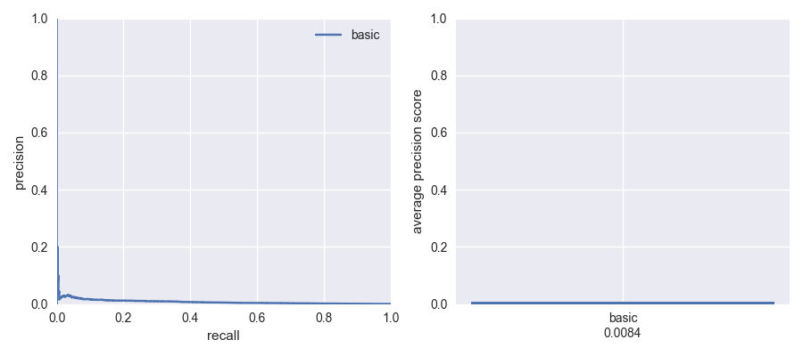

## ROC
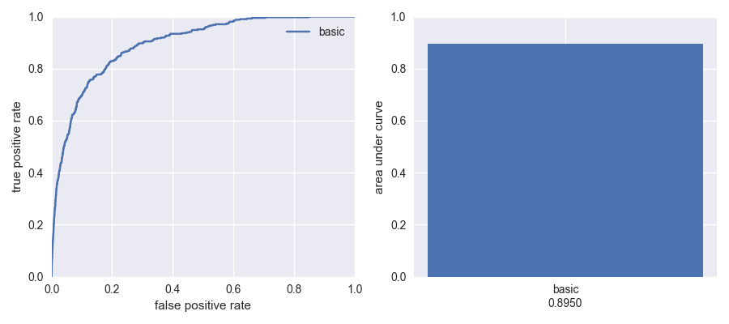


# Distribution of probabilities, by label
We look at the PDF and CDF of the distribution of model probabilities, for converted users and non-converted users separately.

## PDF


## CDF
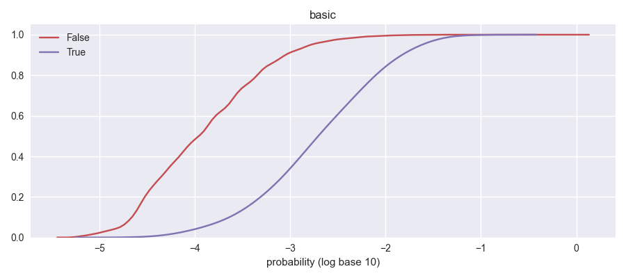


# Fitted model parameters
Warning:
It can be hard to interpret logistic regression or any linear models when the features are correlated.
For example, suppose you model the value of sets of coins using two features, "number of coins" and "number of pennies, nickels, and dimes".
You might get something like:

```
total value ~ 25 * number of coins - 19.67 * number of pennies, nickels, and dimes
```

Even though the coefficient is negative, you wouldn't want to conclude that pennies, nickels, and dimes have negative value.
If you switched to two independent features, "number of quarters" and "number of pennies, nickels, and dimes", you might get:

```
total value ~ 25 * number of quarters + 5.33 * number of pennies, nickels, and dimes
```

parameter|value
-|-
intercept|-11.55521353197379
windows|0.9065071371157214
darwin|1.4048734240895897
linux|1.2317880140394553
git_found|1.110573018166445
cpu_threads|0.01880191704417484
intellij_paid|1.8858658411078215
atom_installed|0.1444944853137855
intellij_installed|-0.033165752622047615
pycharm_installed|0.6120519347099082
sublime3_installed|0.595042952280331
vim_installed|0.7398803384306187
vscode_installed|0.5952001332567838
USA|0.953796489511271
China|-1.3216059568715008
India|-0.7939960992731963


# Some more charts
We measure some stats for different groups:
- free: users who activated, but have not trialed or converted.
- trial: users who have trialed, but not converted.
- pro: users who have converted.


## Country, by group


## OS, by group


## CPU threads, by group
The boxes shows the quartiles and median.
The whiskers show the 10th and 90th percentiles.

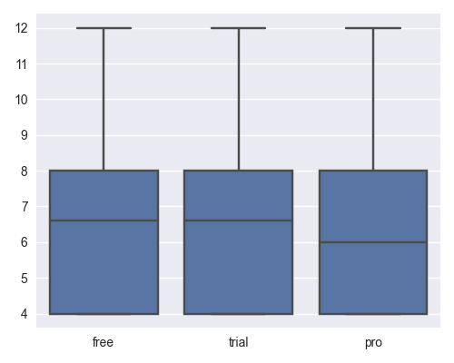

## Git found, by group
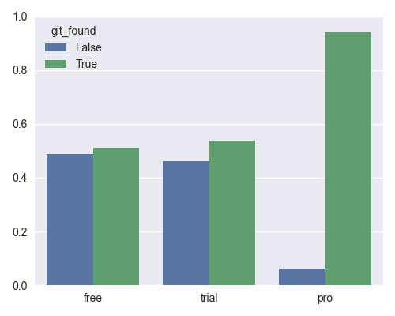

## Windows domain membership, by group


## Activation month, by group
Activation month is the first month that a user sent a fastnode status, going back to 2020-01-01.
Users who activated before January 2020 are incorrectly labelled.

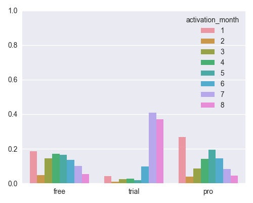

## Editors
### Atom installed, by group
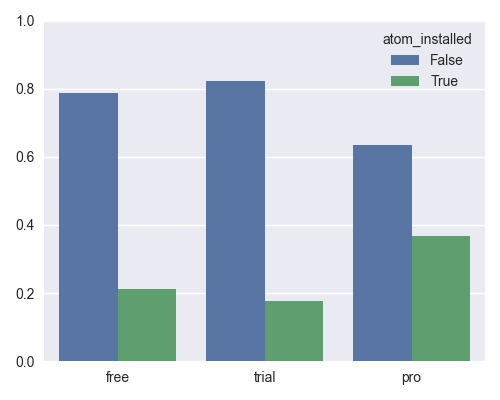

### ItelliJ installed, by group


### IntelliJ paid version installed, by group
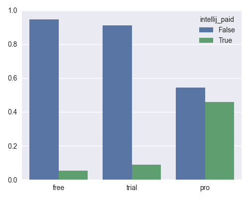

### PyCharm installed, by group
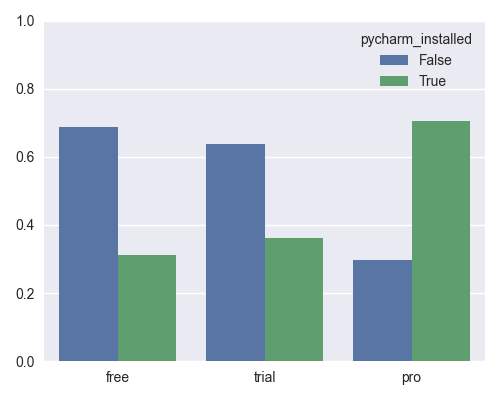

### Sublime3 installed, by group
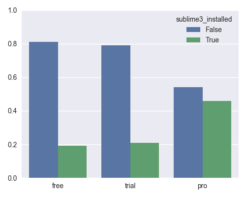

### Vim installed, by group
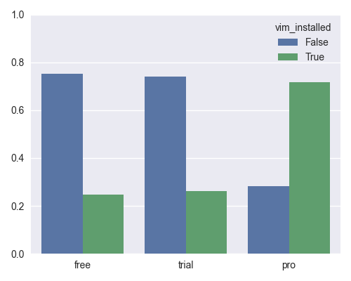

### VSCode installed, by group

