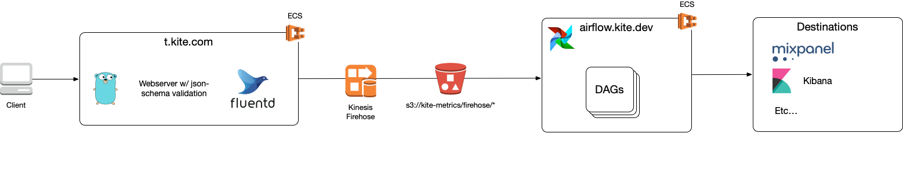

# Metrics collector

## Updating schemas

Schema files are stored in khulnasoft-lab/fastnode-go/metrics. Update the schemas there and run `make schemas`.

After updating schemas, deploy both `t.khulnasoft.com` and Airflow (`khulnasoft-lab/airflow`).

## Schema test client

You can use the test client to test your schemas.

Build the test client: `make test-client`

Run the test client with `./test-client -schema <path to schema file> -data <path to data file or directory>`.

For fastnode_status use: `./test-client -schema schemas/fastnode_status.schema.json -data <path to data file or directory>`.

Baseline performance for fastnode_status records in 3k/second. This should only be relevant if making large or structural changes to the schema.

## Deploying

The metrics collector runs of Amazon ECS using Fargate.

The Docker image will be tagged with the current Git commit. Make, test and commit your changes before deploying.

To build and deploy: `make docker.all deployment.apply`.

Monitor the deploy: `make deployment.list`. The third column is the Git commit hash.